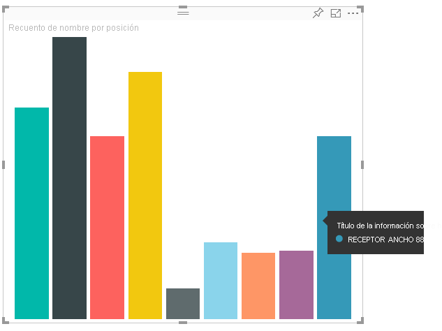
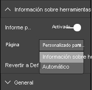

# <a name="tooltips-in-power-bi-visuals"></a><span data-ttu-id="20c08-103">Información sobre herramientas en objetos visuales de Power BI</span><span class="sxs-lookup"><span data-stu-id="20c08-103">Tooltips in Power BI visuals</span></span>

<span data-ttu-id="20c08-104">Ahora, los objetos visuales pueden aprovechar la compatibilidad con la información sobre herramientas de Power BI.</span><span class="sxs-lookup"><span data-stu-id="20c08-104">Visuals can now make use of Power BI tooltip support.</span></span> <span data-ttu-id="20c08-105">Con la información en pantalla de Power BI se controlan las siguientes interacciones:</span><span class="sxs-lookup"><span data-stu-id="20c08-105">Power BI tooltips handle the following interactions:</span></span>

* <span data-ttu-id="20c08-106">Mostrar una información en pantalla.</span><span class="sxs-lookup"><span data-stu-id="20c08-106">Show a tooltip.</span></span>
* <span data-ttu-id="20c08-107">Ocultar una información en pantalla.</span><span class="sxs-lookup"><span data-stu-id="20c08-107">Hide a tooltip.</span></span>
* <span data-ttu-id="20c08-108">Mover una información en pantalla.</span><span class="sxs-lookup"><span data-stu-id="20c08-108">Move a tooltip.</span></span>

<span data-ttu-id="20c08-109">La información sobre herramientas puede mostrar un elemento de texto con un título, un valor en un color determinado y opacidad en un conjunto especificado de coordenadas.</span><span class="sxs-lookup"><span data-stu-id="20c08-109">Tooltips can display a textual element with a title, a value in a given color, and opacity at a specified set of coordinates.</span></span> <span data-ttu-id="20c08-110">Estos datos se proporcionan a la API y el host de Power BI los representa de la misma manera que representa la información sobre herramientas de los objetos visuales nativos.</span><span class="sxs-lookup"><span data-stu-id="20c08-110">This data is provided to the API, and the Power BI host renders it the same way it renders tooltips for native visuals.</span></span>

<span data-ttu-id="20c08-111">En la siguiente imagen se muestra una información sobre herramientas en un gráfico de barras de ejemplo:</span><span class="sxs-lookup"><span data-stu-id="20c08-111">A tooltip in a sample bar chart is shown in the following image:</span></span>



<span data-ttu-id="20c08-113">En la imagen de información sobre herramientas anterior se muestra una sola categoría de barra y su valor.</span><span class="sxs-lookup"><span data-stu-id="20c08-113">The preceding tooltip image illustrates a single bar category and value.</span></span> <span data-ttu-id="20c08-114">Puede extender una sola información sobre herramientas para mostrar varios valores.</span><span class="sxs-lookup"><span data-stu-id="20c08-114">You can extend a single tooltip to display multiple values.</span></span>

## <a name="manage-tooltips"></a><span data-ttu-id="20c08-115">Administración de la información sobre herramientas</span><span class="sxs-lookup"><span data-stu-id="20c08-115">Manage tooltips</span></span>

<span data-ttu-id="20c08-116">La interfaz mediante la que se administra la información sobre herramientas es "ITooltipService".</span><span class="sxs-lookup"><span data-stu-id="20c08-116">The interface through which you manage tooltips is the "ITooltipService."</span></span> <span data-ttu-id="20c08-117">Se usa para notificar al host que una información sobre herramientas debe mostrarse, quitarse o moverse.</span><span class="sxs-lookup"><span data-stu-id="20c08-117">It's used to notify the host that a tooltip needs to be displayed, removed, or moved.</span></span>

```typescript
    interface ITooltipService {
        enabled(): boolean;
        show(options: TooltipShowOptions): void;
        move(options: TooltipMoveOptions): void;
        hide(options: TooltipHideOptions): void;
    }
```

<span data-ttu-id="20c08-118">El objeto visual tiene que escuchar los eventos del mouse dentro del objeto visual y llamar a los delegados `show()`, `move()` y `hide()` según sea necesario con el contenido adecuado rellenado en los objetos `Tooltip****Options`.</span><span class="sxs-lookup"><span data-stu-id="20c08-118">Your visual needs to listen to the mouse events within your visual and call the `show()`, `move()`, and `hide()` delegates, as needed, with the appropriate content populated in the `Tooltip****Options` objects.</span></span>
<span data-ttu-id="20c08-119">A su vez, `TooltipShowOptions` y `TooltipHideOptions` definirían lo que se va a mostrar y cómo comportarse en estos eventos.</span><span class="sxs-lookup"><span data-stu-id="20c08-119">`TooltipShowOptions` and `TooltipHideOptions` would in turn define what to display and how to behave in these events.</span></span>

<span data-ttu-id="20c08-120">Dado que llamar a estos métodos implica eventos de usuario tales como movimientos del mouse o eventos táctiles, es una buena idea crear clientes de escucha para estos eventos, lo que a su vez invocaría a los miembros de `TooltipService`.</span><span class="sxs-lookup"><span data-stu-id="20c08-120">Because calling these methods involves user events such as mouse moves and touch events, it's a good idea to create listeners for these events, which would in turn invoke the `TooltipService` members.</span></span>
<span data-ttu-id="20c08-121">En nuestro ejemplo se agrega en una clase denominada `TooltipServiceWrapper`.</span><span class="sxs-lookup"><span data-stu-id="20c08-121">Our sample aggregates in a class called `TooltipServiceWrapper`.</span></span>

### <a name="the-tooltipservicewrapper-class"></a><span data-ttu-id="20c08-122">Clase TooltipServiceWrapper</span><span class="sxs-lookup"><span data-stu-id="20c08-122">The TooltipServiceWrapper class</span></span>

<span data-ttu-id="20c08-123">La idea básica que subyace en esta clase es mantener la instancia de la clase `TooltipService`, escuchar los eventos del mouse D3 sobre elementos pertinentes y, luego, realizar las llamadas a `show()` y `hide()` cuando sea necesario.</span><span class="sxs-lookup"><span data-stu-id="20c08-123">The basic idea behind this class is to hold the instance of the `TooltipService`, listen to D3 mouse events over relevant elements, and then make the calls to `show()` and `hide()` the elements when needed.</span></span>

<span data-ttu-id="20c08-124">La clase contiene y administra cualquier estado pertinente y la lógica de estos eventos, que están principalmente orientados a interactuar con el código D3 subyacente.</span><span class="sxs-lookup"><span data-stu-id="20c08-124">The class holds and manages any relevant state and logic for these events, which are mostly geared at interfacing with the underlying D3 code.</span></span> <span data-ttu-id="20c08-125">La interactuación y conversión de D3 queda fuera del ámbito de este artículo.</span><span class="sxs-lookup"><span data-stu-id="20c08-125">The D3 interfacing and conversion is out of scope for this article.</span></span>

<span data-ttu-id="20c08-126">Puede encontrar el código de ejemplo completo en el [repositorio del objeto visual SampleBarChart](https://github.com/Microsoft/PowerBI-visuals-sampleBarChart/commit/981b021612d7b333adffe9f723ab27783c76fb14).</span><span class="sxs-lookup"><span data-stu-id="20c08-126">You can find the full sample code in [SampleBarChart visual repository](https://github.com/Microsoft/PowerBI-visuals-sampleBarChart/commit/981b021612d7b333adffe9f723ab27783c76fb14).</span></span>

### <a name="create-tooltipservicewrapper"></a><span data-ttu-id="20c08-127">Creación de TooltipServiceWrapper</span><span class="sxs-lookup"><span data-stu-id="20c08-127">Create TooltipServiceWrapper</span></span>

<span data-ttu-id="20c08-128">Ahora, el constructor de gráficos de barras tiene un miembro de `TooltipServiceWrapper`, del que se crean instancias en el constructor con la instancia de `tooltipService` de host.</span><span class="sxs-lookup"><span data-stu-id="20c08-128">The bar chart constructor now has a `TooltipServiceWrapper` member, which is instantiated in the constructor with the host `tooltipService` instance.</span></span>

```typescript
        private tooltipServiceWrapper: ITooltipServiceWrapper;

        this.tooltipServiceWrapper = createTooltipServiceWrapper(this.host.tooltipService, options.element);
```

<span data-ttu-id="20c08-129">La clase `TooltipServiceWrapper` contiene la instancia de `tooltipService`, también como elemento raíz D3 de los parámetros visuales y táctiles.</span><span class="sxs-lookup"><span data-stu-id="20c08-129">The `TooltipServiceWrapper` class holds the `tooltipService` instance, also as the root D3 element of the visual and touch parameters.</span></span>

```typescript
    class TooltipServiceWrapper implements ITooltipServiceWrapper {
        private handleTouchTimeoutId: number;
        private visualHostTooltipService: ITooltipService;
        private rootElement: Element;
        private handleTouchDelay: number;

        constructor(tooltipService: ITooltipService, rootElement: Element, handleTouchDelay: number) {
            this.visualHostTooltipService = tooltipService;
            this.handleTouchDelay = handleTouchDelay;
            this.rootElement = rootElement;
        }
        .
        .
        .
    }
```

<span data-ttu-id="20c08-130">El único punto de entrada para que esta clase registre a los clientes de escucha de eventos es el método `addTooltip`.</span><span class="sxs-lookup"><span data-stu-id="20c08-130">The single entry point for this class to register event listeners is the `addTooltip` method.</span></span>

### <a name="the-addtooltip-method"></a><span data-ttu-id="20c08-131">Método addTooltip</span><span class="sxs-lookup"><span data-stu-id="20c08-131">The addTooltip method</span></span>

```typescript
        public addTooltip<T>(
            selection: d3.Selection<Element>,
            getTooltipInfoDelegate: (args: TooltipEventArgs<T>) => VisualTooltipDataItem[],
            getDataPointIdentity: (args: TooltipEventArgs<T>) => ISelectionId,
            reloadTooltipDataOnMouseMove?: boolean): void {

            if (!selection || !this.visualHostTooltipService.enabled()) {
                return;
            }
        ...
        ...
        }
```

* <span data-ttu-id="20c08-132">**selection: d3.Selection<Element>** : elementos D3 en los que se controla la información sobre herramientas.</span><span class="sxs-lookup"><span data-stu-id="20c08-132">**selection: d3.Selection<Element>**: The d3 elements over which tooltips are handled.</span></span>

* <span data-ttu-id="20c08-133">**getTooltipInfoDelegate: (args: TooltipEventArgs<T>) => VisualTooltipDataItem[]** : delegado para rellenar el contenido de la información sobre herramientas (lo que se muestra) por contexto.</span><span class="sxs-lookup"><span data-stu-id="20c08-133">**getTooltipInfoDelegate: (args: TooltipEventArgs<T>) => VisualTooltipDataItem[]**: The delegate for populating the tooltip content (what to display) per context.</span></span>

* <span data-ttu-id="20c08-134">**getDataPointIdentity: (args: TooltipEventArgs<T>) => ISelectionId**: delegado para recuperar el identificador del punto de datos (no se usa en este ejemplo).</span><span class="sxs-lookup"><span data-stu-id="20c08-134">**getDataPointIdentity: (args: TooltipEventArgs<T>) => ISelectionId**: The delegate for retrieving the data point ID (unused in this sample).</span></span> 

* <span data-ttu-id="20c08-135">**reloadTooltipDataOnMouseMove? boolean**: valor booleano que indica si se deben actualizar los datos de la información sobre herramientas durante un evento MouseMove (no se usa en este ejemplo).</span><span class="sxs-lookup"><span data-stu-id="20c08-135">**reloadTooltipDataOnMouseMove? boolean**: A Boolean that indicates whether to refresh the tooltip data during a MouseMove event (unused in this sample).</span></span>

<span data-ttu-id="20c08-136">Como puede ver, `addTooltip` se cierra sin realizar ninguna acción si la clase `tooltipService` está deshabilitada o no hay ninguna selección real.</span><span class="sxs-lookup"><span data-stu-id="20c08-136">As you can see, `addTooltip` exits with no action if the `tooltipService` is disabled or there's no real selection.</span></span>

### <a name="call-the-show-method-to-display-a-tooltip"></a><span data-ttu-id="20c08-137">Llamada al método Show para mostrar una información sobre herramientas</span><span class="sxs-lookup"><span data-stu-id="20c08-137">Call the show method to display a tooltip</span></span>

<span data-ttu-id="20c08-138">El siguiente método `addTooltip` escucha el evento D3 `mouseover`, tal y como se muestra en el código siguiente:</span><span class="sxs-lookup"><span data-stu-id="20c08-138">The `addTooltip` method next listens to the D3 `mouseover` event, as shown in the following code:</span></span>

```typescript
        ...
        ...
        selection.on("mouseover.tooltip", () => {
            // Ignore mouseover while handling touch events
            if (!this.canDisplayTooltip(d3.event))
                return;

            let tooltipEventArgs = this.makeTooltipEventArgs<T>(rootNode, true, false);
            if (!tooltipEventArgs)
                return;

            let tooltipInfo = getTooltipInfoDelegate(tooltipEventArgs);
            if (tooltipInfo == null)
                return;

            let selectionId = getDataPointIdentity(tooltipEventArgs);

            this.visualHostTooltipService.show({
                coordinates: tooltipEventArgs.coordinates,
                isTouchEvent: false,
                dataItems: tooltipInfo,
                identities: selectionId ? [selectionId] : [],
            });
        });
```

* <span data-ttu-id="20c08-139">**makeTooltipEventArgs**: Extrae el contexto de los elementos seleccionados de D3 en una clase tooltipEventArgs.</span><span class="sxs-lookup"><span data-stu-id="20c08-139">**makeTooltipEventArgs**: Extracts the context from the D3 selected elements into a tooltipEventArgs.</span></span> <span data-ttu-id="20c08-140">También calcula las coordenadas.</span><span class="sxs-lookup"><span data-stu-id="20c08-140">It calculates the coordinates as well.</span></span>

* <span data-ttu-id="20c08-141">**getTooltipInfoDelegate**: luego, compila el contenido de la información sobre herramientas desde la clase tooltipEventArgs.</span><span class="sxs-lookup"><span data-stu-id="20c08-141">**getTooltipInfoDelegate**: It then builds the tooltip content from the tooltipEventArgs.</span></span> <span data-ttu-id="20c08-142">Es una devolución de llamada a la clase BarChart, ya que es la lógica del objeto visual.</span><span class="sxs-lookup"><span data-stu-id="20c08-142">It's a callback to the BarChart class, because it is the visual's logic.</span></span> <span data-ttu-id="20c08-143">Se trata del contenido de texto real que se va a mostrar en la información sobre herramientas.</span><span class="sxs-lookup"><span data-stu-id="20c08-143">It's the actual text content to display in the tooltip.</span></span>

* <span data-ttu-id="20c08-144">**getDataPointIdentity**: no se usa en este ejemplo.</span><span class="sxs-lookup"><span data-stu-id="20c08-144">**getDataPointIdentity**: Unused in this sample.</span></span>

* <span data-ttu-id="20c08-145">**this.visualHostTooltipService.show**: llamada para mostrar la información sobre herramientas.</span><span class="sxs-lookup"><span data-stu-id="20c08-145">**this.visualHostTooltipService.show**: The call to display the tooltip.</span></span>  

<span data-ttu-id="20c08-146">Se puede encontrar control adicional en el ejemplo de los eventos `mouseout` y `mousemove`.</span><span class="sxs-lookup"><span data-stu-id="20c08-146">Additional handling can be found in the sample for `mouseout` and `mousemove` events.</span></span>

<span data-ttu-id="20c08-147">Para más información, consulte el [repositorio del objeto visual SampleBarChart](https://github.com/Microsoft/PowerBI-visuals-sampleBarChart/commit/981b021612d7b333adffe9f723ab27783c76fb14).</span><span class="sxs-lookup"><span data-stu-id="20c08-147">For more information, see the [SampleBarChart visual repository](https://github.com/Microsoft/PowerBI-visuals-sampleBarChart/commit/981b021612d7b333adffe9f723ab27783c76fb14).</span></span>

### <a name="populate-the-tooltip-content-by-the-gettooltipdata-method"></a><span data-ttu-id="20c08-148">Rellenado del contenido de la información sobre herramientas con el método getTooltipData</span><span class="sxs-lookup"><span data-stu-id="20c08-148">Populate the tooltip content by the getTooltipData method</span></span>

<span data-ttu-id="20c08-149">Se ha agregado la clase BarChart con un miembro `getTooltipData` que simplemente extrae los valores de `category`, `value` y `color` del punto de datos en un elemento VisualTooltipDataItem[].</span><span class="sxs-lookup"><span data-stu-id="20c08-149">The BarChart class was added with a `getTooltipData` member, which simply extracts the `category`, `value`, and `color` of the data point into a VisualTooltipDataItem[] element.</span></span>

```typescript
        private static getTooltipData(value: any): VisualTooltipDataItem[] {
            return [{
                displayName: value.category,
                value: value.value.toString(),
                color: value.color,
                header: 'ToolTip Title'
            }];
        }
```

<span data-ttu-id="20c08-150">En la implementación anterior, el miembro `header` es constante, pero puede usarlo para implementaciones más complejas que requieren valores dinámicos.</span><span class="sxs-lookup"><span data-stu-id="20c08-150">In the preceding implementation, the `header` member is constant, but you can use it for more complex implementations, which require dynamic values.</span></span> <span data-ttu-id="20c08-151">Puede rellenar `VisualTooltipDataItem[]` con más de un elemento, lo que agrega varias líneas a la información sobre herramientas.</span><span class="sxs-lookup"><span data-stu-id="20c08-151">You can populate the `VisualTooltipDataItem[]` with more than one element, which adds multiple lines to the tooltip.</span></span> <span data-ttu-id="20c08-152">Puede resultar útil en objetos visuales como los gráficos de barras apiladas donde la información sobre herramientas puede mostrar datos de más de un solo punto de datos.</span><span class="sxs-lookup"><span data-stu-id="20c08-152">It can be useful in visuals such as stacked bar charts where the tooltip may display data from more than a single data point.</span></span>

### <a name="call-the-addtooltip-method"></a><span data-ttu-id="20c08-153">Llamada al método addTooltip</span><span class="sxs-lookup"><span data-stu-id="20c08-153">Call the addTooltip method</span></span>

<span data-ttu-id="20c08-154">El paso final es llamar al método `addTooltip` cuando los datos reales puedan cambiar.</span><span class="sxs-lookup"><span data-stu-id="20c08-154">The final step is to call the `addTooltip` method when the actual data might change.</span></span> <span data-ttu-id="20c08-155">Esta llamada se realiza en el método `BarChart.update()`.</span><span class="sxs-lookup"><span data-stu-id="20c08-155">This call takes place in the `BarChart.update()` method.</span></span> <span data-ttu-id="20c08-156">Se realiza una llamada para supervisar la selección de todos los elementos "bar" y se pasa solo el elemento `BarChart.getTooltipData()`, tal y como se ha indicado anteriormente.</span><span class="sxs-lookup"><span data-stu-id="20c08-156">A call is made to monitor the selection of all the 'bar' elements, passing only the `BarChart.getTooltipData()`, as mentioned previously.</span></span>

```typescript
        this.tooltipServiceWrapper.addTooltip(this.barContainer.selectAll('.bar'),
            (tooltipEvent: TooltipEventArgs<number>) => BarChart.getTooltipData(tooltipEvent.data),
            (tooltipEvent: TooltipEventArgs<number>) => null);
```

## <a name="add-report-page-tooltips"></a><span data-ttu-id="20c08-157">Adición de información sobre herramientas de la página de informes</span><span class="sxs-lookup"><span data-stu-id="20c08-157">Add report page tooltips</span></span>

<span data-ttu-id="20c08-158">Para agregar compatibilidad con la información sobre herramientas de la página de informes, encontrará la mayoría de los cambios en el archivo *capabilities.json*.</span><span class="sxs-lookup"><span data-stu-id="20c08-158">To add report page tooltips support, you'll find most changes in the *capabilities.json* file.</span></span>

<span data-ttu-id="20c08-159">Un esquema de ejemplo es el siguiente:</span><span class="sxs-lookup"><span data-stu-id="20c08-159">A sample schema is</span></span>

```json
{
    "tooltips": {
        "supportedTypes": {
            "default": true,
            "canvas": true
        },
        "roles": [
            "tooltips"
        ]
    }
}
```

<span data-ttu-id="20c08-160">Puede definir la información sobre herramientas de la página de informes en el panel **Formato**.</span><span class="sxs-lookup"><span data-stu-id="20c08-160">You can define report page tooltips in the **Format** pane.</span></span>



* <span data-ttu-id="20c08-162">`supportedTypes`: configuración de la información sobre herramientas que admite el objeto visual y que se refleja en el área de campos.</span><span class="sxs-lookup"><span data-stu-id="20c08-162">`supportedTypes`: The tooltip configuration that's supported by the visual and reflected in the fields well.</span></span> 
   * <span data-ttu-id="20c08-163">`default`: especifica si se admite el enlace de la información sobre herramientas "automática" mediante el campo de datos.</span><span class="sxs-lookup"><span data-stu-id="20c08-163">`default`: Specifies whether the "automatic" tooltips binding via the data field is supported.</span></span> 
   * <span data-ttu-id="20c08-164">`canvas`: especifica si se admite la información sobre herramientas de la página de informes.</span><span class="sxs-lookup"><span data-stu-id="20c08-164">`canvas`: Specifies whether the report page tooltips are supported.</span></span>

* <span data-ttu-id="20c08-165">`roles`: una vez definida, indica qué roles de datos se enlazan a la opción de información sobre herramientas seleccionada en el área de campos (opcional).</span><span class="sxs-lookup"><span data-stu-id="20c08-165">`roles`: (Optional) After it's defined, it instructs what data roles are bound to the selected tooltip option in the fields well.</span></span>

<span data-ttu-id="20c08-166">Para obtener más información, consulte las [normas de uso de la información sobre herramientas de la página de informes](https://powerbi.microsoft.com/blog/power-bi-desktop-march-2018-feature-summary/#tooltips).</span><span class="sxs-lookup"><span data-stu-id="20c08-166">For more information, see [Report page tooltips usage guidelines](https://powerbi.microsoft.com/blog/power-bi-desktop-march-2018-feature-summary/#tooltips).</span></span>

<span data-ttu-id="20c08-167">Para mostrar la información sobre herramientas de la página de informes, después de que el host de Power BI llame a `ITooltipService.Show(options: TooltipShowOptions)` o `ITooltipService.Move(options: TooltipMoveOptions)`, consume el valor de selectionId (propiedad `identities` del argumento `options` anterior).</span><span class="sxs-lookup"><span data-stu-id="20c08-167">To display the report page tooltip, after the Power BI host calls `ITooltipService.Show(options: TooltipShowOptions)` or `ITooltipService.Move(options: TooltipMoveOptions)`, it consumes the selectionId (`identities` property of the preceding `options` argument).</span></span> <span data-ttu-id="20c08-168">Para que lo recupere la información sobre herramientas, SelectionId debe representar los datos seleccionados (categoría, serie, etc.) del elemento sobre el que ha mantenido el mouse.</span><span class="sxs-lookup"><span data-stu-id="20c08-168">To be retrieved by the tooltip, SelectionId should represent the selected data (category, series, and so on) of the item you hovered over.</span></span>

<span data-ttu-id="20c08-169">En el siguiente código se muestra un ejemplo del envío de selectionId a llamadas de visualización de la información sobre herramientas:</span><span class="sxs-lookup"><span data-stu-id="20c08-169">An example of sending the selectionId to tooltip display calls is shown in the following code:</span></span>

```typescript
    this.tooltipServiceWrapper.addTooltip(this.barContainer.selectAll('.bar'),
        (tooltipEvent: TooltipEventArgs<number>) => BarChart.getTooltipData(tooltipEvent.data),
        (tooltipEvent: TooltipEventArgs<number>) => tooltipEvent.data.selectionID);
```
