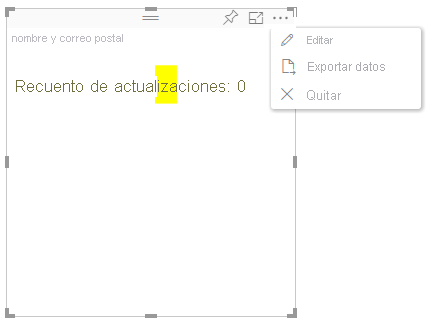

# Modo de edición avanzada en objetos visuales de Power BIAdvanced edit mode in Power BI visuals

Si necesita controles de interfaz de usuario avanzados en el objeto visual de Power BI, puede aprovechar el modo de edición avanzada.If you require advanced UI controls in your Power BI visual, you can take advantage of advanced edit mode. Cuando esté en el modo de edición de informes, seleccione el botón **Editar** para establecer el modo de edición en **Avanzado**.When you're in report editing mode, you select an **Edit** button to set the edit mode to **Advanced**. El objeto visual puede usar la marca `EditMode` para determinar si debe mostrar este control de interfaz de usuario.The visual can use the `EditMode` flag to determine whether it should display this UI control.

De forma predeterminada, el objeto visual no admite el modo de edición avanzada.By default, the visual doesn't support advanced edit mode. Si se requiere otro comportamiento, puede indicarlo de forma explícita en el archivo *capabilities.json* del objeto visual, al establecer la propiedad `advancedEditModeSupport`.If a different behavior is required, you can explicitly state this in the visual's *capabilities.json* file by setting the `advancedEditModeSupport` property.

Los valores posibles son los siguientes:The possible values are:

- `0`: NotSupported`0` - NotSupported

- `1`: SupportedNoAction`1` - SupportedNoAction

- `2`: SupportedInFocus`2` - SupportedInFocus

## Acceso al modo de edición avanzadaEnter advanced edit mode

Se muestra el botón **Editar** si:An **Edit** button is displayed if:

* La propiedad `advancedEditModeSupport` está establecida en el archivo *capabilities.json* en `SupportedNoAction` o `SupportedInFocus`.The `advancedEditModeSupport` property is set in the *capabilities.json* file to either `SupportedNoAction` or `SupportedInFocus`.

* El objeto visual se ve en el modo de edición de informes.The visual is viewed in report editing mode.

Si falta la propiedad `advancedEditModeSupport` en el archivo *capabilities.json* o está establecida en `NotSupported`, no se muestra el botón **Editar**.If `advancedEditModeSupport` property is missing from the *capabilities.json* file or set to `NotSupported`, the **Edit** button is not displayed.

Al seleccionar **Editar**, el objeto visual recibe una llamada de update() con EditMode establecido en `Advanced`.When you select **Edit**, the visual gets an update() call with EditMode set to `Advanced`. Según el valor que se haya establecido en el archivo *capabilities.json*, se producen las siguientes acciones:Depending on the value that's set in the *capabilities.json* file, the following actions occur:

* `SupportedNoAction`: el host no requiere más acciones.`SupportedNoAction`: No further action is required by the host.
* `SupportedInFocus`: el host muestra el objeto visual en el modo de enfoque.`SupportedInFocus`: The host pops out the visual into in focus mode.

## Salida del modo de edición avanzadaExit advanced edit mode

Se muestra el botón **Volver al informe** si:The **Back to report** button is displayed if:

* La propiedad `advancedEditModeSupport` está establecida en el archivo *capabilities.json* en `SupportedInFocus`.The `advancedEditModeSupport` property is set in the *capabilities.json* file to `SupportedInFocus`.
