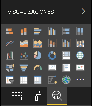

# <a name="the-analytics-pane-in-power-bi-visuals"></a><span data-ttu-id="9abd8-103">Panel Analytics en objetos visuales de Power BI</span><span class="sxs-lookup"><span data-stu-id="9abd8-103">The Analytics pane in Power BI visuals</span></span>

<span data-ttu-id="9abd8-104">El panel **Analytics** se introdujo para [objetos visuales nativos](https://docs.microsoft.com/power-bi/desktop-analytics-pane) en noviembre de 2018.</span><span class="sxs-lookup"><span data-stu-id="9abd8-104">The **Analytics** pane was introduced for [native visuals](https://docs.microsoft.com/power-bi/desktop-analytics-pane) in November 2018.</span></span>
<span data-ttu-id="9abd8-105">En este artículo se explica cómo los objetos visuales de Power BI con la API v2.5.0 pueden presentar y administrar sus propiedades en el panel **Analytics**.</span><span class="sxs-lookup"><span data-stu-id="9abd8-105">This article discusses how Power BI visuals with API v2.5.0 can present and manage their properties in the **Analytics** pane.</span></span>



## <a name="manage-the-analytics-pane"></a><span data-ttu-id="9abd8-107">Administración del panel Analytics</span><span class="sxs-lookup"><span data-stu-id="9abd8-107">Manage the Analytics pane</span></span>

<span data-ttu-id="9abd8-108">Del mismo modo que administra las propiedades del [panel **Formato**](https://docs.microsoft.com/power-bi/developer/visuals/custom-visual-develop-tutorial-format-options), administre el panel **Analytics** al definir un objeto en el archivo *capabilities.json* del objeto visual.</span><span class="sxs-lookup"><span data-stu-id="9abd8-108">Just as you'd manage properties in the [**Format** pane](https://docs.microsoft.com/power-bi/developer/visuals/custom-visual-develop-tutorial-format-options), you manage the **Analytics** pane by defining an object in the visual's *capabilities.json* file.</span></span>

<span data-ttu-id="9abd8-109">En el panel **Analytics**, las diferencias son las siguientes:</span><span class="sxs-lookup"><span data-stu-id="9abd8-109">For the **Analytics** pane, the differences are as follows:</span></span>

* <span data-ttu-id="9abd8-110">En la definición del objeto, agregue un campo **objectCategory** con un valor de 2.</span><span class="sxs-lookup"><span data-stu-id="9abd8-110">Under the object's definition, you add an **objectCategory** field with a value of 2.</span></span>

    > [!NOTE]
    > <span data-ttu-id="9abd8-111">El campo opcional `objectCategory` se presentó en la API 2.5.0.</span><span class="sxs-lookup"><span data-stu-id="9abd8-111">The optional `objectCategory` field was introduced in API 2.5.0.</span></span> <span data-ttu-id="9abd8-112">Define el aspecto del objeto visual que controla el objeto (1 = formato, 2 = análisis).</span><span class="sxs-lookup"><span data-stu-id="9abd8-112">It defines the aspect of the visual that the object controls (1 = Formatting, 2 = Analytics).</span></span> <span data-ttu-id="9abd8-113">`Formatting` se usa para elementos como la apariencia, los colores, los ejes y las etiquetas.</span><span class="sxs-lookup"><span data-stu-id="9abd8-113">`Formatting` is used for such elements as look and feel, colors, axes, and labels.</span></span> <span data-ttu-id="9abd8-114">`Analytics` se usa para elementos como las previsiones, las líneas de tendencia, las líneas de referencia y las formas.</span><span class="sxs-lookup"><span data-stu-id="9abd8-114">`Analytics` is used for such elements as forecasts, trendlines, reference lines, and shapes.</span></span>
    >
    > <span data-ttu-id="9abd8-115">Si no se especifica el valor, el valor predeterminado de `objectCategory` es "Formatting".</span><span class="sxs-lookup"><span data-stu-id="9abd8-115">If the value isn't specified, `objectCategory` defaults to "Formatting."</span></span>

* <span data-ttu-id="9abd8-116">El objeto debe tener estas dos propiedades:</span><span class="sxs-lookup"><span data-stu-id="9abd8-116">The object must have the following two properties:</span></span>
    * <span data-ttu-id="9abd8-117">`show` de tipo `bool`, con un valor predeterminado de `false`.</span><span class="sxs-lookup"><span data-stu-id="9abd8-117">`show` of type `bool`, with a default value of `false`.</span></span>
    * <span data-ttu-id="9abd8-118">`displayName` de tipo `text`.</span><span class="sxs-lookup"><span data-stu-id="9abd8-118">`displayName` of type `text`.</span></span> <span data-ttu-id="9abd8-119">El valor predeterminado que elija se convierte en el nombre para mostrar inicial de la instancia.</span><span class="sxs-lookup"><span data-stu-id="9abd8-119">The default value that you choose becomes the instance's initial display name.</span></span>

```json
{
  "objects": {
    "YourAnalyticsPropertiesCard": {
      "displayName": "Your analytics properties card's name",
      "objectCategory": 2,
      "properties": {
        "show": {
          "type": {
            "bool": true
          }
        },
        "displayName": {
          "type": {
            "text": true
          }
        },
      ... //any other properties for your Analytics card
      }
    }
  ...
  }
}
```

<span data-ttu-id="9abd8-120">Puede definir otras propiedades de la misma manera que lo hace para los objetos de **Formato**.</span><span class="sxs-lookup"><span data-stu-id="9abd8-120">You can define other properties in the same way that you do for **Format** objects.</span></span> <span data-ttu-id="9abd8-121">Además, puede enumerar objetos igual que en el panel **Formato**.</span><span class="sxs-lookup"><span data-stu-id="9abd8-121">And you can enumerate objects just as you do in the **Format** pane.</span></span>

## <a name="known-limitations-and-issues-of-the-analytics-pane"></a><span data-ttu-id="9abd8-122">Limitaciones y problemas conocidos del panel Analytics</span><span class="sxs-lookup"><span data-stu-id="9abd8-122">Known limitations and issues of the Analytics pane</span></span>

* <span data-ttu-id="9abd8-123">El panel **Analytics** aún no es compatible con varias instancias.</span><span class="sxs-lookup"><span data-stu-id="9abd8-123">The **Analytics** pane has no multi-instance support yet.</span></span> <span data-ttu-id="9abd8-124">Los objetos no pueden tener un [selector](https://microsoft.github.io/PowerBI-visuals/docs/concepts/objects-and-properties/#selector) que no sea estático (es decir, "selector": null), y los objetos visuales de Power BI no pueden tener varias instancias de una tarjeta definidas por el usuario.</span><span class="sxs-lookup"><span data-stu-id="9abd8-124">Objects can't have a [selector](https://microsoft.github.io/PowerBI-visuals/docs/concepts/objects-and-properties/#selector) other than static (that is, "selector": null), and Power BI visuals can't have user-defined multiple instances of a card.</span></span>
* <span data-ttu-id="9abd8-125">Las propiedades del tipo `integer` no se muestran correctamente.</span><span class="sxs-lookup"><span data-stu-id="9abd8-125">Properties of type `integer` aren't displayed correctly.</span></span> <span data-ttu-id="9abd8-126">Como solución alternativa, use el tipo `numeric` en su lugar.</span><span class="sxs-lookup"><span data-stu-id="9abd8-126">As a workaround, use type `numeric` instead.</span></span>

> [!NOTE]
> * <span data-ttu-id="9abd8-127">Use el panel **Analytics** solo para los objetos que agreguen nueva información o proporcionen nuevas perspectivas sobre la información presentada (por ejemplo, líneas de referencia dinámicas que muestren tendencias importantes).</span><span class="sxs-lookup"><span data-stu-id="9abd8-127">Use the **Analytics** pane only for objects that add new information or shed new light on the presented information (for example, dynamic reference lines that illustrate important trends).</span></span>
> * <span data-ttu-id="9abd8-128">Cualquier opción que controle la apariencia del objeto visual (es decir, el formato) debe limitarse en el panel **Formato**.</span><span class="sxs-lookup"><span data-stu-id="9abd8-128">Any options that control the look and feel of the visual (that is, formatting) should be limited to the **Formatting** pane.</span></span>
