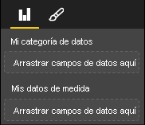

# <a name="capabilities-and-properties-of-power-bi-visuals"></a><span data-ttu-id="8fe0d-103">Funcionalidades y propiedades de objetos visuales de Power BI</span><span class="sxs-lookup"><span data-stu-id="8fe0d-103">Capabilities and properties of Power BI visuals</span></span> 

<span data-ttu-id="8fe0d-104">Usará las funcionalidades para proporcionar información al host sobre el objeto visual.</span><span class="sxs-lookup"><span data-stu-id="8fe0d-104">You use capabilities to provide information to the host about your visual.</span></span> <span data-ttu-id="8fe0d-105">Todas las propiedades del modelo de funcionalidades son `optional`.</span><span class="sxs-lookup"><span data-stu-id="8fe0d-105">All properties on the capabilities model are `optional`.</span></span>

<span data-ttu-id="8fe0d-106">Los objetos raíz de las funcionalidades de un objeto visual son `dataRoles`, `dataViewMappings`, etc.</span><span class="sxs-lookup"><span data-stu-id="8fe0d-106">The root objects of a visual's capabilities are `dataRoles`, `dataViewMappings`, and so on.</span></span>

```json
{
    "dataRoles": [ ... ],
    "dataViewMappings": [ ... ],
    "objects":  { ... },
    "supportsHighlight": true|false,
    "advancedEditModeSupport": 0|1|2,
    "sorting": { ... }
}

```

## <a name="define-the-data-fields-that-your-visual-expects-dataroles"></a><span data-ttu-id="8fe0d-107">Definición de los campos de datos que espera el objeto visual: dataRoles</span><span class="sxs-lookup"><span data-stu-id="8fe0d-107">Define the data fields that your visual expects: dataRoles</span></span>

<span data-ttu-id="8fe0d-108">Para definir los campos que se pueden enlazar con los datos, use `dataRoles`.</span><span class="sxs-lookup"><span data-stu-id="8fe0d-108">To define fields that can be bound to data, you use `dataRoles`.</span></span> <span data-ttu-id="8fe0d-109">`dataRoles` toma una matriz de objetos `DataViewRole` que define todas las propiedades necesarias.</span><span class="sxs-lookup"><span data-stu-id="8fe0d-109">`dataRoles` takes an array of `DataViewRole` objects, which defines all the required properties.</span></span>

### <a name="properties"></a><span data-ttu-id="8fe0d-110">Propiedades</span><span class="sxs-lookup"><span data-stu-id="8fe0d-110">Properties</span></span>

* <span data-ttu-id="8fe0d-111">**name**: nombre interno de este campo de datos (tiene que ser único).</span><span class="sxs-lookup"><span data-stu-id="8fe0d-111">**name**: The internal name of this data field (must be unique).</span></span>
* <span data-ttu-id="8fe0d-112">**kind**: tipo de campo:</span><span class="sxs-lookup"><span data-stu-id="8fe0d-112">**kind**: The kind of field:</span></span>
    * <span data-ttu-id="8fe0d-113">`Grouping`: valores discretos que se usan para agrupar campos de medida.</span><span class="sxs-lookup"><span data-stu-id="8fe0d-113">`Grouping`: Discrete values that are used to group measure fields.</span></span>
    * <span data-ttu-id="8fe0d-114">`Measure`: valores de datos numéricos.</span><span class="sxs-lookup"><span data-stu-id="8fe0d-114">`Measure`: Numeric data values.</span></span>
    * <span data-ttu-id="8fe0d-115">`GroupingOrMeasure`: valores que se pueden usar como una agrupación o una medida.</span><span class="sxs-lookup"><span data-stu-id="8fe0d-115">`GroupingOrMeasure`: Values that can be used as either a grouping or a measure.</span></span>
* <span data-ttu-id="8fe0d-116">**displayName**: nombre que se muestra al usuario en el panel **Propiedades**.</span><span class="sxs-lookup"><span data-stu-id="8fe0d-116">**displayName**: The name displayed to the user in the **Properties** pane.</span></span>
* <span data-ttu-id="8fe0d-117">**description**: descripción breve del campo (opcional).</span><span class="sxs-lookup"><span data-stu-id="8fe0d-117">**description**: A short description of the field (optional).</span></span>
* <span data-ttu-id="8fe0d-118">**requiredTypes**: tipo de datos necesario para este rol de datos.</span><span class="sxs-lookup"><span data-stu-id="8fe0d-118">**requiredTypes**: The required type of data for this data role.</span></span> <span data-ttu-id="8fe0d-119">Los valores que no coinciden se establecen en null (opcional).</span><span class="sxs-lookup"><span data-stu-id="8fe0d-119">Values that don't match are set to null (optional).</span></span>
* <span data-ttu-id="8fe0d-120">**preferredTypes**: tipo de datos preferido para este rol de datos (opcional).</span><span class="sxs-lookup"><span data-stu-id="8fe0d-120">**preferredTypes**: The preferred type of data for this data role (optional).</span></span>

### <a name="valid-data-types-in-requiredtypes-and-preferredtypes"></a><span data-ttu-id="8fe0d-121">Tipos de datos válidos en requiredTypes y preferredTypes</span><span class="sxs-lookup"><span data-stu-id="8fe0d-121">Valid data types in requiredTypes and preferredTypes</span></span>

* <span data-ttu-id="8fe0d-122">**bool**: valor booleano.</span><span class="sxs-lookup"><span data-stu-id="8fe0d-122">**bool**: A boolean value</span></span>
* <span data-ttu-id="8fe0d-123">**integer**: valor entero (número entero).</span><span class="sxs-lookup"><span data-stu-id="8fe0d-123">**integer**: An integer (whole number) value</span></span>
* <span data-ttu-id="8fe0d-124">**numeric**: valor numérico.</span><span class="sxs-lookup"><span data-stu-id="8fe0d-124">**numeric**: A numeric value</span></span>
* <span data-ttu-id="8fe0d-125">**text**: valor de texto.</span><span class="sxs-lookup"><span data-stu-id="8fe0d-125">**text**: A text value</span></span>
* <span data-ttu-id="8fe0d-126">**geography**: datos geográficos.</span><span class="sxs-lookup"><span data-stu-id="8fe0d-126">**geography**: A geographic data</span></span>

### <a name="example"></a><span data-ttu-id="8fe0d-127">Ejemplo</span><span class="sxs-lookup"><span data-stu-id="8fe0d-127">Example</span></span>

```json
"dataRoles": [
    {
        "displayName": "My Category Data",
        "name": "myCategory",
        "kind": "Grouping",
        "requiredTypes": [
            {
                "text": true
            },
            {
                "numeric": true
            },
            {
                "integer": true
            }
        ],
        "preferredTypes": [
            {
                "text": true
            }
        ]
    },
    {
        "displayName": "My Measure Data",
        "name": "myMeasure",
        "kind": "Measure",
        "requiredTypes": [
            {
                "integer": true
            },
            {
                "numeric": true
            }
        ],
        "preferredTypes": [
            {
                "integer": true
            }
        ]
    },
    {
        "displayNameKey": "Visual_Location",
        "name": "Locations",
        "kind": "Measure",
        "displayName": "Locations",
        "requiredTypes": [
            {
                "geography": {
                    "address": true
                }
            },
            {
                "geography": {
                    "city": true
                }
            },
            {
                "geography": {
                    "continent": true
                }
            },
            {
                "geography": {
                    "country": true
                }
            },
            {
                "geography": {
                    "county": true
                }
            },
            {
                "geography": {
                    "place": true
                }
            },
            {
                "geography": {
                    "postalCode": true
                }
            },
            {
                "geography": {
                    "region": true
                }
            },
            {
                "geography": {
                    "stateOrProvince": true
                }
            }
        ]
    }
]
```

<span data-ttu-id="8fe0d-128">Los roles de datos anteriores crearían los campos que se muestran en la siguiente imagen:</span><span class="sxs-lookup"><span data-stu-id="8fe0d-128">The preceding data roles would create the fields that are displayed in the following image:</span></span>



## <a name="define-how-you-want-the-data-mapped-dataviewmappings"></a><span data-ttu-id="8fe0d-130">Definición de la forma en que se quieren asignar los datos: dataViewMappings</span><span class="sxs-lookup"><span data-stu-id="8fe0d-130">Define how you want the data mapped: dataViewMappings</span></span>

<span data-ttu-id="8fe0d-131">Una propiedad DataViewMappings describe cómo se relacionan los roles de datos entre sí y le permite especificar requisitos condicionales para estos.</span><span class="sxs-lookup"><span data-stu-id="8fe0d-131">A DataViewMappings property describes how the data roles relate to each other and allows you to specify conditional requirements for the them.</span></span>

<span data-ttu-id="8fe0d-132">La mayoría de los objetos visuales proporcionan una sola asignación, pero puede proporcionar varios elementos dataViewMappings.</span><span class="sxs-lookup"><span data-stu-id="8fe0d-132">Most visuals provide a single mapping, but you can provide multiple dataViewMappings.</span></span> <span data-ttu-id="8fe0d-133">Cada asignación válida genera una vista de datos.</span><span class="sxs-lookup"><span data-stu-id="8fe0d-133">Each valid mapping produces a data view.</span></span> 

```json
"dataViewMappings": [
    {
        "conditions": [ ... ],
        "categorical": { ... },
        "table": { ... },
        "single": { ... },
        "matrix": { ... }
    }
]
```

<span data-ttu-id="8fe0d-134">Para obtener más información, consulte [Información sobre las asignaciones de vistas de datos en objetos visuales de Power BI](dataview-mappings.md).</span><span class="sxs-lookup"><span data-stu-id="8fe0d-134">For more information, see [Understand data view mapping in Power BI visuals](dataview-mappings.md).</span></span>

## <a name="define-property-pane-options-objects"></a><span data-ttu-id="8fe0d-135">Definición de las opciones del panel de propiedades: objetos</span><span class="sxs-lookup"><span data-stu-id="8fe0d-135">Define property pane options: objects</span></span>

<span data-ttu-id="8fe0d-136">Los objetos describen propiedades personalizables que están asociadas al objeto visual.</span><span class="sxs-lookup"><span data-stu-id="8fe0d-136">Objects describe customizable properties that are associated with the visual.</span></span> <span data-ttu-id="8fe0d-137">Cada objeto puede tener varias propiedades y cada propiedad tiene un tipo asociado.</span><span class="sxs-lookup"><span data-stu-id="8fe0d-137">Each object can have multiple properties, and each property has a type that's associated with it.</span></span> <span data-ttu-id="8fe0d-138">Los tipos hacen referencia a lo que será la propiedad.</span><span class="sxs-lookup"><span data-stu-id="8fe0d-138">Types refer to what the property will be.</span></span> 

```json
"objects": {
    "myCustomObject": {
        "displayName": "My Object Name",
        "properties": { ... }
    }
}
```

<span data-ttu-id="8fe0d-139">Para obtener más información, vea [Objetos y propiedades de objetos visuales de Power BI](objects-properties.md).</span><span class="sxs-lookup"><span data-stu-id="8fe0d-139">For more information, see [Objects and properties of Power BI visuals](objects-properties.md).</span></span>

## <a name="handle-partial-highlighting-supportshighlight"></a><span data-ttu-id="8fe0d-140">Control del resaltado parcial: supportsHighlight</span><span class="sxs-lookup"><span data-stu-id="8fe0d-140">Handle partial highlighting: supportsHighlight</span></span>

<span data-ttu-id="8fe0d-141">De forma predeterminada, este valor se establece en `false`, lo que significa que los valores se filtran automáticamente cuando se selecciona algo en la página.</span><span class="sxs-lookup"><span data-stu-id="8fe0d-141">By default, this value is set to `false`, which means that your values are automatically filtered when something on the page is selected.</span></span> <span data-ttu-id="8fe0d-142">Este filtrado automático, a su vez, actualiza el objeto visual para mostrar solo el valor seleccionado.</span><span class="sxs-lookup"><span data-stu-id="8fe0d-142">This automatic filtering in turn updates your visual to display only the selected value.</span></span> <span data-ttu-id="8fe0d-143">Si quiere mostrar todos los datos, pero solo resaltar los elementos seleccionados, necesita establecer `supportsHighlight` en `true` en el archivo *capabilities.json*.</span><span class="sxs-lookup"><span data-stu-id="8fe0d-143">If you want to display the full data but highlight only the selected items, you need to set `supportsHighlight` to `true` in your *capabilities.json* file.</span></span>

<span data-ttu-id="8fe0d-144">Para obtener más información, consulte [Resaltado de puntos de datos en objetos visuales de Power BI](highlight.md).</span><span class="sxs-lookup"><span data-stu-id="8fe0d-144">For more information, see [Highlight data points in Power BI visuals](highlight.md).</span></span>

## <a name="handle-advanced-edit-mode-advancededitmodesupport"></a><span data-ttu-id="8fe0d-145">Control del modo de edición avanzada: advancedEditModeSupport</span><span class="sxs-lookup"><span data-stu-id="8fe0d-145">Handle advanced edit mode: advancedEditModeSupport</span></span>

<span data-ttu-id="8fe0d-146">Un objeto visual puede declarar su compatibilidad con el modo de edición avanzada.</span><span class="sxs-lookup"><span data-stu-id="8fe0d-146">A visual can declare its support of advanced edit mode.</span></span> <span data-ttu-id="8fe0d-147">De forma predeterminada, un objeto visual no admite el modo de edición avanzada, a menos que se indique lo contrario en el archivo *capabilities.json*.</span><span class="sxs-lookup"><span data-stu-id="8fe0d-147">By default, a visual doesn't support advanced edit mode, unless stated otherwise in the *capabilities.json* file.</span></span>

<span data-ttu-id="8fe0d-148">Para obtener más información, consulte [Modo de edición avanzada en objetos visuales de Power BI](advanced-edit-mode.md).</span><span class="sxs-lookup"><span data-stu-id="8fe0d-148">For more information, see [Advanced edit mode in Power BI visuals](advanced-edit-mode.md).</span></span>

## <a name="data-sorting-options-for-visual-sorting"></a><span data-ttu-id="8fe0d-149">Opciones de ordenación de datos para objetos visuales: ordenación</span><span class="sxs-lookup"><span data-stu-id="8fe0d-149">Data sorting options for visual: sorting</span></span>

<span data-ttu-id="8fe0d-150">Un objeto visual puede definir su comportamiento de ordenación mediante sus funciones.</span><span class="sxs-lookup"><span data-stu-id="8fe0d-150">A visual can define its sorting behavior via its capabilities.</span></span> <span data-ttu-id="8fe0d-151">De forma predeterminada, un objeto visual no permite que se modifique su criterio de ordenación, a menos que se indique lo contrario en el archivo *capabilities.json*.</span><span class="sxs-lookup"><span data-stu-id="8fe0d-151">By default, a visual doesn't support modifying its sorting order, unless stated otherwise in the *capabilities.json* file.</span></span>

<span data-ttu-id="8fe0d-152">Para obtener más información, consulte [Opciones de ordenación para objetos visuales de Power BI](sort-options.md).</span><span class="sxs-lookup"><span data-stu-id="8fe0d-152">For more information, see [Sorting options for Power BI visuals](sort-options.md).</span></span>
