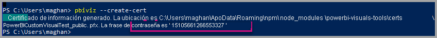
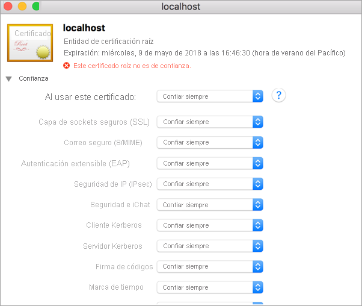
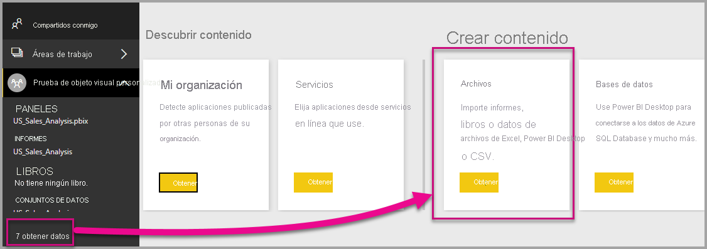
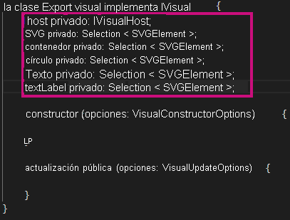
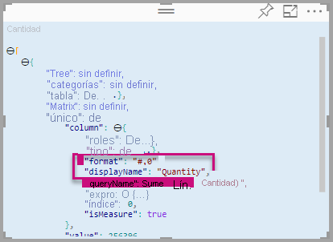
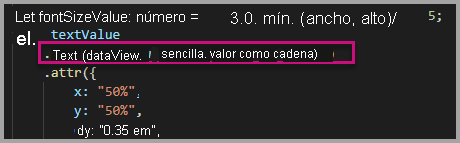

# <a name="tutorial-developing-a-power-bi-visual"></a><span data-ttu-id="f7c31-103">Tutorial: desarrollar un Power BI visual</span><span class="sxs-lookup"><span data-stu-id="f7c31-103">Tutorial: Developing a Power BI visual</span></span>

<span data-ttu-id="f7c31-104">Permitimos que los desarrolladores agreguen fácilmente a Power BI objetos visuales de Power BI para usarlos en los paneles e informes.</span><span class="sxs-lookup"><span data-stu-id="f7c31-104">We’re enabling developers to easily add Power BI visuals into Power BI for use in dashboard and reports.</span></span> <span data-ttu-id="f7c31-105">Para ayudarle a comenzar, publicamos en GitHub el código de todas nuestras visualizaciones.</span><span class="sxs-lookup"><span data-stu-id="f7c31-105">To help you get started, we’ve published the code for all of our visualizations to GitHub.</span></span>

<span data-ttu-id="f7c31-106">Junto con el marco de trabajo de visualización, incluimos nuestro conjunto de pruebas y herramientas para ayudar a la comunidad a crear objetos visuales de Power BI de alta calidad para Power BI.</span><span class="sxs-lookup"><span data-stu-id="f7c31-106">Along with the visualization framework, we’ve provided our test suite and tools to help the community build high-quality Power BI visuals for Power BI.</span></span>

<span data-ttu-id="f7c31-107">Este tutorial le muestra cómo desarrollar un objeto visual personalizado de Power BI llamado Circle Card para mostrar un valor de medida formateado dentro de un círculo.</span><span class="sxs-lookup"><span data-stu-id="f7c31-107">This tutorial shows you how to develop a Power BI custom visual named Circle Card to display a formatted measure value inside a circle.</span></span> <span data-ttu-id="f7c31-108">El objeto visual Circle Card admite la personalización del color de relleno y el grosor de su contorno.</span><span class="sxs-lookup"><span data-stu-id="f7c31-108">The Circle Card visual supports customization of fill color and thickness of its outline.</span></span>

<span data-ttu-id="f7c31-109">En el informe de Power BI Desktop, las tarjetas se modifican para convertirse en tarjetas circulares.</span><span class="sxs-lookup"><span data-stu-id="f7c31-109">In the Power BI Desktop report, the cards are modified to become Circle Cards.</span></span>

  

<span data-ttu-id="f7c31-111">En este tutorial, obtendrá información sobre cómo:</span><span class="sxs-lookup"><span data-stu-id="f7c31-111">In this tutorial, you learn how to:</span></span>
> [!div class="checklist"]
> * <span data-ttu-id="f7c31-112">Crear un objeto visual de Power BI.</span><span class="sxs-lookup"><span data-stu-id="f7c31-112">Create a Power BI custom visual.</span></span>
> * <span data-ttu-id="f7c31-113">Desarrollar el objeto visual personalizado con elementos visuales de D3.</span><span class="sxs-lookup"><span data-stu-id="f7c31-113">Develop the custom visual with D3 visual elements.</span></span>
> * <span data-ttu-id="f7c31-114">Configurar el enlace de datos con los elementos visuales.</span><span class="sxs-lookup"><span data-stu-id="f7c31-114">Configure data binding with the visual elements.</span></span>
> * <span data-ttu-id="f7c31-115">Dar formato a los valores de datos.</span><span class="sxs-lookup"><span data-stu-id="f7c31-115">Format data values.</span></span>

## <a name="prerequisites"></a><span data-ttu-id="f7c31-116">Requisitos previos</span><span class="sxs-lookup"><span data-stu-id="f7c31-116">Prerequisites</span></span>

* <span data-ttu-id="f7c31-117">Si no está registrado en **Power BI Pro**, [regístrese para obtener una evaluación gratuita](https://powerbi.microsoft.com/pricing/) antes de empezar.</span><span class="sxs-lookup"><span data-stu-id="f7c31-117">If you're not signed up for **Power BI Pro**, [sign up for a free trial](https://powerbi.microsoft.com/pricing/) before you begin.</span></span>
* <span data-ttu-id="f7c31-118">Necesita tener [Visual Studio Code](https://www.visualstudio.com/) instalado.</span><span class="sxs-lookup"><span data-stu-id="f7c31-118">You need [Visual Studio Code](https://www.visualstudio.com/) installed.</span></span>
* <span data-ttu-id="f7c31-119">Necesita la versión 4 de [Windows PowerShell](https://docs.microsoft.com/powershell/scripting/setup/installing-windows-powershell?view=powershell-6) o una posterior para los usuarios de Windows o [Terminal](https://macpaw.com/how-to/use-terminal-on-mac) para los usuarios de OSX.</span><span class="sxs-lookup"><span data-stu-id="f7c31-119">You need [Windows PowerShell](https://docs.microsoft.com/powershell/scripting/setup/installing-windows-powershell?view=powershell-6) version 4 or later for windows users OR the [Terminal](https://macpaw.com/how-to/use-terminal-on-mac) for OSX users.</span></span>

## <a name="setting-up-the-developer-environment"></a><span data-ttu-id="f7c31-120">Configuración del entorno de desarrollo</span><span class="sxs-lookup"><span data-stu-id="f7c31-120">Setting up the developer environment</span></span>

<span data-ttu-id="f7c31-121">Además de los requisitos previos, hay algunas herramientas más que necesita instalar.</span><span class="sxs-lookup"><span data-stu-id="f7c31-121">In addition to the prerequisites, there are a few more tools you need to install.</span></span>

### <a name="installing-nodejs"></a><span data-ttu-id="f7c31-122">Instalación de node.js</span><span class="sxs-lookup"><span data-stu-id="f7c31-122">Installing node.js</span></span>

1. <span data-ttu-id="f7c31-123">Para instalar Node.js en un explorador web, vaya a [Node.js](https://nodejs.org).</span><span class="sxs-lookup"><span data-stu-id="f7c31-123">To install Node.js, in a web browser, navigate to [Node.js](https://nodejs.org).</span></span>

2. <span data-ttu-id="f7c31-124">Descargue la última característica del instalador MSI.</span><span class="sxs-lookup"><span data-stu-id="f7c31-124">Download the latest feature MSI installer.</span></span>

3. <span data-ttu-id="f7c31-125">Ejecute al instalador y, después, siga los pasos de instalación.</span><span class="sxs-lookup"><span data-stu-id="f7c31-125">Run the installer, and then follow the installation steps.</span></span> <span data-ttu-id="f7c31-126">Acepte los términos del contrato de licencia y todos los valores predeterminados.</span><span class="sxs-lookup"><span data-stu-id="f7c31-126">Accept the terms of the license agreement and all defaults.</span></span>

   

4. <span data-ttu-id="f7c31-128">Reinicie el equipo.</span><span class="sxs-lookup"><span data-stu-id="f7c31-128">Restart the computer.</span></span>

### <a name="installing-packages"></a><span data-ttu-id="f7c31-129">Instalación de paquetes</span><span class="sxs-lookup"><span data-stu-id="f7c31-129">Installing packages</span></span>

<span data-ttu-id="f7c31-130">Ahora tiene que instalar el paquete **pbiviz**.</span><span class="sxs-lookup"><span data-stu-id="f7c31-130">Now you need to install the **pbiviz** package.</span></span>

1. <span data-ttu-id="f7c31-131">Una vez reiniciado el equipo, abra Windows PowerShell.</span><span class="sxs-lookup"><span data-stu-id="f7c31-131">Open Windows PowerShell after the computer has been restarted.</span></span>

2. <span data-ttu-id="f7c31-132">Para instalar pbiviz, escriba el siguiente comando.</span><span class="sxs-lookup"><span data-stu-id="f7c31-132">To install pbiviz, enter the following command.</span></span>

    ```powershell
    npm i -g powerbi-visuals-tools
    ```

### <a name="creating-and-installing-a-certificate"></a><span data-ttu-id="f7c31-133">Creación e instalación de un certificado</span><span class="sxs-lookup"><span data-stu-id="f7c31-133">Creating and installing a certificate</span></span>

#### <a name="windows"></a><span data-ttu-id="f7c31-134">Windows</span><span class="sxs-lookup"><span data-stu-id="f7c31-134">Windows</span></span>

1. <span data-ttu-id="f7c31-135">Para crear e instalar un certificado, escriba el siguiente comando.</span><span class="sxs-lookup"><span data-stu-id="f7c31-135">To create and install a certificate, enter the following command.</span></span>

    ```powershell
    pbiviz --install-cert
    ```

    <span data-ttu-id="f7c31-136">Devuelve un resultado que genera una *frase de contraseña*.</span><span class="sxs-lookup"><span data-stu-id="f7c31-136">It returns a result that produces a *passphrase*.</span></span> <span data-ttu-id="f7c31-137">En este caso, la *frase de contraseña* es **_15105661266553327_** .</span><span class="sxs-lookup"><span data-stu-id="f7c31-137">In this case, the *passphrase* is **_15105661266553327_**.</span></span> <span data-ttu-id="f7c31-138">También inicia el Asistente para importar certificados.</span><span class="sxs-lookup"><span data-stu-id="f7c31-138">It also starts the Certificate Import Wizard.</span></span>

    

2. <span data-ttu-id="f7c31-140">En el Asistente para importar certificados, compruebe que la ubicación del almacén se establece en el usuario actual.</span><span class="sxs-lookup"><span data-stu-id="f7c31-140">In the Certificate Import Wizard, verify that the store location is set to Current User.</span></span> <span data-ttu-id="f7c31-141">Después, seleccione *Siguiente*.</span><span class="sxs-lookup"><span data-stu-id="f7c31-141">Then select *Next*.</span></span>

      

3. <span data-ttu-id="f7c31-143">En el paso **Archivo para importar**, seleccione *Siguiente*.</span><span class="sxs-lookup"><span data-stu-id="f7c31-143">At the **File to Import** step, select *Next*.</span></span>

4. <span data-ttu-id="f7c31-144">En el paso **protección de clave privada** , en el cuadro contraseña, pegue la frase de contraseña que recibió al crear el certificado.  De nuevo, en este caso es **_15105661266553327_** .</span><span class="sxs-lookup"><span data-stu-id="f7c31-144">At the **Private Key Protection** step, in the Password box, paste the passphrase you received from creating the cert.  Again, in this case it is **_15105661266553327_**.</span></span>

      

5. <span data-ttu-id="f7c31-146">En el paso **Almacén de certificados**, seleccione la opción **Colocar todos los certificados en el siguiente almacén**.</span><span class="sxs-lookup"><span data-stu-id="f7c31-146">At the **Certificate Store** step, select the **Place all certificates in the Following store** option.</span></span> <span data-ttu-id="f7c31-147">Después, seleccione *Examinar*.</span><span class="sxs-lookup"><span data-stu-id="f7c31-147">Then select *Browse*.</span></span>

      

6. <span data-ttu-id="f7c31-149">En la ventana **Seleccionar almacén de certificados**, seleccione **Entidades de certificación raíz de confianza** y luego seleccione *Aceptar*.</span><span class="sxs-lookup"><span data-stu-id="f7c31-149">In the **Select Certificate Store** window, select **Trusted Root Certification Authorities** and then select *OK*.</span></span> <span data-ttu-id="f7c31-150">A continuación, seleccione *Siguiente* en la pantalla **Almacén de certificados**.</span><span class="sxs-lookup"><span data-stu-id="f7c31-150">Then select *Next* on the **Certificate Store** screen.</span></span>

      

7. <span data-ttu-id="f7c31-152">Para completar la importación, seleccione **Finalizar**.</span><span class="sxs-lookup"><span data-stu-id="f7c31-152">To complete the import, select **Finish**.</span></span>

8. <span data-ttu-id="f7c31-153">Si recibe una advertencia de seguridad, seleccione **Sí**.</span><span class="sxs-lookup"><span data-stu-id="f7c31-153">If you receive a security warning, select **Yes**.</span></span>

    

9. <span data-ttu-id="f7c31-155">Cuando se le notifique que la importación se ha realizado correctamente, seleccione **Aceptar**.</span><span class="sxs-lookup"><span data-stu-id="f7c31-155">When notified that the import was successful, select **OK**.</span></span>

    

> [!Important]
> <span data-ttu-id="f7c31-157">No cierre la sesión de Windows PowerShell.</span><span class="sxs-lookup"><span data-stu-id="f7c31-157">Do not close the Windows PowerShell session.</span></span>

#### <a name="osx"></a><span data-ttu-id="f7c31-158">OSX</span><span class="sxs-lookup"><span data-stu-id="f7c31-158">OSX</span></span>

1. <span data-ttu-id="f7c31-159">Si el candado de la parte superior izquierda está bloqueado, selecciónelo para desbloquearlo.</span><span class="sxs-lookup"><span data-stu-id="f7c31-159">If the lock in the upper left is locked, select it to unlock.</span></span> <span data-ttu-id="f7c31-160">Busque *localhost* y haga doble clic en el certificado.</span><span class="sxs-lookup"><span data-stu-id="f7c31-160">Search for *localhost* and double-click on the certificate.</span></span>

    

2. <span data-ttu-id="f7c31-162">Seleccione **Confiar siempre** y cierre la ventana.</span><span class="sxs-lookup"><span data-stu-id="f7c31-162">Select **Always Trust** and close the window.</span></span>

    

3. <span data-ttu-id="f7c31-164">Escriba el nombre de usuario y contraseña.</span><span class="sxs-lookup"><span data-stu-id="f7c31-164">Enter your username and password.</span></span> <span data-ttu-id="f7c31-165">Seleccione **Actualizar configuración**.</span><span class="sxs-lookup"><span data-stu-id="f7c31-165">Select **Update Settings**.</span></span>

    

4. <span data-ttu-id="f7c31-167">Cierre los exploradores que tenga abiertos.</span><span class="sxs-lookup"><span data-stu-id="f7c31-167">Close any browsers that you have open.</span></span>

> [!NOTE]
> <span data-ttu-id="f7c31-168">Si no se reconoce el certificado, deberá reiniciar el equipo.</span><span class="sxs-lookup"><span data-stu-id="f7c31-168">If the certificate is not recognized, you may need to restart your computer.</span></span>

## <a name="creating-a-custom-visual"></a><span data-ttu-id="f7c31-169">Creación de un objeto visual personalizado</span><span class="sxs-lookup"><span data-stu-id="f7c31-169">Creating a custom visual</span></span>

<span data-ttu-id="f7c31-170">Ahora que ha configurado el entorno, es momento de crear el objeto visual personalizado.</span><span class="sxs-lookup"><span data-stu-id="f7c31-170">Now that you have set up your environment, it is time to create your custom visual.</span></span>

<span data-ttu-id="f7c31-171">También puede [descargar](https://github.com/Microsoft/PowerBI-visuals-circlecard) el código fuente completo para este tutorial.</span><span class="sxs-lookup"><span data-stu-id="f7c31-171">You can [download](https://github.com/Microsoft/PowerBI-visuals-circlecard) the full source code for this tutorial.</span></span>

1. <span data-ttu-id="f7c31-172">Compruebe que se ha instalado el paquete de herramientas de objetos visuales de Power BI.</span><span class="sxs-lookup"><span data-stu-id="f7c31-172">Verify that the Power BI Visual Tools package has been installed.</span></span>

    ```powershell
    pbiviz
    ```
    <span data-ttu-id="f7c31-173">Debería ver el resultado de la ayuda.</span><span class="sxs-lookup"><span data-stu-id="f7c31-173">You should see the help output.</span></span>

    <pre><code>
        +syyso+/
    oms/+osyhdhyso/
    ym/       /+oshddhys+/
    ym/              /+oyhddhyo+/
    ym/                     /osyhdho
    ym/                           sm+
    ym/               yddy        om+
    ym/         shho /mmmm/       om+
        /    oys/ +mmmm /mmmm/       om+
    oso  ommmh +mmmm /mmmm/       om+
    ymmmy smmmh +mmmm /mmmm/       om+
    ymmmy smmmh +mmmm /mmmm/       om+
    ymmmy smmmh +mmmm /mmmm/       om+
    +dmd+ smmmh +mmmm /mmmm/       om+
            /hmdo +mmmm /mmmm/ /so+//ym/
                /dmmh /mmmm/ /osyhhy/
                    //   dmmd
                        ++

        PowerBI Custom Visual Tool

    Usage: pbiviz [options] [command]

    Commands:

    new [name]        Create a new visual
    info              Display info about the current visual
    start             Start the current visual
    package           Package the current visual into a pbiviz file
    update [version]  Updates the api definitions and schemas in the current visual. Changes the version if specified
    help [cmd]        display help for [cmd]

    Options:

    -h, --help      output usage information
    -V, --version   output the version number
    --install-cert  Install localhost certificate
    </code></pre>

    <a name="ssl-setup"></a>

2. <span data-ttu-id="f7c31-174">Revise la salida, incluida la lista de comandos admitidos.</span><span class="sxs-lookup"><span data-stu-id="f7c31-174">Review the output, including the list of supported commands.</span></span>

    

3. <span data-ttu-id="f7c31-176">Para crear un proyecto de objetos visuales personalizados, escriba el siguiente comando.</span><span class="sxs-lookup"><span data-stu-id="f7c31-176">To create a custom visual project, enter the following command.</span></span> <span data-ttu-id="f7c31-177">**CircleCard** es el nombre del proyecto.</span><span class="sxs-lookup"><span data-stu-id="f7c31-177">**CircleCard** is the name of the project.</span></span>

    ```PowerShell
    pbiviz new CircleCard
    ```
    

    > [!Note]
    > <span data-ttu-id="f7c31-179">El nuevo proyecto se crea en la ubicación actual de la confirmación.</span><span class="sxs-lookup"><span data-stu-id="f7c31-179">You create the new project at the current location of the prompt.</span></span>

4. <span data-ttu-id="f7c31-180">Vaya a la carpeta del proyecto.</span><span class="sxs-lookup"><span data-stu-id="f7c31-180">Navigate to the project folder.</span></span>

    ```powershell
    cd CircleCard
    ```
5. <span data-ttu-id="f7c31-181">Inicie el objeto visual personalizado.</span><span class="sxs-lookup"><span data-stu-id="f7c31-181">Start the custom visual.</span></span> <span data-ttu-id="f7c31-182">Su objeto visual CircleCard ahora se ejecuta mientras está hospedado en el equipo.</span><span class="sxs-lookup"><span data-stu-id="f7c31-182">Your CircleCard visual is now running while being hosted on your computer.</span></span>

    ```powershell
    pbiviz start
    ```

    

> [!Important]
> <span data-ttu-id="f7c31-184">No cierre la sesión de Windows PowerShell.</span><span class="sxs-lookup"><span data-stu-id="f7c31-184">Do not close the Windows PowerShell session.</span></span>

### <a name="testing-the-custom-visual"></a><span data-ttu-id="f7c31-185">Prueba del objeto visual personalizado</span><span class="sxs-lookup"><span data-stu-id="f7c31-185">Testing the custom visual</span></span>

<span data-ttu-id="f7c31-186">En esta sección, vamos a probar el objeto visual personalizado CircleCard al cargar un informe de Power BI Desktop y luego editar el informe para mostrar el objeto visual personalizado.</span><span class="sxs-lookup"><span data-stu-id="f7c31-186">In this section, we are going to test the CircleCard custom visual by uploading a Power BI Desktop report and then editing the report to display the custom visual.</span></span>

1. <span data-ttu-id="f7c31-187">Inicie sesión en [PowerBI.com](https://powerbi.microsoft.com/) > vaya al **icono de engranaje** > y seleccione **Settings** (Configuración).</span><span class="sxs-lookup"><span data-stu-id="f7c31-187">Sign in to [PowerBI.com](https://powerbi.microsoft.com/) > go to the **Gear icon** > then select **Settings**.</span></span>

      

2. <span data-ttu-id="f7c31-189">Seleccione **Desarrollador** y luego active la casilla **Habilitar objeto visual de desarrollador para realizar pruebas**.</span><span class="sxs-lookup"><span data-stu-id="f7c31-189">Select **Developer** then check the **Enable Developer Visual for testing** checkbox.</span></span>

    

3. <span data-ttu-id="f7c31-191">Cargue un informe de Power BI Desktop.</span><span class="sxs-lookup"><span data-stu-id="f7c31-191">Upload a Power BI Desktop report.</span></span>  

    <span data-ttu-id="f7c31-192">Obtener datos > Archivos > Archivo local.</span><span class="sxs-lookup"><span data-stu-id="f7c31-192">Get Data > Files > Local File.</span></span>

    <span data-ttu-id="f7c31-193">También puede [descargar](https://microsoft.github.io/PowerBI-visuals/docs/step-by-step-lab/images/US_Sales_Analysis.pbix) un informe de ejemplo de Power BI Desktop si aún no ha creado uno.</span><span class="sxs-lookup"><span data-stu-id="f7c31-193">You can [download](https://microsoft.github.io/PowerBI-visuals/docs/step-by-step-lab/images/US_Sales_Analysis.pbix) a sample Power BI Desktop report if you do not have one created already.</span></span>

    <span data-ttu-id="f7c31-194"> </span><span class="sxs-lookup"><span data-stu-id="f7c31-194"> </span></span>

    <span data-ttu-id="f7c31-195">Ahora, para ver el informe, seleccione **US_Sales_Analysis** en la sección **Informe** del panel de navegación de la izquierda.</span><span class="sxs-lookup"><span data-stu-id="f7c31-195">Now to view the report, select **US_Sales_Analysis** from the **Report** section in the navigation pane on the left.</span></span>

    

4. <span data-ttu-id="f7c31-197">Ahora tiene que editar el informe en el servicio Power BI.</span><span class="sxs-lookup"><span data-stu-id="f7c31-197">Now you need to edit the report while in the Power BI service.</span></span>

    <span data-ttu-id="f7c31-198">Vaya a **Editar informe**.</span><span class="sxs-lookup"><span data-stu-id="f7c31-198">Go to **Edit report**.</span></span>

    

5. <span data-ttu-id="f7c31-200">Seleccione el **objeto visual de desarrollador** en el panel **Visualizaciones**.</span><span class="sxs-lookup"><span data-stu-id="f7c31-200">Select the **Developer Visual** from the **Visualizations** pane.</span></span>

    

    > [!Note]
    > <span data-ttu-id="f7c31-202">Esta visualización representa el objeto visual personalizado que inició en el equipo.</span><span class="sxs-lookup"><span data-stu-id="f7c31-202">This visualization represents the custom visual that you started on your computer.</span></span> <span data-ttu-id="f7c31-203">Solo está disponible cuando se ha habilitado la configuración del desarrollador.</span><span class="sxs-lookup"><span data-stu-id="f7c31-203">It is only available when the developer settings have been enabled.</span></span>

6. <span data-ttu-id="f7c31-204">Tenga en cuenta que se ha agregado una visualización al lienzo del informe.</span><span class="sxs-lookup"><span data-stu-id="f7c31-204">Notice that a visualization was added to the report canvas.</span></span>

    

    > [!Note]
    > <span data-ttu-id="f7c31-206">Este es un objeto visual muy simple que muestra el número de veces que se ha llamado al método update.</span><span class="sxs-lookup"><span data-stu-id="f7c31-206">This is a very simple visual that displays the number of times its Update method has been called.</span></span> <span data-ttu-id="f7c31-207">En esta fase, el objeto visual todavía no recupera los datos.</span><span class="sxs-lookup"><span data-stu-id="f7c31-207">At this stage, the visual does not yet retrieve any data.</span></span>

7. <span data-ttu-id="f7c31-208">Al seleccionar el nuevo objeto visual en el informe, vaya al panel Campos > expanda Ventas > seleccione Cantidad.</span><span class="sxs-lookup"><span data-stu-id="f7c31-208">While selecting the new visual in the report, Go to the Fields Pane > expand Sales > select Quantity.</span></span>

    

8. <span data-ttu-id="f7c31-210">Después, para probar el nuevo objeto visual, cambie el tamaño del objeto visual y observe los incrementos de valor de actualización.</span><span class="sxs-lookup"><span data-stu-id="f7c31-210">Then to test the new visual, resize the visual and notice the update value increments.</span></span>

    

<span data-ttu-id="f7c31-212">Para detener la ejecución del objeto visual personalizado en PowerShell, introduzca Ctrl+C.</span><span class="sxs-lookup"><span data-stu-id="f7c31-212">To stop the custom visual running in PowerShell, enter Ctrl+C.</span></span> <span data-ttu-id="f7c31-213">Cuando se le solicite que finalice el trabajo por lotes, escriba S y presione ENTRAR.</span><span class="sxs-lookup"><span data-stu-id="f7c31-213">When prompted to terminate the batch job, enter Y, then press Enter.</span></span>

## <a name="adding-visual-elements"></a><span data-ttu-id="f7c31-214">Adición de elementos visuales</span><span class="sxs-lookup"><span data-stu-id="f7c31-214">Adding visual elements</span></span>

<span data-ttu-id="f7c31-215">Ahora tiene que instalar la **biblioteca JavaScript D3**.</span><span class="sxs-lookup"><span data-stu-id="f7c31-215">Now you need to install the **D3 JavaScript library**.</span></span> <span data-ttu-id="f7c31-216">D3 es una biblioteca de JavaScript para producir visualizaciones de datos dinámicos e interactivos en exploradores web.</span><span class="sxs-lookup"><span data-stu-id="f7c31-216">D3 is a JavaScript library for producing dynamic, interactive data visualizations in web browsers.</span></span> <span data-ttu-id="f7c31-217">Utiliza estándares SVG HTML5 y CSS ampliamente implementados.</span><span class="sxs-lookup"><span data-stu-id="f7c31-217">It makes use of widely implemented SVG HTML5, and CSS standards.</span></span>

<span data-ttu-id="f7c31-218">Ahora puede desarrollar el objeto visual personalizado para mostrar un círculo con texto.</span><span class="sxs-lookup"><span data-stu-id="f7c31-218">Now you can develop the custom visual to display a circle with text.</span></span>

> [!Note]
> <span data-ttu-id="f7c31-219">Muchas de las entradas de texto de este tutorial se pueden copiar desde [aquí](https://github.com/Microsoft/powerbi-visuals-circlecard).</span><span class="sxs-lookup"><span data-stu-id="f7c31-219">Many text entries in this tutorial can be copied from [here](https://github.com/Microsoft/powerbi-visuals-circlecard).</span></span>

1. <span data-ttu-id="f7c31-220">Para instalar la **biblioteca D3** en PowerShell, escriba el siguiente comando.</span><span class="sxs-lookup"><span data-stu-id="f7c31-220">To install the **D3 library** in PowerShell, enter the command below.</span></span>

    ```powershell
    npm i d3@^5.0.0 --save
    ```

    ```powershell
    PS C:\circlecard>npm i d3@^5.0.0 --save
    + d3@5.11.0
    added 179 packages from 169 contributors and audited 306 packages in 33.25s
    found 0 vulnerabilities

    PS C:\circlecard>
    ```

2. <span data-ttu-id="f7c31-221">Para instalar las definiciones de tipo para la **biblioteca D3**, escriba el siguiente comando.</span><span class="sxs-lookup"><span data-stu-id="f7c31-221">To install type definitions for the **D3 library**, enter the command below.</span></span>

    ```powershell
    npm i @types/d3@^5.0.0 --save
    ```

    ```powershell
    PS C:\circlecard>npm i @types/d3@^5.0.0 --save
    + @types/d3@5.7.2
    updated 1 package and audited 306 packages in 2.217s
    found 0 vulnerabilities

    PS C:\circlecard>
    ```

    <span data-ttu-id="f7c31-222">Este comando instala las definiciones de TypeScript basadas en archivos JavaScript, lo que le permite desarrollar el objeto visual personalizado en TypeScript (que es un superconjunto de JavaScript).</span><span class="sxs-lookup"><span data-stu-id="f7c31-222">This command installs TypeScript definitions based on JavaScript files, enabling you to develop the custom visual in TypeScript (which is a superset of JavaScript).</span></span> <span data-ttu-id="f7c31-223">Visual Studio Code es el entorno de desarrollo integrado perfecto para desarrollar aplicaciones de TypeScript.</span><span class="sxs-lookup"><span data-stu-id="f7c31-223">Visual Studio Code is an ideal IDE for developing TypeScript applications.</span></span>

3. <span data-ttu-id="f7c31-224">Para instalar **core-js** en PowerShell, escriba el siguiente comando.</span><span class="sxs-lookup"><span data-stu-id="f7c31-224">To install the **core-js** in PowerShell, enter the command below.</span></span>

    ```powershell
    npm i core-js@3.2.1 --save
    ```

    ```powershell
    PS C:\circlecard> npm i core-js@3.2.1 --save

    > core-js@3.2.1 postinstall F:\circlecard\node_modules\core-js
    > node scripts/postinstall || echo "ignore"

    Thank you for using core-js ( https://github.com/zloirock/core-js ) for polyfilling JavaScript standard library!

    The project needs your help! Please consider supporting of core-js on Open Collective or Patreon:
    > https://opencollective.com/core-js
    > https://www.patreon.com/zloirock

    + core-js@3.2.1
    updated 1 package and audited 306 packages in 6.051s
    found 0 vulnerabilities

    PS C:\circlecard>
    ```

    <span data-ttu-id="f7c31-225">Este comando instala la biblioteca estándar modular de JavaScript.</span><span class="sxs-lookup"><span data-stu-id="f7c31-225">This command installs modular standard library for JavaScript.</span></span> <span data-ttu-id="f7c31-226">Incluye polyfill para ECMAScript hasta 2019.</span><span class="sxs-lookup"><span data-stu-id="f7c31-226">It includes polyfills for ECMAScript up to 2019.</span></span> <span data-ttu-id="f7c31-227">En [`core-js`](https://www.npmjs.com/package/core-js) encontrará más información al respecto.</span><span class="sxs-lookup"><span data-stu-id="f7c31-227">Read more about [`core-js`](https://www.npmjs.com/package/core-js)</span></span>

4. <span data-ttu-id="f7c31-228">Para instalar **powerbi-visual-api** en PowerShell, escriba el siguiente comando.</span><span class="sxs-lookup"><span data-stu-id="f7c31-228">To install the **powerbi-visual-api** in PowerShell, enter the command below.</span></span>

    ```powershell
    npm i powerbi-visuals-api --save-dev
    ```

    ```powershell
    PS C:\circlecard>npm i powerbi-visuals-api --save-dev

    + powerbi-visuals-api@2.6.1
    updated 1 package and audited 306 packages in 2.139s
    found 0 vulnerabilities

    PS C:\circlecard>
    ```

    <span data-ttu-id="f7c31-229">Este comando instala definiciones de API de objetos visuales de Power BI.</span><span class="sxs-lookup"><span data-stu-id="f7c31-229">This command installs Power BI Visuals API definitions.</span></span>

5. <span data-ttu-id="f7c31-230">Inicie [Visual Studio Code](https://code.visualstudio.com/).</span><span class="sxs-lookup"><span data-stu-id="f7c31-230">Launch [Visual Studio Code](https://code.visualstudio.com/).</span></span>

    <span data-ttu-id="f7c31-231">Puede iniciar **Visual Studio Code** desde PowerShell mediante el comando siguiente.</span><span class="sxs-lookup"><span data-stu-id="f7c31-231">You can launch **Visual Studio Code** from PowerShell by using the following command.</span></span>

    ```powershell
    code .
    ```

6. <span data-ttu-id="f7c31-232">En el **panel Explorador**, expanda la carpeta **node_modules** para comprobar que la **biblioteca D3** se ha instalado.</span><span class="sxs-lookup"><span data-stu-id="f7c31-232">In the **Explorer pane**, expand the **node_modules** folder to verify that the **d3 library** was installed.</span></span>

    

7. <span data-ttu-id="f7c31-234">Expanda node_modules >  **> d3 en el** panel Explorador@types y asegúrese de que el archivo **index.d.ts** se ha agregado.</span><span class="sxs-lookup"><span data-stu-id="f7c31-234">Make sure that file **index.d.ts** was added, by expanding node_modules > @types > d3 in the **Explorer pane**.</span></span>

    

### <a name="developing-the-visual-elements"></a><span data-ttu-id="f7c31-236">Desarrollo de los elementos visuales</span><span class="sxs-lookup"><span data-stu-id="f7c31-236">Developing the visual elements</span></span>

<span data-ttu-id="f7c31-237">Ahora podemos explorar cómo desarrollar el objeto visual personalizado para mostrar un círculo y un texto de ejemplo.</span><span class="sxs-lookup"><span data-stu-id="f7c31-237">Now we can explore how to develop the custom visual to show a circle and sample text.</span></span>

1. <span data-ttu-id="f7c31-238">En el **panel Explorador**, expanda la carpeta **src** y, después, seleccione **visual.ts**.</span><span class="sxs-lookup"><span data-stu-id="f7c31-238">In the **Explorer pane**, expand the **src** folder and then select **visual.ts**.</span></span>

    > [!Note]
    > <span data-ttu-id="f7c31-239">Tenga en cuenta los comentarios de la parte superior del archivo **visual.ts**.</span><span class="sxs-lookup"><span data-stu-id="f7c31-239">Notice the comments at the top of the **visual.ts** file.</span></span> <span data-ttu-id="f7c31-240">El permiso para utilizar los paquetes de objetos visuales personalizados de Power BI se concede sin cargo en virtud de los términos de la licencia MIT.</span><span class="sxs-lookup"><span data-stu-id="f7c31-240">Permission to use the Power BI custom visual packages is granted free of charge under the terms of the MIT License.</span></span> <span data-ttu-id="f7c31-241">Como parte del contrato, debe dejar los comentarios en la parte superior del archivo.</span><span class="sxs-lookup"><span data-stu-id="f7c31-241">As part of the agreement, you must leave the comments at the top of the file.</span></span>

2. <span data-ttu-id="f7c31-242">Quite la siguiente lógica del objeto visual personalizado predeterminada de la clase Visual.</span><span class="sxs-lookup"><span data-stu-id="f7c31-242">Remove the following default custom visual logic from the Visual class.</span></span>
    * <span data-ttu-id="f7c31-243">Las cuatro declaraciones privadas de variables a nivel de clase.</span><span class="sxs-lookup"><span data-stu-id="f7c31-243">The four class-level private variable declarations.</span></span>
    * <span data-ttu-id="f7c31-244">Todas las líneas de código desde el constructor.</span><span class="sxs-lookup"><span data-stu-id="f7c31-244">All lines of code from the constructor.</span></span>
    * <span data-ttu-id="f7c31-245">Todas las líneas de código desde el método update.</span><span class="sxs-lookup"><span data-stu-id="f7c31-245">All lines of code from the update method.</span></span>
    * <span data-ttu-id="f7c31-246">Todas las líneas restantes dentro del módulo, incluidos los métodos parseSettings y enumerateObjectInstances.</span><span class="sxs-lookup"><span data-stu-id="f7c31-246">All remaining lines within the module, including the parseSettings and enumerateObjectInstances methods.</span></span>

    <span data-ttu-id="f7c31-247">Compruebe que el código del módulo tiene un aspecto similar al siguiente.</span><span class="sxs-lookup"><span data-stu-id="f7c31-247">Verify that the module code looks like the following.</span></span>

    ```typescript
    "use strict";
    import "core-js/stable";
    import "../style/visual.less";
    import powerbi from "powerbi-visuals-api";
    import IVisual = powerbi.extensibility.IVisual;
    import VisualConstructorOptions = powerbi.extensibility.visual.VisualConstructorOptions;
    import VisualUpdateOptions = powerbi.extensibility.visual.VisualUpdateOptions;

    import * as d3 from "d3";
    type Selection<T extends d3.BaseType> = d3.Selection<T, any,any, any>;

    export class Visual implements IVisual {

        constructor(options: VisualConstructorOptions) {

        }

        public update(options: VisualUpdateOptions) {

        }
    }
    ```

3. <span data-ttu-id="f7c31-248">Debajo de la declaración de clase *Visual*, inserte las siguientes propiedades de nivel de clase.</span><span class="sxs-lookup"><span data-stu-id="f7c31-248">Beneath the *Visual* class declaration, insert the following class-level properties.</span></span>

    ```typescript
    export class Visual implements IVisual {
        // ...
        private host: IVisualHost;
        private svg: Selection<SVGElement>;
        private container: Selection<SVGElement>;
        private circle: Selection<SVGElement>;
        private textValue: Selection<SVGElement>;
        private textLabel: Selection<SVGElement>;
        // ...
    }
    ```

    

4. <span data-ttu-id="f7c31-250">Agregue el código siguiente al *constructor*.</span><span class="sxs-lookup"><span data-stu-id="f7c31-250">Add the following code to the *constructor*.</span></span>

    ```typescript
    this.svg = d3.select(options.element)
        .append('svg')
        .classed('circleCard', true);
    this.container = this.svg.append("g")
        .classed('container', true);
    this.circle = this.container.append("circle")
        .classed('circle', true);
    this.textValue = this.container.append("text")
        .classed("textValue", true);
    this.textLabel = this.container.append("text")
        .classed("textLabel", true);
    ```

    <span data-ttu-id="f7c31-251">Este código agrega un grupo de SVG dentro del objeto visual y, después, agrega tres formas: un círculo y dos elementos de texto.</span><span class="sxs-lookup"><span data-stu-id="f7c31-251">This code adds an SVG group inside the visual and then adds three shapes: a circle and two text elements.</span></span>

    <span data-ttu-id="f7c31-252">Para dar formato al código en el documento, haga clic con el botón derecho en cualquier parte del documento **Visual Studio Code** y, después, seleccione **Dar formato al documento**.</span><span class="sxs-lookup"><span data-stu-id="f7c31-252">To format the code in the document, right-select anywhere in the **Visual Studio Code document**, and then select **Format Document**.</span></span>

      

    <span data-ttu-id="f7c31-254">Para mejorar la legibilidad, se recomienda que dé formato al documento cada vez que se peguen fragmentos de código.</span><span class="sxs-lookup"><span data-stu-id="f7c31-254">To improve readability, it is recommended that you format the document every time that paste in code snippets.</span></span>

5. <span data-ttu-id="f7c31-255">Agregue el código siguiente al método *update*.</span><span class="sxs-lookup"><span data-stu-id="f7c31-255">Add the following code to the *update* method.</span></span>

    ```typescript
    let width: number = options.viewport.width;
    let height: number = options.viewport.height;
    this.svg.attr("width", width);
    this.svg.attr("height", height);
    let radius: number = Math.min(width, height) / 2.2;
    this.circle
        .style("fill", "white")
        .style("fill-opacity", 0.5)
        .style("stroke", "black")
        .style("stroke-width", 2)
        .attr("r", radius)
        .attr("cx", width / 2)
        .attr("cy", height / 2);
    let fontSizeValue: number = Math.min(width, height) / 5;
    this.textValue
        .text("Value")
        .attr("x", "50%")
        .attr("y", "50%")
        .attr("dy", "0.35em")
        .attr("text-anchor", "middle")
        .style("font-size", fontSizeValue + "px");
    let fontSizeLabel: number = fontSizeValue / 4;
    this.textLabel
        .text("Label")
        .attr("x", "50%")
        .attr("y", height / 2)
        .attr("dy", fontSizeValue / 1.2)
        .attr("text-anchor", "middle")
        .style("font-size", fontSizeLabel + "px");
    ```

    <span data-ttu-id="f7c31-256">*Este código establece el ancho y la altura del objeto visual, y después inicializa los atributos y estilos de los elementos visuales.*</span><span class="sxs-lookup"><span data-stu-id="f7c31-256">*This code sets the width and height of the visual, and then initializes the attributes and styles of the visual elements.*</span></span>

6. <span data-ttu-id="f7c31-257">Guarde el archivo **visual.ts**.</span><span class="sxs-lookup"><span data-stu-id="f7c31-257">Save the **visual.ts** file.</span></span>

7. <span data-ttu-id="f7c31-258">Seleccione el archivo **capabilities.json**.</span><span class="sxs-lookup"><span data-stu-id="f7c31-258">Select the **capabilities.json** file.</span></span>

    <span data-ttu-id="f7c31-259">En la línea 14, quite el elemento objects completo (líneas 14-60).</span><span class="sxs-lookup"><span data-stu-id="f7c31-259">At line 14, remove the entire objects element (lines 14-60).</span></span>

8. <span data-ttu-id="f7c31-260">Guarde el archivo **capabilities.json**.</span><span class="sxs-lookup"><span data-stu-id="f7c31-260">Save the **capabilities.json** file.</span></span>

9. <span data-ttu-id="f7c31-261">En PowerShell, inicie el objeto visual personalizado.</span><span class="sxs-lookup"><span data-stu-id="f7c31-261">In PowerShell, start the custom visual.</span></span>

    ```powershell
    pbiviz start
    ```

### <a name="toggle-auto-reload"></a><span data-ttu-id="f7c31-262">Activar recarga automática</span><span class="sxs-lookup"><span data-stu-id="f7c31-262">Toggle auto reload</span></span>

1. <span data-ttu-id="f7c31-263">Vuelva al informe de Power BI.</span><span class="sxs-lookup"><span data-stu-id="f7c31-263">Navigate back to the Power BI report.</span></span>
2. <span data-ttu-id="f7c31-264">En la barra de herramientas flotante sobre el objeto visual de desarrollador, seleccione **Activar recarga automática**.</span><span class="sxs-lookup"><span data-stu-id="f7c31-264">In the toolbar floating above the developer visual, select the **Toggle Auto Reload**.</span></span>

    

    <span data-ttu-id="f7c31-266">Esta opción asegura que el objeto visual se recargue automáticamente cada vez que guarde los cambios en el proyecto.</span><span class="sxs-lookup"><span data-stu-id="f7c31-266">This option ensures that the visual is automatically reloaded each time you save project changes.</span></span>

3. <span data-ttu-id="f7c31-267">En el **panel Campos**, arrastre el campo **Cantidad** al objeto visual de desarrollador.</span><span class="sxs-lookup"><span data-stu-id="f7c31-267">From the **Fields pane**, drag the **Quantity** field into the developer visual.</span></span>

4. <span data-ttu-id="f7c31-268">Compruebe que el objeto visual tiene un aspecto similar al siguiente.</span><span class="sxs-lookup"><span data-stu-id="f7c31-268">Verify that the visual looks like the following.</span></span>

    

5. <span data-ttu-id="f7c31-270">Cambie el tamaño del objeto visual.</span><span class="sxs-lookup"><span data-stu-id="f7c31-270">Resize the visual.</span></span>

    <span data-ttu-id="f7c31-271">Observe que las escalas de los valores del círculo y texto se ajustan a la dimensión disponible del objeto visual.</span><span class="sxs-lookup"><span data-stu-id="f7c31-271">Notice that the circle and text value scales to fit the available dimension of the visual.</span></span>

    <span data-ttu-id="f7c31-272">El método update se llama continuamente con el cambio de tamaño del objeto visual y tiene como resultado un cambio de escala fluido de los elementos visuales.</span><span class="sxs-lookup"><span data-stu-id="f7c31-272">The update method is called continuously with resizing the visual, and it results in the fluid rescaling of the visual elements.</span></span>

    <span data-ttu-id="f7c31-273">Ahora ha desarrollado los elementos visuales.</span><span class="sxs-lookup"><span data-stu-id="f7c31-273">You have now developed the visual elements.</span></span>

6. <span data-ttu-id="f7c31-274">Continúe ejecutando el objeto visual.</span><span class="sxs-lookup"><span data-stu-id="f7c31-274">Continue running the visual.</span></span>

## <a name="process-data-in-the-visual-code"></a><span data-ttu-id="f7c31-275">Procesar datos en el código del elemento visual</span><span class="sxs-lookup"><span data-stu-id="f7c31-275">Process data in the visual code</span></span>

<span data-ttu-id="f7c31-276">Defina los roles de datos y las asignaciones de vista de datos, y después modifique la lógica del objeto visual personalizado para mostrar el valor y el nombre para mostrar de una medida.</span><span class="sxs-lookup"><span data-stu-id="f7c31-276">Define the data roles and data view mappings, and then modify the custom visual logic to display the value and display name of a measure.</span></span>

### <a name="configuring-the-capabilities"></a><span data-ttu-id="f7c31-277">Configuración de las funcionalidades</span><span class="sxs-lookup"><span data-stu-id="f7c31-277">Configuring the capabilities</span></span>

<span data-ttu-id="f7c31-278">Modifique el archivo **capabilities.json** para definir el rol de datos y las asignaciones de vistas de datos.</span><span class="sxs-lookup"><span data-stu-id="f7c31-278">Modify the **capabilities.json** file to define the data role and data view mappings.</span></span>

1. <span data-ttu-id="f7c31-279">En Visual Studio Code, en el archivo **capabilities.json**, desde dentro de la matriz **dataRoles**, quite todo el contenido (líneas 3-12).</span><span class="sxs-lookup"><span data-stu-id="f7c31-279">In Visual Studio code, in the **capabilities.json** file, from inside the **dataRoles** array, remove all content (lines 3-12).</span></span>

2. <span data-ttu-id="f7c31-280">Dentro de la matriz **dataRoles**, inserte el código siguiente.</span><span class="sxs-lookup"><span data-stu-id="f7c31-280">Inside the **dataRoles** array, insert the following code.</span></span>

    ```json
    {
        "displayName": "Measure",
        "name": "measure",
        "kind": "Measure"
    }
    ```

    <span data-ttu-id="f7c31-281">La matriz **dataRoles** define ahora un rol de datos único de tipo **measure**, que se denomina **measure** y se muestra como **Measure**.</span><span class="sxs-lookup"><span data-stu-id="f7c31-281">The **dataRoles** array now defines a single data role of type **measure**, that is named **measure**, and displays as **Measure**.</span></span> <span data-ttu-id="f7c31-282">Este rol de datos permite pasar un campo de medida o un campo integrado.</span><span class="sxs-lookup"><span data-stu-id="f7c31-282">This data role allows passing either a measure field, or a field that is summarized.</span></span>

3. <span data-ttu-id="f7c31-283">Desde dentro de la matriz **dataViewMappings**, quite todo el contenido (líneas 10-31).</span><span class="sxs-lookup"><span data-stu-id="f7c31-283">From inside the **dataViewMappings** array, remove all content (lines 10-31).</span></span>

4. <span data-ttu-id="f7c31-284">Dentro de la matriz **dataViewMappings**, inserte el siguiente contenido.</span><span class="sxs-lookup"><span data-stu-id="f7c31-284">Inside the **dataViewMappings** array, insert the following content.</span></span>

    ```json
    {
        "conditions": [
            { "measure": { "max": 1 } }
        ],
        "single": {
            "role": "measure"
        }
    }
    ```

    <span data-ttu-id="f7c31-285">La matriz **dataViewMappings** ahora define un campo se puede pasar al rol de datos denominado **measure**.</span><span class="sxs-lookup"><span data-stu-id="f7c31-285">The **dataViewMappings** array now defines one field can be passed to the data role named **measure**.</span></span>

5. <span data-ttu-id="f7c31-286">Guarde el archivo **capabilities.json**.</span><span class="sxs-lookup"><span data-stu-id="f7c31-286">Save the **capabilities.json** file.</span></span>

6. <span data-ttu-id="f7c31-287">En Power BI, observe que el objeto visual ahora puede configurarse con **Measure**.</span><span class="sxs-lookup"><span data-stu-id="f7c31-287">In Power BI, notice that the visual now can be configured with **Measure**.</span></span>

    

    > [!Note]
    > <span data-ttu-id="f7c31-289">El proyecto de objeto visual todavía no incluye la lógica de enlace de datos.</span><span class="sxs-lookup"><span data-stu-id="f7c31-289">The visual project does not yet include data binding logic.</span></span>

### <a name="exploring-the-dataview"></a><span data-ttu-id="f7c31-290">Exploración de la vista de datos</span><span class="sxs-lookup"><span data-stu-id="f7c31-290">Exploring the dataview</span></span>

1. <span data-ttu-id="f7c31-291">En la barra de herramientas flotante encima del objeto visual, seleccione **Mostrar vista de datos**.</span><span class="sxs-lookup"><span data-stu-id="f7c31-291">In the toolbar floating above the visual, select **Show Dataview**.</span></span>

    

2. <span data-ttu-id="f7c31-293">Desplácese hacia abajo a **single** y observe el valor.</span><span class="sxs-lookup"><span data-stu-id="f7c31-293">Expand down into **single**, and then notice the value.</span></span>

    

3. <span data-ttu-id="f7c31-295">Vaya a **metadata** y, después, en la matriz **columns** observe en particular los valores **format** y **displayName**.</span><span class="sxs-lookup"><span data-stu-id="f7c31-295">Expand down into **metadata**, and then into the **columns** array, and in particular notice the **format** and **displayName** values.</span></span>

    

4. <span data-ttu-id="f7c31-297">Para volver al objeto visual, en la barra de herramientas flotante sobre el objeto visual, seleccione **Mostrar vista de datos**.</span><span class="sxs-lookup"><span data-stu-id="f7c31-297">To toggle back to the visual, in the toolbar floating above the visual, select **Show Dataview**.</span></span>

    

### <a name="consume-data-in-the-visual-code"></a><span data-ttu-id="f7c31-299">Consumir datos en el código del elemento visual</span><span class="sxs-lookup"><span data-stu-id="f7c31-299">Consume data in the visual code</span></span>

1. <span data-ttu-id="f7c31-300">En **Visual Studio Code**, en el archivo **visual.ts**,</span><span class="sxs-lookup"><span data-stu-id="f7c31-300">In **Visual Studio Code**, in the **visual.ts** file,</span></span>

    <span data-ttu-id="f7c31-301">importe la interfaz `DataView` desde el módulo `powerbi`</span><span class="sxs-lookup"><span data-stu-id="f7c31-301">import the `DataView` interface from `powerbi` module</span></span>

    ```typescript
    import DataView = powerbi.DataView;
    ```

    <span data-ttu-id="f7c31-302">y agregue la siguiente instrucción como la primera instrucción del método update.</span><span class="sxs-lookup"><span data-stu-id="f7c31-302">and add the following statement as the first statement of the update method.</span></span>

    ```typescript
    let dataView: DataView = options.dataViews[0];
    ```

    

    <span data-ttu-id="f7c31-304">Esta instrucción asigna el objeto *dataView* a una variable para facilitar el acceso y declara la variable para hacer referencia a dicho objeto *dataView*.</span><span class="sxs-lookup"><span data-stu-id="f7c31-304">This statement assigns the *dataView* to a variable for easy access, and declares the variable to reference the *dataView* object.</span></span>

2. <span data-ttu-id="f7c31-305">En el método **update**, reemplace **.text("Value")** por lo siguiente.</span><span class="sxs-lookup"><span data-stu-id="f7c31-305">In the **update** method, replace **.text("Value")** with the following.</span></span>

    ```typescript
    .text(<string>dataView.single.value)
    ```

    

3. <span data-ttu-id="f7c31-307">En el método **update**, reemplace **.text("Label")** por lo siguiente.</span><span class="sxs-lookup"><span data-stu-id="f7c31-307">In the **update** method, replace **.text("Label")** with the following.</span></span>

    ```typescript
    .text(dataView.metadata.columns[0].displayName)
    ```

    

4. <span data-ttu-id="f7c31-309">Guarde el archivo **visual.ts**.</span><span class="sxs-lookup"><span data-stu-id="f7c31-309">Save the **visual.ts** file.</span></span>

5. <span data-ttu-id="f7c31-310">En **Power BI**, revise el objeto visual, que ahora muestra el valor y el nombre para mostrar.</span><span class="sxs-lookup"><span data-stu-id="f7c31-310">In **Power BI**, review the visual, which now displays the value and the display name.</span></span>

<span data-ttu-id="f7c31-311">Ahora ha configurado los roles de datos y ha enlazado el objeto visual con la vista de datos.</span><span class="sxs-lookup"><span data-stu-id="f7c31-311">You have now configured the data roles and bound the visual to the dataview.</span></span>

<span data-ttu-id="f7c31-312">En el siguiente tutorial aprenderá a agregar opciones de formato al objeto visual personalizado.</span><span class="sxs-lookup"><span data-stu-id="f7c31-312">In the next tutorial you learn how to add formatting options to the custom visual.</span></span>

## <a name="debugging"></a><span data-ttu-id="f7c31-313">Depuración</span><span class="sxs-lookup"><span data-stu-id="f7c31-313">Debugging</span></span>

<span data-ttu-id="f7c31-314">Para obtener sugerencias sobre cómo depurar el objeto visual personalizado, consulte la [guía de depuración](https://microsoft.github.io/PowerBI-visuals/docs/how-to-guide/how-to-debug/).</span><span class="sxs-lookup"><span data-stu-id="f7c31-314">For tips about debugging your custom visual, see the [debugging guide](https://microsoft.github.io/PowerBI-visuals/docs/how-to-guide/how-to-debug/).</span></span>

## <a name="next-steps"></a><span data-ttu-id="f7c31-315">Pasos siguientes</span><span class="sxs-lookup"><span data-stu-id="f7c31-315">Next steps</span></span>

> [!div class="nextstepaction"]
> [<span data-ttu-id="f7c31-316">Adición de opciones de formato</span><span class="sxs-lookup"><span data-stu-id="f7c31-316">Adding formatting options</span></span>](custom-visual-develop-tutorial-format-options.md)
