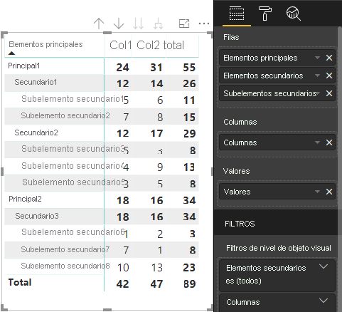

# <a name="understand-data-view-mapping-in-power-bi-visuals"></a><span data-ttu-id="1388a-103">Información sobre las asignaciones de vistas de datos en objetos visuales de Power BI</span><span class="sxs-lookup"><span data-stu-id="1388a-103">Understand data view mapping in Power BI visuals</span></span>

<span data-ttu-id="1388a-104">En este artículo se explica la asignación de vista de datos, se describe cómo se relacionan los roles de datos entre sí y le permite especificar requisitos condicionales para estos.</span><span class="sxs-lookup"><span data-stu-id="1388a-104">This article discusses data view mapping and describes how data roles relate to each other and allow you to specify conditional requirements for them.</span></span> <span data-ttu-id="1388a-105">En el artículo también se describe cada tipo de `dataMappings`.</span><span class="sxs-lookup"><span data-stu-id="1388a-105">The article also describes each `dataMappings` type.</span></span>

<span data-ttu-id="1388a-106">Cada asignación válida genera una vista de datos, pero actualmente solo se permite ejecutar una consulta por objeto visual.</span><span class="sxs-lookup"><span data-stu-id="1388a-106">Each valid mapping produces a data view, but we currently support performing only one query per visual.</span></span> <span data-ttu-id="1388a-107">Normalmente, solo obtiene una vista de datos,</span><span class="sxs-lookup"><span data-stu-id="1388a-107">You ordinarily get only one data view.</span></span> <span data-ttu-id="1388a-108">pero puede proporcionar varias asignaciones de datos en determinadas condiciones, lo que permite lo siguiente:</span><span class="sxs-lookup"><span data-stu-id="1388a-108">However, you can provide multiple data mappings in certain conditions, which allow:</span></span>

```json
"dataViewMappings": [
    {
        "conditions": [ ... ],
        "categorical": { ... },
        "single": { ... },
        "table": { ... },
        "matrix": { ... }
    }
]
```

<span data-ttu-id="1388a-109">Power BI solo creará una asignación a una vista de datos si la asignación válida se rellena en `dataViewMappings`.</span><span class="sxs-lookup"><span data-stu-id="1388a-109">Power BI creates a mapping to a data view if and only if the valid mapping is filled in `dataViewMappings`.</span></span>

<span data-ttu-id="1388a-110">En otras palabras, `categorical` podría definirse en `dataViewMappings`, pero otras asignaciones, como `table` o `single`, podrían no estar definidas.</span><span class="sxs-lookup"><span data-stu-id="1388a-110">In other words, `categorical` might be defined in `dataViewMappings` but other mappings, such as `table` or `single`, might not be.</span></span> <span data-ttu-id="1388a-111">Por ejemplo:</span><span class="sxs-lookup"><span data-stu-id="1388a-111">For example:</span></span>

```json
"dataViewMappings": [
    {
        "categorical": { ... }
    }
]
```

<span data-ttu-id="1388a-112">Power BI genera una vista de datos con una sola asignación `categorical`, y `table` y otras asignaciones no están definidas:</span><span class="sxs-lookup"><span data-stu-id="1388a-112">Power BI produces a data view with a single `categorical` mapping, and `table` and other mappings are undefined:</span></span>

```javascript
{
    "categorical": {
        "categories": [ ... ],
        "values": [ ... ]
    },
    "metadata": { ... }
}
```

## <a name="conditions"></a><span data-ttu-id="1388a-113">Condiciones</span><span class="sxs-lookup"><span data-stu-id="1388a-113">Conditions</span></span>

<span data-ttu-id="1388a-114">En esta sección se describen las condiciones de una asignación de datos específica.</span><span class="sxs-lookup"><span data-stu-id="1388a-114">This section describes conditions for a particular data mapping.</span></span> <span data-ttu-id="1388a-115">Puede proporcionar varios conjuntos de condiciones y, si los datos coinciden con uno de los conjuntos de condiciones descritos, el objeto visual acepta los datos como válidos.</span><span class="sxs-lookup"><span data-stu-id="1388a-115">You can provide multiple sets of conditions and, if the data matches one of the described sets of conditions, the visual accepts the data as valid.</span></span>

<span data-ttu-id="1388a-116">Actualmente, se puede especificar un valor mínimo y máximo para cada campo.</span><span class="sxs-lookup"><span data-stu-id="1388a-116">Currently, for each field, you can specify a minimum and maximum value.</span></span> <span data-ttu-id="1388a-117">El valor representa el número de campos que pueden estar enlazados a ese rol de datos.</span><span class="sxs-lookup"><span data-stu-id="1388a-117">The value represents the number of fields that can be bound to that data role.</span></span> 

> [!NOTE]
> <span data-ttu-id="1388a-118">Si se omite un rol de datos en la condición, puede tener cualquier número de campos.</span><span class="sxs-lookup"><span data-stu-id="1388a-118">If a data role is omitted in the condition, it can have any number of fields.</span></span>

### <a name="example-1"></a><span data-ttu-id="1388a-119">Ejemplo 1</span><span class="sxs-lookup"><span data-stu-id="1388a-119">Example 1</span></span>

<span data-ttu-id="1388a-120">Puede arrastrar varios campos a cada rol de datos.</span><span class="sxs-lookup"><span data-stu-id="1388a-120">You can drag multiple fields into each data role.</span></span> <span data-ttu-id="1388a-121">En este ejemplo, limitará la categoría a un campo de datos y la medida a dos campos de datos.</span><span class="sxs-lookup"><span data-stu-id="1388a-121">In this example, you limit the category to one data field and the measure to two data fields.</span></span>

```json
"conditions": [
    { "category": { "max": 1 }, "y": { "max": 2 } },
]
```

### <a name="example-2"></a><span data-ttu-id="1388a-122">Ejemplo 2</span><span class="sxs-lookup"><span data-stu-id="1388a-122">Example 2</span></span>

<span data-ttu-id="1388a-123">En este ejemplo, se necesita una de estas dos condiciones:</span><span class="sxs-lookup"><span data-stu-id="1388a-123">In this example, either of two conditions is required:</span></span>
* <span data-ttu-id="1388a-124">Exactamente un campo de datos de categoría y exactamente dos medidas.</span><span class="sxs-lookup"><span data-stu-id="1388a-124">Exactly one category data field and exactly two measures</span></span>
* <span data-ttu-id="1388a-125">Exactamente dos categorías y exactamente una medida.</span><span class="sxs-lookup"><span data-stu-id="1388a-125">Exactly two categories and exactly one measure.</span></span>

```json
"conditions": [
    { "category": { "min": 1, "max": 1 }, "measure": { "min": 2, "max": 2 } },
    { "category": { "min": 2, "max": 2 }, "measure": { "min": 1, "max": 1 } }
]
```

## <a name="single-data-mapping"></a><span data-ttu-id="1388a-126">Asignación de datos única</span><span class="sxs-lookup"><span data-stu-id="1388a-126">Single data mapping</span></span>

<span data-ttu-id="1388a-127">La asignación de datos única es la forma más simple de asignación de datos.</span><span class="sxs-lookup"><span data-stu-id="1388a-127">Single data mapping is the simplest form of data mapping.</span></span> <span data-ttu-id="1388a-128">Admite un solo campo de medida y proporciona el total.</span><span class="sxs-lookup"><span data-stu-id="1388a-128">It accepts a single measure field and gives you the total.</span></span> <span data-ttu-id="1388a-129">Si el campo es numérico, proporciona la suma.</span><span class="sxs-lookup"><span data-stu-id="1388a-129">If the field is numeric, it gives you the sum.</span></span> <span data-ttu-id="1388a-130">De lo contrario, proporciona un recuento de valores únicos.</span><span class="sxs-lookup"><span data-stu-id="1388a-130">Otherwise, it gives you a count of unique values.</span></span>

<span data-ttu-id="1388a-131">Para usar la asignación de datos única, es necesario definir el nombre del rol de datos que quiera asignar.</span><span class="sxs-lookup"><span data-stu-id="1388a-131">To use single data mapping, you need to define the name of the data role that you want to map.</span></span> <span data-ttu-id="1388a-132">Esta asignación solo funciona con un único campo de medida.</span><span class="sxs-lookup"><span data-stu-id="1388a-132">This mapping works only with a single measure field.</span></span> <span data-ttu-id="1388a-133">Si se asigna un segundo campo, no se genera ninguna vista de datos, por lo que también es recomendable incluir una condición que limite los datos a un solo campo.</span><span class="sxs-lookup"><span data-stu-id="1388a-133">If a second field is assigned, no data view is generated, so it's also a good practice to include a condition that limits the data to a single field.</span></span>

> [!NOTE]
> <span data-ttu-id="1388a-134">Esta asignación de datos no se puede usar con ninguna otra asignación de datos.</span><span class="sxs-lookup"><span data-stu-id="1388a-134">This data mapping can't be used in conjunction with any other data mapping.</span></span> <span data-ttu-id="1388a-135">Su objetivo es reducir los datos a un único valor numérico.</span><span class="sxs-lookup"><span data-stu-id="1388a-135">It's meant to reduce data into a single numeric value.</span></span>

### <a name="example-3"></a><span data-ttu-id="1388a-136">Ejemplo 3</span><span class="sxs-lookup"><span data-stu-id="1388a-136">Example 3</span></span>

```json
"dataViewMappings": {
    "conditions": [
        { "Y": { "max": 1 } }
    ],
    "single": {
        "role": "Y"
    }
}  
```

<span data-ttu-id="1388a-137">La vista de datos resultante sigue conteniendo los otros tipos (tabla, categórico, etc.), pero cada asignación solo contiene el valor único.</span><span class="sxs-lookup"><span data-stu-id="1388a-137">The resulting data view still contains the other types (table, categorical, and so on), but each mapping contains only the single value.</span></span> <span data-ttu-id="1388a-138">El procedimiento recomendado es acceder solo al valor único.</span><span class="sxs-lookup"><span data-stu-id="1388a-138">The best practice is to access the value only in single.</span></span>

```JSON
{
    "dataView": [
        {
            "metadata": null,
            "categorical": null,
            "matrix": null,
            "table": null,
            "tree": null,
            "single": {
                "value": 94163140.3560001
            }
        }
    ]
}
```

## <a name="categorical-data-mapping"></a><span data-ttu-id="1388a-139">Asignación de datos categóricos</span><span class="sxs-lookup"><span data-stu-id="1388a-139">Categorical data mapping</span></span>

<span data-ttu-id="1388a-140">La asignación de datos categóricos se usa para obtener una o dos agrupaciones de datos independientes.</span><span class="sxs-lookup"><span data-stu-id="1388a-140">Categorical data mapping is used to get one or two independent groupings of data.</span></span>

### <a name="example-4"></a><span data-ttu-id="1388a-141">Ejemplo 4</span><span class="sxs-lookup"><span data-stu-id="1388a-141">Example 4</span></span>

<span data-ttu-id="1388a-142">Esta es la definición del ejemplo anterior de los roles de datos:</span><span class="sxs-lookup"><span data-stu-id="1388a-142">Here is the definition from the previous example for data roles:</span></span>

```json
"dataRole":[
    {
        "displayName": "Category",
        "name": "category",
        "kind": "Grouping"
    },
    {
        "displayName": "Y Axis",
        "name": "measure",
        "kind": "Measure"
    }
]
```

<span data-ttu-id="1388a-143">Esta es la asignación:</span><span class="sxs-lookup"><span data-stu-id="1388a-143">Here is the mapping:</span></span>

```json
"dataViewMappings": {
    "categorical": {
        "categories": {
            "for": { "in": "category" }
        },
        "values": {
            "select": [
                { "bind": { "to": "measure" } }
            ]
        }
    }
}
```

<span data-ttu-id="1388a-144">Es un ejemplo sencillo.</span><span class="sxs-lookup"><span data-stu-id="1388a-144">It's a simple example.</span></span> <span data-ttu-id="1388a-145">Dice lo siguiente: "Quiero asignar mi rol de datos `category` para que, en todos los campos que arrastre a `category`, sus datos se asignen a `categorical.categories`.</span><span class="sxs-lookup"><span data-stu-id="1388a-145">It reads "Map my `category` data role so that for every field I drag into `category`, its data is mapped to `categorical.categories`.</span></span> <span data-ttu-id="1388a-146">Además, también quiero asignar mi rol de datos `measure` a `categorical.values`".</span><span class="sxs-lookup"><span data-stu-id="1388a-146">Also map my `measure` data role to `categorical.values`."</span></span>

* <span data-ttu-id="1388a-147">**for...in**: quiero que se incluyan en la consulta de datos todos los elementos de este rol de datos.</span><span class="sxs-lookup"><span data-stu-id="1388a-147">**for...in**: For all the items in this data role, include them in the data query.</span></span>
* <span data-ttu-id="1388a-148">**bind...to**: produce el mismo resultado que *for...in*, pero espera que el rol de datos tenga una condición que lo restrinja a un único campo.</span><span class="sxs-lookup"><span data-stu-id="1388a-148">**bind...to**: Produces the same result as in *for...in*, but expects that the data role will have a condition restricting it to a single field.</span></span>

### <a name="example-5"></a><span data-ttu-id="1388a-149">Ejemplo 5</span><span class="sxs-lookup"><span data-stu-id="1388a-149">Example 5</span></span>

<span data-ttu-id="1388a-150">En este ejemplo, se usan los dos primeros roles de datos del ejemplo anterior y, además, se definen `grouping` y `measure2`.</span><span class="sxs-lookup"><span data-stu-id="1388a-150">This example uses the first two data roles from the previous example and additionally defines `grouping` and `measure2`.</span></span>

```json
"dataRole":[
    {
        "displayName": "Category",
        "name": "category",
        "kind": "Grouping"
    },
    {
        "displayName": "Y Axis",
        "name": "measure",
        "kind": "Measure"
    },
    {
        "displayName": "Grouping with",
        "name": "grouping",
        "kind": "Grouping"
    },
    {
        "displayName": "X Axis",
        "name": "measure2",
        "kind": "Grouping"
    }
]
```

<span data-ttu-id="1388a-151">Esta es la asignación:</span><span class="sxs-lookup"><span data-stu-id="1388a-151">Here is the mapping:</span></span>

```json
"dataViewMappings":{
    "categorical": {
        "categories": {
            "for": { "in": "category" }
        },
        "values": {
            "group": {
                "by": "grouping",
                "select":[
                    { "bind": { "to": "measure" } },
                    { "bind": { "to": "measure2" } }
                ]
            }
        }
    }
}
```

<span data-ttu-id="1388a-152">Aquí, la diferencia es la forma en que asignamos valores categóricos.</span><span class="sxs-lookup"><span data-stu-id="1388a-152">Here the difference is in how we are mapping categorical.values.</span></span> <span data-ttu-id="1388a-153">Decimos lo siguiente: "Quiero asignar los roles de datos `measure` y `measure2` para que se agrupen según el rol de datos `grouping`".</span><span class="sxs-lookup"><span data-stu-id="1388a-153">We are saying that "Map my `measure` and `measure2` data roles to be grouped by the data role `grouping`."</span></span>

### <a name="example-6"></a><span data-ttu-id="1388a-154">Ejemplo 6</span><span class="sxs-lookup"><span data-stu-id="1388a-154">Example 6</span></span>

<span data-ttu-id="1388a-155">Estos son los roles de datos:</span><span class="sxs-lookup"><span data-stu-id="1388a-155">Here are the data roles:</span></span>

```json
"dataRoles": [
    {
        "displayName": "Categories",
        "name": "category",
        "kind": "Grouping"
    },
    {
        "displayName": "Measures",
        "name": "measure",
        "kind": "Measure"
    },
    {
        "displayName": "Series",
        "name": "series",
        "kind": "Measure"
    }
]
```

<span data-ttu-id="1388a-156">Esta es la asignación de vista de datos:</span><span class="sxs-lookup"><span data-stu-id="1388a-156">Here is the data view mapping:</span></span>

```json
"dataViewMappings": [
    {
        "categorical": {
            "categories": {
                "for": {
                    "in": "category"
                }
            },
            "values": {
                "group": {
                    "by": "series",
                    "select": [{
                            "for": {
                                "in": "measure"
                            }
                        }
                    ]
                }
            }
        }
    }
]
```

<span data-ttu-id="1388a-157">La vista de datos categóricos podrían visualizarse de esta forma:</span><span class="sxs-lookup"><span data-stu-id="1388a-157">The categorical data view could be visualized like this:</span></span>

| <span data-ttu-id="1388a-158">Categórico</span><span class="sxs-lookup"><span data-stu-id="1388a-158">Categorical</span></span> |  |  | | | |
|-----|-----|------|------|------|------|
| | <span data-ttu-id="1388a-159">Año</span><span class="sxs-lookup"><span data-stu-id="1388a-159">Year</span></span> | <span data-ttu-id="1388a-160">2013</span><span class="sxs-lookup"><span data-stu-id="1388a-160">2013</span></span> | <span data-ttu-id="1388a-161">2014</span><span class="sxs-lookup"><span data-stu-id="1388a-161">2014</span></span> | <span data-ttu-id="1388a-162">2015</span><span class="sxs-lookup"><span data-stu-id="1388a-162">2015</span></span> | <span data-ttu-id="1388a-163">2016</span><span class="sxs-lookup"><span data-stu-id="1388a-163">2016</span></span> |
| <span data-ttu-id="1388a-164">País</span><span class="sxs-lookup"><span data-stu-id="1388a-164">Country</span></span> | | |
| <span data-ttu-id="1388a-165">EE. UU.</span><span class="sxs-lookup"><span data-stu-id="1388a-165">USA</span></span> | | <span data-ttu-id="1388a-166">x</span><span class="sxs-lookup"><span data-stu-id="1388a-166">x</span></span> | <span data-ttu-id="1388a-167">x</span><span class="sxs-lookup"><span data-stu-id="1388a-167">x</span></span> | <span data-ttu-id="1388a-168">125</span><span class="sxs-lookup"><span data-stu-id="1388a-168">125</span></span> | <span data-ttu-id="1388a-169">100</span><span class="sxs-lookup"><span data-stu-id="1388a-169">100</span></span> |
| <span data-ttu-id="1388a-170">Canadá</span><span class="sxs-lookup"><span data-stu-id="1388a-170">Canada</span></span> | | <span data-ttu-id="1388a-171">x</span><span class="sxs-lookup"><span data-stu-id="1388a-171">x</span></span> | <span data-ttu-id="1388a-172">50</span><span class="sxs-lookup"><span data-stu-id="1388a-172">50</span></span> | <span data-ttu-id="1388a-173">200</span><span class="sxs-lookup"><span data-stu-id="1388a-173">200</span></span> | <span data-ttu-id="1388a-174">x</span><span class="sxs-lookup"><span data-stu-id="1388a-174">x</span></span> |
| <span data-ttu-id="1388a-175">México</span><span class="sxs-lookup"><span data-stu-id="1388a-175">Mexico</span></span> | | <span data-ttu-id="1388a-176">300</span><span class="sxs-lookup"><span data-stu-id="1388a-176">300</span></span> | <span data-ttu-id="1388a-177">x</span><span class="sxs-lookup"><span data-stu-id="1388a-177">x</span></span> | <span data-ttu-id="1388a-178">x</span><span class="sxs-lookup"><span data-stu-id="1388a-178">x</span></span> | <span data-ttu-id="1388a-179">x</span><span class="sxs-lookup"><span data-stu-id="1388a-179">x</span></span> |
| <span data-ttu-id="1388a-180">Reino Unido</span><span class="sxs-lookup"><span data-stu-id="1388a-180">UK</span></span> | | <span data-ttu-id="1388a-181">x</span><span class="sxs-lookup"><span data-stu-id="1388a-181">x</span></span> | <span data-ttu-id="1388a-182">x</span><span class="sxs-lookup"><span data-stu-id="1388a-182">x</span></span> | <span data-ttu-id="1388a-183">75</span><span class="sxs-lookup"><span data-stu-id="1388a-183">75</span></span> | <span data-ttu-id="1388a-184">x</span><span class="sxs-lookup"><span data-stu-id="1388a-184">x</span></span> |

<span data-ttu-id="1388a-185">Power BI lo genera como la vista de datos categóricos.</span><span class="sxs-lookup"><span data-stu-id="1388a-185">Power BI produces it as the categorical data view.</span></span> <span data-ttu-id="1388a-186">Es el conjunto de categorías.</span><span class="sxs-lookup"><span data-stu-id="1388a-186">It's the set of categories.</span></span>

```JSON
{
    "categorical": {
        "categories": [
            {
                "source": {...},
                "values": [
                    "Canada",
                    "Mexico",
                    "UK",
                    "USA"
                ],
                "identity": [...],
                "identityFields": [...],
            }
        ]
    }
}
```

<span data-ttu-id="1388a-187">Cada categoría también se asigna a un conjunto de valores.</span><span class="sxs-lookup"><span data-stu-id="1388a-187">Each category maps to a set of values as well.</span></span> <span data-ttu-id="1388a-188">Cada uno de estos valores se agrupa por series, que se expresan como años.</span><span class="sxs-lookup"><span data-stu-id="1388a-188">Each of these values is grouped by series, which is expressed as years.</span></span>

<span data-ttu-id="1388a-189">Por ejemplo, las ventas de Canadá en 2013 son nulas, mientras que las ventas de Canadá en 2014 equivalen a 50.</span><span class="sxs-lookup"><span data-stu-id="1388a-189">For example, Canada sales in 2013 is null, Canada sales in 2014 is 50.</span></span>

```JSON
{
    "values": [
        {
            "source": {...},
            "values": [
                null,
                300,
                null,
                null
            ],
            "identity": [...],
        },
        {
            "source": {...},
            "values": [
                50,
                null,
                150,
                null
            ],
            "identity": [...],
        },
        {
            "source": {...},
            "values": [
                200,
                null,
                null,
                125
            ],
            "identity": [...],
        },
        {
            "source": {...},
            "values": [
                null,
                null,
                null,
                100
            ],
            "identity": [...],
        }
    ]
}
```

## <a name="table-data-mapping"></a><span data-ttu-id="1388a-190">Asignación de datos de tabla</span><span class="sxs-lookup"><span data-stu-id="1388a-190">Table data mapping</span></span>

<span data-ttu-id="1388a-191">La vista de datos de tabla es una asignación de datos sencilla.</span><span class="sxs-lookup"><span data-stu-id="1388a-191">The table data view is a simple data mapping.</span></span> <span data-ttu-id="1388a-192">Básicamente, es una lista de puntos de datos donde se pueden agregar puntos de datos numéricos.</span><span class="sxs-lookup"><span data-stu-id="1388a-192">Essentially, it's a list of data points, where numeric data points could be aggregated.</span></span>

### <a name="example-7"></a><span data-ttu-id="1388a-193">Ejemplo 7</span><span class="sxs-lookup"><span data-stu-id="1388a-193">Example 7</span></span>

<span data-ttu-id="1388a-194">Con las funciones especificadas:</span><span class="sxs-lookup"><span data-stu-id="1388a-194">With the given capabilities:</span></span>

```json
"dataRoles": [
    {
        "displayName": "Values",
        "name": "values",
        "kind": "Measure"
    }
]
```

```json
"dataViewMappings": [
    {
        "table": {
            "rows": {
                "for": {
                    "in": "values"
                }
            }
        }
    }
]
```

<span data-ttu-id="1388a-195">Puede visualizar la vista de datos de tabla como se muestra a continuación:</span><span class="sxs-lookup"><span data-stu-id="1388a-195">You can visualize the table data view as the following:</span></span>  

| <span data-ttu-id="1388a-196">País</span><span class="sxs-lookup"><span data-stu-id="1388a-196">Country</span></span>| <span data-ttu-id="1388a-197">Año</span><span class="sxs-lookup"><span data-stu-id="1388a-197">Year</span></span> | <span data-ttu-id="1388a-198">Ventas</span><span class="sxs-lookup"><span data-stu-id="1388a-198">Sales</span></span> |
|-----|-----|------|
| <span data-ttu-id="1388a-199">EE. UU.</span><span class="sxs-lookup"><span data-stu-id="1388a-199">USA</span></span> | <span data-ttu-id="1388a-200">2016</span><span class="sxs-lookup"><span data-stu-id="1388a-200">2016</span></span> | <span data-ttu-id="1388a-201">100</span><span class="sxs-lookup"><span data-stu-id="1388a-201">100</span></span> |
| <span data-ttu-id="1388a-202">EE. UU.</span><span class="sxs-lookup"><span data-stu-id="1388a-202">USA</span></span> | <span data-ttu-id="1388a-203">2015</span><span class="sxs-lookup"><span data-stu-id="1388a-203">2015</span></span> | <span data-ttu-id="1388a-204">50</span><span class="sxs-lookup"><span data-stu-id="1388a-204">50</span></span> |
| <span data-ttu-id="1388a-205">Canadá</span><span class="sxs-lookup"><span data-stu-id="1388a-205">Canada</span></span> | <span data-ttu-id="1388a-206">2015</span><span class="sxs-lookup"><span data-stu-id="1388a-206">2015</span></span> | <span data-ttu-id="1388a-207">200</span><span class="sxs-lookup"><span data-stu-id="1388a-207">200</span></span> |
| <span data-ttu-id="1388a-208">Canadá</span><span class="sxs-lookup"><span data-stu-id="1388a-208">Canada</span></span> | <span data-ttu-id="1388a-209">2015</span><span class="sxs-lookup"><span data-stu-id="1388a-209">2015</span></span> | <span data-ttu-id="1388a-210">50</span><span class="sxs-lookup"><span data-stu-id="1388a-210">50</span></span> |
| <span data-ttu-id="1388a-211">México</span><span class="sxs-lookup"><span data-stu-id="1388a-211">Mexico</span></span> | <span data-ttu-id="1388a-212">2013</span><span class="sxs-lookup"><span data-stu-id="1388a-212">2013</span></span> | <span data-ttu-id="1388a-213">300</span><span class="sxs-lookup"><span data-stu-id="1388a-213">300</span></span> |
| <span data-ttu-id="1388a-214">Reino Unido</span><span class="sxs-lookup"><span data-stu-id="1388a-214">UK</span></span> | <span data-ttu-id="1388a-215">2014</span><span class="sxs-lookup"><span data-stu-id="1388a-215">2014</span></span> | <span data-ttu-id="1388a-216">150</span><span class="sxs-lookup"><span data-stu-id="1388a-216">150</span></span> |
| <span data-ttu-id="1388a-217">EE. UU.</span><span class="sxs-lookup"><span data-stu-id="1388a-217">USA</span></span> | <span data-ttu-id="1388a-218">2015</span><span class="sxs-lookup"><span data-stu-id="1388a-218">2015</span></span> | <span data-ttu-id="1388a-219">75</span><span class="sxs-lookup"><span data-stu-id="1388a-219">75</span></span> |

<span data-ttu-id="1388a-220">Power BI muestra los datos como la vista de datos de tabla.</span><span class="sxs-lookup"><span data-stu-id="1388a-220">Power BI displays your data as the table data view.</span></span> <span data-ttu-id="1388a-221">No debe asumir que los datos están ordenados.</span><span class="sxs-lookup"><span data-stu-id="1388a-221">You shouldn't assume that the data is ordered.</span></span>

```JSON
{
    "table" : {
        "columns": [...],
        "rows": [
            [
                "Canada",
                2014,
                50
            ],
            [
                "Canada",
                2015,
                200
            ],
            [
                "Mexico",
                2013,
                300
            ],
            [
                "UK",
                2014,
                150
            ],
            [
                "USA",
                2015,
                100
            ],
            [
                "USA",
                2015,
                75
            ],
            [
                "USA",
                2016,
                100
            ]
        ]
    }
}
```

<span data-ttu-id="1388a-222">Puede agregar los datos si selecciona el campo que quiera y después selecciona Suma.</span><span class="sxs-lookup"><span data-stu-id="1388a-222">You can aggregate the data by selecting the desired field and then selecting sum.</span></span>  


## <a name="matrix-data-mapping"></a><span data-ttu-id="1388a-224">Asignación de datos de matriz</span><span class="sxs-lookup"><span data-stu-id="1388a-224">Matrix data mapping</span></span>

<span data-ttu-id="1388a-225">La asignación de datos de matriz es similar a la asignación de datos de tabla, pero las filas se presentan jerárquicamente.</span><span class="sxs-lookup"><span data-stu-id="1388a-225">Matrix data mapping is similar to table data mapping, but the rows are presented hierarchically.</span></span> <span data-ttu-id="1388a-226">Cualquiera de los valores de los roles de datos se puede usar como un valor de encabezado de columna.</span><span class="sxs-lookup"><span data-stu-id="1388a-226">Any of the data role values can be used as a column header value.</span></span>

```json
{
    "dataRoles": [
        {
            "name": "Category",
            "displayName": "Category",
            "displayNameKey": "Visual_Category",
            "kind": "Grouping"
        },
        {
            "name": "Column",
            "displayName": "Column",
            "displayNameKey": "Visual_Column",
            "kind": "Grouping"
        },
        {
            "name": "Measure",
            "displayName": "Measure",
            "displayNameKey": "Visual_Values",
            "kind": "Measure"
        }
    ],
    "dataViewMappings": [
        {
            "matrix": {
                "rows": {
                    "for": {
                        "in": "Category"
                    }
                },
                "columns": {
                    "for": {
                        "in": "Column"
                    }
                },
                "values": {
                    "select": [
                        {
                            "for": {
                                "in": "Measure"
                            }
                        }
                    ]
                }
            }
        }
    ]
}
```

<span data-ttu-id="1388a-227">Power BI crea una estructura de datos jerárquica.</span><span class="sxs-lookup"><span data-stu-id="1388a-227">Power BI creates a hierarchical data structure.</span></span> <span data-ttu-id="1388a-228">La raíz de la jerarquía de árbol incluye los datos de la columna **Elementos principales** del rol de datos `Category`, con elementos secundarios de la columna **Elementos secundarios** de la tabla de roles de datos.</span><span class="sxs-lookup"><span data-stu-id="1388a-228">The root of the tree hierarchy includes the data from the **Parents** column of the `Category` data role, with children from the **Children** column of the data role table.</span></span>

<span data-ttu-id="1388a-229">Conjunto de datos:</span><span class="sxs-lookup"><span data-stu-id="1388a-229">Dataset:</span></span>

| <span data-ttu-id="1388a-230">Elementos principales</span><span class="sxs-lookup"><span data-stu-id="1388a-230">Parents</span></span> | <span data-ttu-id="1388a-231">Elementos secundarios</span><span class="sxs-lookup"><span data-stu-id="1388a-231">Children</span></span> | <span data-ttu-id="1388a-232">Elementos descendientes del secundario</span><span class="sxs-lookup"><span data-stu-id="1388a-232">Grandchildren</span></span> | <span data-ttu-id="1388a-233">Columnas</span><span class="sxs-lookup"><span data-stu-id="1388a-233">Columns</span></span> | <span data-ttu-id="1388a-234">Valores</span><span class="sxs-lookup"><span data-stu-id="1388a-234">Values</span></span> |
|-----|-----|------|-------|-------|
| <span data-ttu-id="1388a-235">Principal1</span><span class="sxs-lookup"><span data-stu-id="1388a-235">Parent1</span></span> | <span data-ttu-id="1388a-236">Secundario1</span><span class="sxs-lookup"><span data-stu-id="1388a-236">Child1</span></span> | <span data-ttu-id="1388a-237">Subelemento secundario1</span><span class="sxs-lookup"><span data-stu-id="1388a-237">Grand child1</span></span> | <span data-ttu-id="1388a-238">Col1</span><span class="sxs-lookup"><span data-stu-id="1388a-238">Col1</span></span> | <span data-ttu-id="1388a-239">5</span><span class="sxs-lookup"><span data-stu-id="1388a-239">5</span></span> |
| <span data-ttu-id="1388a-240">Principal1</span><span class="sxs-lookup"><span data-stu-id="1388a-240">Parent1</span></span> | <span data-ttu-id="1388a-241">Secundario1</span><span class="sxs-lookup"><span data-stu-id="1388a-241">Child1</span></span> | <span data-ttu-id="1388a-242">Subelemento secundario1</span><span class="sxs-lookup"><span data-stu-id="1388a-242">Grand child1</span></span> | <span data-ttu-id="1388a-243">Col2</span><span class="sxs-lookup"><span data-stu-id="1388a-243">Col2</span></span> | <span data-ttu-id="1388a-244">6</span><span class="sxs-lookup"><span data-stu-id="1388a-244">6</span></span> |
| <span data-ttu-id="1388a-245">Principal1</span><span class="sxs-lookup"><span data-stu-id="1388a-245">Parent1</span></span> | <span data-ttu-id="1388a-246">Secundario1</span><span class="sxs-lookup"><span data-stu-id="1388a-246">Child1</span></span> | <span data-ttu-id="1388a-247">Subelemento secundario2</span><span class="sxs-lookup"><span data-stu-id="1388a-247">Grand child2</span></span> | <span data-ttu-id="1388a-248">Col1</span><span class="sxs-lookup"><span data-stu-id="1388a-248">Col1</span></span> | <span data-ttu-id="1388a-249">7</span><span class="sxs-lookup"><span data-stu-id="1388a-249">7</span></span> |
| <span data-ttu-id="1388a-250">Principal1</span><span class="sxs-lookup"><span data-stu-id="1388a-250">Parent1</span></span> | <span data-ttu-id="1388a-251">Secundario1</span><span class="sxs-lookup"><span data-stu-id="1388a-251">Child1</span></span> | <span data-ttu-id="1388a-252">Subelemento secundario2</span><span class="sxs-lookup"><span data-stu-id="1388a-252">Grand child2</span></span> | <span data-ttu-id="1388a-253">Col2</span><span class="sxs-lookup"><span data-stu-id="1388a-253">Col2</span></span> | <span data-ttu-id="1388a-254">8</span><span class="sxs-lookup"><span data-stu-id="1388a-254">8</span></span> |
| <span data-ttu-id="1388a-255">Principal1</span><span class="sxs-lookup"><span data-stu-id="1388a-255">Parent1</span></span> | <span data-ttu-id="1388a-256">Secundario2</span><span class="sxs-lookup"><span data-stu-id="1388a-256">Child2</span></span> | <span data-ttu-id="1388a-257">Subelemento secundario3</span><span class="sxs-lookup"><span data-stu-id="1388a-257">Grand child3</span></span> | <span data-ttu-id="1388a-258">Col1</span><span class="sxs-lookup"><span data-stu-id="1388a-258">Col1</span></span> | <span data-ttu-id="1388a-259">5</span><span class="sxs-lookup"><span data-stu-id="1388a-259">5</span></span> |
| <span data-ttu-id="1388a-260">Principal1</span><span class="sxs-lookup"><span data-stu-id="1388a-260">Parent1</span></span> | <span data-ttu-id="1388a-261">Secundario2</span><span class="sxs-lookup"><span data-stu-id="1388a-261">Child2</span></span> | <span data-ttu-id="1388a-262">Subelemento secundario3</span><span class="sxs-lookup"><span data-stu-id="1388a-262">Grand child3</span></span> | <span data-ttu-id="1388a-263">Col2</span><span class="sxs-lookup"><span data-stu-id="1388a-263">Col2</span></span> | <span data-ttu-id="1388a-264">3</span><span class="sxs-lookup"><span data-stu-id="1388a-264">3</span></span> |
| <span data-ttu-id="1388a-265">Principal1</span><span class="sxs-lookup"><span data-stu-id="1388a-265">Parent1</span></span> | <span data-ttu-id="1388a-266">Secundario2</span><span class="sxs-lookup"><span data-stu-id="1388a-266">Child2</span></span> | <span data-ttu-id="1388a-267">Subelemento secundario4</span><span class="sxs-lookup"><span data-stu-id="1388a-267">Grand child4</span></span> | <span data-ttu-id="1388a-268">Col1</span><span class="sxs-lookup"><span data-stu-id="1388a-268">Col1</span></span> | <span data-ttu-id="1388a-269">4</span><span class="sxs-lookup"><span data-stu-id="1388a-269">4</span></span> |
| <span data-ttu-id="1388a-270">Principal1</span><span class="sxs-lookup"><span data-stu-id="1388a-270">Parent1</span></span> | <span data-ttu-id="1388a-271">Secundario2</span><span class="sxs-lookup"><span data-stu-id="1388a-271">Child2</span></span> | <span data-ttu-id="1388a-272">Subelemento secundario4</span><span class="sxs-lookup"><span data-stu-id="1388a-272">Grand child4</span></span> | <span data-ttu-id="1388a-273">Col2</span><span class="sxs-lookup"><span data-stu-id="1388a-273">Col2</span></span> | <span data-ttu-id="1388a-274">9</span><span class="sxs-lookup"><span data-stu-id="1388a-274">9</span></span> |
| <span data-ttu-id="1388a-275">Principal1</span><span class="sxs-lookup"><span data-stu-id="1388a-275">Parent1</span></span> | <span data-ttu-id="1388a-276">Secundario2</span><span class="sxs-lookup"><span data-stu-id="1388a-276">Child2</span></span> | <span data-ttu-id="1388a-277">Subelemento secundario5</span><span class="sxs-lookup"><span data-stu-id="1388a-277">Grand child5</span></span> | <span data-ttu-id="1388a-278">Col1</span><span class="sxs-lookup"><span data-stu-id="1388a-278">Col1</span></span> | <span data-ttu-id="1388a-279">3</span><span class="sxs-lookup"><span data-stu-id="1388a-279">3</span></span> |
| <span data-ttu-id="1388a-280">Principal1</span><span class="sxs-lookup"><span data-stu-id="1388a-280">Parent1</span></span> | <span data-ttu-id="1388a-281">Secundario2</span><span class="sxs-lookup"><span data-stu-id="1388a-281">Child2</span></span> | <span data-ttu-id="1388a-282">Subelemento secundario5</span><span class="sxs-lookup"><span data-stu-id="1388a-282">Grand child5</span></span> | <span data-ttu-id="1388a-283">Col2</span><span class="sxs-lookup"><span data-stu-id="1388a-283">Col2</span></span> | <span data-ttu-id="1388a-284">5</span><span class="sxs-lookup"><span data-stu-id="1388a-284">5</span></span> |
| <span data-ttu-id="1388a-285">Principal2</span><span class="sxs-lookup"><span data-stu-id="1388a-285">Parent2</span></span> | <span data-ttu-id="1388a-286">Secundario3</span><span class="sxs-lookup"><span data-stu-id="1388a-286">Child3</span></span> | <span data-ttu-id="1388a-287">Subelemento secundario6</span><span class="sxs-lookup"><span data-stu-id="1388a-287">Grand child6</span></span> | <span data-ttu-id="1388a-288">Col1</span><span class="sxs-lookup"><span data-stu-id="1388a-288">Col1</span></span> | <span data-ttu-id="1388a-289">1</span><span class="sxs-lookup"><span data-stu-id="1388a-289">1</span></span> |
| <span data-ttu-id="1388a-290">Principal2</span><span class="sxs-lookup"><span data-stu-id="1388a-290">Parent2</span></span> | <span data-ttu-id="1388a-291">Secundario3</span><span class="sxs-lookup"><span data-stu-id="1388a-291">Child3</span></span> | <span data-ttu-id="1388a-292">Subelemento secundario6</span><span class="sxs-lookup"><span data-stu-id="1388a-292">Grand child6</span></span> | <span data-ttu-id="1388a-293">Col2</span><span class="sxs-lookup"><span data-stu-id="1388a-293">Col2</span></span> | <span data-ttu-id="1388a-294">2</span><span class="sxs-lookup"><span data-stu-id="1388a-294">2</span></span> |
| <span data-ttu-id="1388a-295">Principal2</span><span class="sxs-lookup"><span data-stu-id="1388a-295">Parent2</span></span> | <span data-ttu-id="1388a-296">Secundario3</span><span class="sxs-lookup"><span data-stu-id="1388a-296">Child3</span></span> | <span data-ttu-id="1388a-297">Subelemento secundario7</span><span class="sxs-lookup"><span data-stu-id="1388a-297">Grand child7</span></span> | <span data-ttu-id="1388a-298">Col1</span><span class="sxs-lookup"><span data-stu-id="1388a-298">Col1</span></span> | <span data-ttu-id="1388a-299">7</span><span class="sxs-lookup"><span data-stu-id="1388a-299">7</span></span> |
| <span data-ttu-id="1388a-300">Principal2</span><span class="sxs-lookup"><span data-stu-id="1388a-300">Parent2</span></span> | <span data-ttu-id="1388a-301">Secundario3</span><span class="sxs-lookup"><span data-stu-id="1388a-301">Child3</span></span> | <span data-ttu-id="1388a-302">Subelemento secundario7</span><span class="sxs-lookup"><span data-stu-id="1388a-302">Grand child7</span></span> | <span data-ttu-id="1388a-303">Col2</span><span class="sxs-lookup"><span data-stu-id="1388a-303">Col2</span></span> | <span data-ttu-id="1388a-304">1</span><span class="sxs-lookup"><span data-stu-id="1388a-304">1</span></span> |
| <span data-ttu-id="1388a-305">Principal2</span><span class="sxs-lookup"><span data-stu-id="1388a-305">Parent2</span></span> | <span data-ttu-id="1388a-306">Secundario3</span><span class="sxs-lookup"><span data-stu-id="1388a-306">Child3</span></span> | <span data-ttu-id="1388a-307">Subelemento secundario8</span><span class="sxs-lookup"><span data-stu-id="1388a-307">Grand child8</span></span> | <span data-ttu-id="1388a-308">Col1</span><span class="sxs-lookup"><span data-stu-id="1388a-308">Col1</span></span> | <span data-ttu-id="1388a-309">10</span><span class="sxs-lookup"><span data-stu-id="1388a-309">10</span></span> |
| <span data-ttu-id="1388a-310">Principal2</span><span class="sxs-lookup"><span data-stu-id="1388a-310">Parent2</span></span> | <span data-ttu-id="1388a-311">Secundario3</span><span class="sxs-lookup"><span data-stu-id="1388a-311">Child3</span></span> | <span data-ttu-id="1388a-312">Subelemento secundario8</span><span class="sxs-lookup"><span data-stu-id="1388a-312">Grand child8</span></span> | <span data-ttu-id="1388a-313">Col2</span><span class="sxs-lookup"><span data-stu-id="1388a-313">Col2</span></span> | <span data-ttu-id="1388a-314">13</span><span class="sxs-lookup"><span data-stu-id="1388a-314">13</span></span> |

<span data-ttu-id="1388a-315">El objeto visual de la matriz principal de Power BI representa los datos como una tabla.</span><span class="sxs-lookup"><span data-stu-id="1388a-315">The core matrix visual of Power BI renders the data as a table.</span></span>



<span data-ttu-id="1388a-317">El objeto visual obtiene su estructura de datos tal y como se describe en el código siguiente (aquí solo se muestran las dos primeras filas de la tabla):</span><span class="sxs-lookup"><span data-stu-id="1388a-317">The visual gets its data structure as described in the following code (only the first two table rows are shown here):</span></span>

```json
{
    "metadata": {...},
    "matrix": {
        "rows": {
            "levels": [...],
            "root": {
                "childIdentityFields": [...],
                "children": [
                    {
                        "level": 0,
                        "levelValues": [...],
                        "value": "Parent1",
                        "identity": {...},
                        "childIdentityFields": [...],
                        "children": [
                            {
                                "level": 1,
                                "levelValues": [...],
                                "value": "Child1",
                                "identity": {...},
                                "childIdentityFields": [...],
                                "children": [
                                    {
                                        "level": 2,
                                        "levelValues": [...],
                                        "value": "Grand child1",
                                        "identity": {...},
                                        "values": {
                                            "0": {
                                                "value": 5 // value for Col1
                                            },
                                            "1": {
                                                "value": 6 // value for Col2
                                            }
                                        }
                                    },
                                    ...
                                ]
                            },
                            ...
                        ]
                    },
                    ...
                ]
            }
        },
        "columns": {
            "levels": [...],
            "root": {
                "childIdentityFields": [...],
                "children": [
                    {
                        "level": 0,
                        "levelValues": [...],
                        "value": "Col1",
                        "identity": {...}
                    },
                    {
                        "level": 0,
                        "levelValues": [...],
                        "value": "Col2",
                        "identity": {...}
                    },
                    ...
                ]
            }
        },
        "valueSources": [...]
    }
}
```

## <a name="data-reduction-algorithm"></a><span data-ttu-id="1388a-318">Algoritmo de reducción de datos</span><span class="sxs-lookup"><span data-stu-id="1388a-318">Data reduction algorithm</span></span>

<span data-ttu-id="1388a-319">Para controlar la cantidad de datos que se van a recibir en la vista de datos, puede aplicar un algoritmo de reducción de datos.</span><span class="sxs-lookup"><span data-stu-id="1388a-319">To control the amount of data to receive in the data view, you can apply a data reduction algorithm.</span></span>

<span data-ttu-id="1388a-320">De manera predeterminada, todos los objetos visuales de Power BI tienen aplicado el algoritmo de reducción de datos principal con el valor de *count* establecido en 1000 puntos de datos.</span><span class="sxs-lookup"><span data-stu-id="1388a-320">By default, all Power BI visuals have the top data reduction algorithm applied with the *count* set to 1000 data points.</span></span> <span data-ttu-id="1388a-321">Esto equivale a establecer las siguientes propiedades en el archivo *capabilities.json*:</span><span class="sxs-lookup"><span data-stu-id="1388a-321">It's the same as setting the following properties in the *capabilities.json* file:</span></span>

```json
"dataReductionAlgorithm": {
    "top": {
        "count": 1000
    }
}
```

<span data-ttu-id="1388a-322">Puede modificar el valor de *count* por cualquier valor entero hasta 30 000.</span><span class="sxs-lookup"><span data-stu-id="1388a-322">You can modify the *count* value to any integer value up to 30000.</span></span> <span data-ttu-id="1388a-323">Los objetos visuales de Power BI basados en R admiten hasta 150 000 filas.</span><span class="sxs-lookup"><span data-stu-id="1388a-323">R-based Power BI visuals can support up to 150000 rows.</span></span>

## <a name="data-reduction-algorithm-types"></a><span data-ttu-id="1388a-324">Tipos de algoritmos de reducción de datos</span><span class="sxs-lookup"><span data-stu-id="1388a-324">Data reduction algorithm types</span></span>

<span data-ttu-id="1388a-325">Hay cuatro tipos de valores del algoritmo de reducción de datos:</span><span class="sxs-lookup"><span data-stu-id="1388a-325">There are four types of data reduction algorithm settings:</span></span>

* <span data-ttu-id="1388a-326">`top`: si quiere limitar los datos a los valores obtenidos de la parte superior del conjunto de datos.</span><span class="sxs-lookup"><span data-stu-id="1388a-326">`top`: If you want to limit the data to values taken from the top of the dataset.</span></span> <span data-ttu-id="1388a-327">Los primeros valores superiores de *count* se obtendrán del conjunto de datos.</span><span class="sxs-lookup"><span data-stu-id="1388a-327">The top first *count* values will be taken from the dataset.</span></span>
* <span data-ttu-id="1388a-328">`bottom`: si quiere limitar los datos a valores obtenidos de la parte inferior del conjunto de datos.</span><span class="sxs-lookup"><span data-stu-id="1388a-328">`bottom`: If you want to limit the data to values taken from the bottom of the dataset.</span></span> <span data-ttu-id="1388a-329">Los últimos valores de "count" se obtendrán del conjunto de datos.</span><span class="sxs-lookup"><span data-stu-id="1388a-329">The last "count" values will be taken from the dataset.</span></span>
* <span data-ttu-id="1388a-330">`sample`: reduzca el conjunto de datos mediante un sencillo algoritmo de muestreo limitado a un número de elementos de *count*.</span><span class="sxs-lookup"><span data-stu-id="1388a-330">`sample`: Reduce the dataset by a simple sampling algorithm, limited to a *count* number of items.</span></span> <span data-ttu-id="1388a-331">Esto significa que se incluyen el primer y último elemento, y un número de elementos de *count* que tienen intervalos iguales entre ellos.</span><span class="sxs-lookup"><span data-stu-id="1388a-331">It means that the first and last items are included, and a *count* number of items have equal intervals between them.</span></span>
<span data-ttu-id="1388a-332">Por ejemplo, si tiene un conjunto de datos [0, 1, 2 … 100] y un valor de *count* de 9, recibirá los valores [0, 10, 20 ... 100].</span><span class="sxs-lookup"><span data-stu-id="1388a-332">For example, if you have a dataset [0, 1, 2, ... 100] and a *count* of 9,  you'll receive the values [0, 10, 20 ... 100].</span></span>
* <span data-ttu-id="1388a-333">`window`: carga una *ventana* de puntos de datos que contiene elementos de *count*.</span><span class="sxs-lookup"><span data-stu-id="1388a-333">`window`: Loads one *window* of data points at a time containing *count* elements.</span></span> <span data-ttu-id="1388a-334">Actualmente, `top` y `window` son equivalentes.</span><span class="sxs-lookup"><span data-stu-id="1388a-334">Currently, `top` and `window` are equivalent.</span></span> <span data-ttu-id="1388a-335">Estamos trabajando para admitir totalmente una configuración basada en ventanas.</span><span class="sxs-lookup"><span data-stu-id="1388a-335">We are working toward fully supporting a windowing setting.</span></span>

## <a name="data-reduction-algorithm-usage"></a><span data-ttu-id="1388a-336">Uso de algoritmos de reducción de datos</span><span class="sxs-lookup"><span data-stu-id="1388a-336">Data reduction algorithm usage</span></span>

<span data-ttu-id="1388a-337">El algoritmo de reducción de datos se puede usar en una asignación de vista de datos de matriz, de tabla o categóricos.</span><span class="sxs-lookup"><span data-stu-id="1388a-337">The data reduction algorithm can be used in categorical, table, or matrix data view mapping.</span></span>

<span data-ttu-id="1388a-338">Puede establecer el algoritmo en `categories` o en una sección de grupo de `values` para la asignación de datos categóricos.</span><span class="sxs-lookup"><span data-stu-id="1388a-338">You can set the algorithm into `categories` and/or group section of `values` for categorical data mapping.</span></span>

### <a name="example-8"></a><span data-ttu-id="1388a-339">Ejemplo 8</span><span class="sxs-lookup"><span data-stu-id="1388a-339">Example 8</span></span>

```json
"dataViewMappings": {
    "categorical": {
        "categories": {
            "for": { "in": "category" },
            "dataReductionAlgorithm": {
                "window": {
                    "count": 300
                }
            }  
        },
        "values": {
            "group": {
                "by": "series",
                "select": [{
                        "for": {
                            "in": "measure"
                        }
                    }
                ],
                "dataReductionAlgorithm": {
                    "top": {
                        "count": 100
                    }
                }  
            }
        }
    }
}
```

<span data-ttu-id="1388a-340">Puede aplicar el algoritmo de reducción de datos a la sección `rows` de la tabla de asignación de vistas de datos.</span><span class="sxs-lookup"><span data-stu-id="1388a-340">You can apply the data reduction algorithm to the `rows` section of the Data View mapping table.</span></span>

### <a name="example-9"></a><span data-ttu-id="1388a-341">Ejemplo 9</span><span class="sxs-lookup"><span data-stu-id="1388a-341">Example 9</span></span>

```json
"dataViewMappings": [
    {
        "table": {
            "rows": {
                "for": {
                    "in": "values"
                },
                "dataReductionAlgorithm": {
                    "top": {
                        "count": 2000
                    }
                } 
            }
        }
    }
]
```

<span data-ttu-id="1388a-342">Puede aplicar el algoritmo de reducción de datos a las secciones `rows` y `columns` de la matriz de asignación de vistas de datos.</span><span class="sxs-lookup"><span data-stu-id="1388a-342">You can apply the data reduction algorithm to the `rows` and `columns` sections of the Data View mapping matrix.</span></span>
