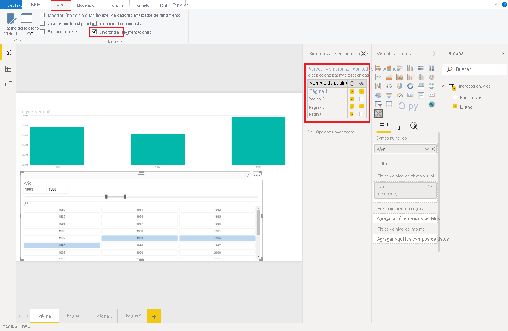

# <a name="sync-slicers-in-power-bi-visuals"></a><span data-ttu-id="ca7db-103">Segmentaciones de sincronización en objetos visuales de Power BI</span><span class="sxs-lookup"><span data-stu-id="ca7db-103">Sync slicers in Power BI visuals</span></span>

<span data-ttu-id="ca7db-104">Para admitir la característica [Segmentaciones de sincronización](https://docs.microsoft.com/power-bi/desktop-slicers), el objeto visual de segmentación personalizado debe usar la versión de API 1.13 o posterior.</span><span class="sxs-lookup"><span data-stu-id="ca7db-104">To support the [Sync Slicers](https://docs.microsoft.com/power-bi/desktop-slicers) feature, your custom slicer visual must use API version 1.13 or later.</span></span>

<span data-ttu-id="ca7db-105">Además, debe habilitar la opción en el archivo *capabilities.json*, tal y como se muestra en el código siguiente:</span><span class="sxs-lookup"><span data-stu-id="ca7db-105">Additionally, you need to enable the option in the *capabilities.json* file, as shown in the following code:</span></span>

```json
{
    ...
    "supportsHighlight": true,
    "suppressDefaultTitle": true,
    "supportsSynchronizingFilterState": true,
    "sorting": {
        "default": {}
    }
}
```

<span data-ttu-id="ca7db-106">Después de actualizar el archivo *capabilities.json*, puede ver el panel de opciones **Segmentaciones de sincronización** al seleccionar el objeto visual de segmentación personalizado.</span><span class="sxs-lookup"><span data-stu-id="ca7db-106">After you've updated the *capabilities.json* file, you can view the **Sync slicers** options pane when you select your custom slicer visual.</span></span>

> [!NOTE]
> <span data-ttu-id="ca7db-107">La característica Segmentaciones de sincronización no admite más de un campo.</span><span class="sxs-lookup"><span data-stu-id="ca7db-107">The Sync Slicers feature doesn't support more than one field.</span></span> <span data-ttu-id="ca7db-108">Si su segmentación tiene más de un campo (**Categoría** o **Medida**), la característica se deshabilita.</span><span class="sxs-lookup"><span data-stu-id="ca7db-108">If your slicer has more than one field (**Category** or **Measure**), the feature is disabled.</span></span>



<span data-ttu-id="ca7db-110">En el panel **Segmentaciones de sincronización**, puede ver que la visibilidad de la segmentación y su filtración se pueden aplicar en varias páginas del informe.</span><span class="sxs-lookup"><span data-stu-id="ca7db-110">In the **Sync slicers** pane, you can see that your slicer visibility and its filtration can be applied to several report pages.</span></span>
