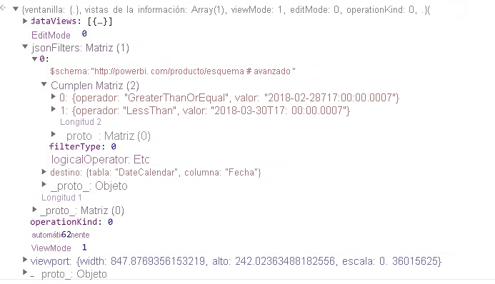

# <a name="the-visual-filters-api-in-power-bi-visuals"></a><span data-ttu-id="58a29-103">Visual Filters API en objetos visuales de Power BI</span><span class="sxs-lookup"><span data-stu-id="58a29-103">The Visual Filters API in Power BI visuals</span></span>

<span data-ttu-id="58a29-104">Visual Filters API le permite filtrar datos en objetos visuales de Power BI.</span><span class="sxs-lookup"><span data-stu-id="58a29-104">The Visual Filters API allows you to filter data in Power BI visuals.</span></span> <span data-ttu-id="58a29-105">La principal diferencia con respecto a otras selecciones es que otros objetos visuales se filtrarán de todos modos, a pesar de que otro objeto visual admita el resaltado.</span><span class="sxs-lookup"><span data-stu-id="58a29-105">The main difference from other selections is that other visuals will be filtered in any way, despite highlight support by other visual.</span></span>

<span data-ttu-id="58a29-106">Para habilitar el filtrado del objeto visual, este debe contener un objeto `filter` en la sección `general` del código de *capabilities.json*.</span><span class="sxs-lookup"><span data-stu-id="58a29-106">To enable filtering for the visual, it should contain a `filter` object in the `general` section of *capabilities.json* code.</span></span>

```json
"objects": {
        "general": {
            "displayName": "General",
            "displayNameKey": "formattingGeneral",
            "properties": {
                "filter": {
                    "type": {
                        "filter": true
                    }
                }
            }
        }
    }
```

<span data-ttu-id="58a29-107">Las interfaces de Visual Filters API están disponibles en el paquete [powerbi-models](https://www.npmjs.com/package/powerbi-models).</span><span class="sxs-lookup"><span data-stu-id="58a29-107">Visual Filters API interfaces are available in the [powerbi-models](https://www.npmjs.com/package/powerbi-models) package.</span></span> <span data-ttu-id="58a29-108">El paquete también contiene clases para crear instancias de filtro.</span><span class="sxs-lookup"><span data-stu-id="58a29-108">The package also contains classes to create filter instances.</span></span>

```cmd
npm install powerbi-models --save
```

<span data-ttu-id="58a29-109">Si usa una versión antigua (anterior a la 3.x.x) de las herramientas, debe incluir `powerbi-models` en el paquete de objetos visuales.</span><span class="sxs-lookup"><span data-stu-id="58a29-109">If you use an older (earlier than 3.x.x) version of the tools, you should include `powerbi-models` in the visuals package.</span></span> <span data-ttu-id="58a29-110">Para obtener más información, vea la guía breve [Adición de Advanced Filter API al objeto visual personalizado](https://github.com/Microsoft/powerbi-visuals-sampleslicer/blob/master/doc/AddingAdvancedFilterAPI.md).</span><span class="sxs-lookup"><span data-stu-id="58a29-110">For more information, see the short guide, [Add the Advanced Filter API to the custom visual](https://github.com/Microsoft/powerbi-visuals-sampleslicer/blob/master/doc/AddingAdvancedFilterAPI.md).</span></span>

<span data-ttu-id="58a29-111">Todos los filtros amplían la interfaz de `IFilter`, como se muestra en el código siguiente:</span><span class="sxs-lookup"><span data-stu-id="58a29-111">All filters extend the `IFilter` interface, as shown in the following code:</span></span>

```typescript
export interface IFilter {
    $schema: string;
    target: IFilterTarget;
}
```
<span data-ttu-id="58a29-112">Donde:</span><span class="sxs-lookup"><span data-stu-id="58a29-112">Where:</span></span>
* <span data-ttu-id="58a29-113">`target` es la columna de la tabla en el origen de datos.</span><span class="sxs-lookup"><span data-stu-id="58a29-113">`target` is the table column on the data source.</span></span>

## <a name="the-basic-filter-api"></a><span data-ttu-id="58a29-114">Basic Filter API</span><span class="sxs-lookup"><span data-stu-id="58a29-114">The Basic Filter API</span></span>

<span data-ttu-id="58a29-115">En el código siguiente se muestra la interfaz de filtro básica:</span><span class="sxs-lookup"><span data-stu-id="58a29-115">Basic filter interface is shown in the following code:</span></span>

```typescript
export interface IBasicFilter extends IFilter {
    operator: BasicFilterOperators;
    values: (string | number | boolean)[];
}
```

<span data-ttu-id="58a29-116">Donde:</span><span class="sxs-lookup"><span data-stu-id="58a29-116">Where:</span></span>
* <span data-ttu-id="58a29-117">`operator` es una enumeración con los valores *In*, *NotIn* y *All*.</span><span class="sxs-lookup"><span data-stu-id="58a29-117">`operator` is an enumeration with the values *In*, *NotIn*, and *All*.</span></span>
* <span data-ttu-id="58a29-118">`values` son los valores para la condición.</span><span class="sxs-lookup"><span data-stu-id="58a29-118">`values` are values for the condition.</span></span>

<span data-ttu-id="58a29-119">Ejemplo de filtro básico:</span><span class="sxs-lookup"><span data-stu-id="58a29-119">Example of a basic filter:</span></span>

```typescript
let basicFilter = {
    target: {
        column: "Col1"
    },
    operator: "In",
    values: [1,2,3]
}
```

<span data-ttu-id="58a29-120">El filtro significa "Enviadme todas las filas donde `col1` es igual al valor 1, 2 o 3".</span><span class="sxs-lookup"><span data-stu-id="58a29-120">The filter means, "Give me all rows where `col1` equals the value 1, 2, or 3."</span></span>

<span data-ttu-id="58a29-121">El equivalente en SQL es el siguiente:</span><span class="sxs-lookup"><span data-stu-id="58a29-121">The SQL equivalent is:</span></span>

```sql
SELECT * FROM table WHERE col1 IN ( 1 , 2 , 3 )
```

<span data-ttu-id="58a29-122">Para crear un filtro, puede usar la clase BasicFilter en `powerbi-models`.</span><span class="sxs-lookup"><span data-stu-id="58a29-122">To create a filter, you can use the BasicFilter class in `powerbi-models`.</span></span>

<span data-ttu-id="58a29-123">Si usa una versión anterior de la herramienta, debería obtener una instancia de los modelos en el objeto de ventana mediante `window['powerbi-models']`, como se muestra en el código siguiente:</span><span class="sxs-lookup"><span data-stu-id="58a29-123">If you use an older version of the tool, you should get an instance of models in the window object by using `window['powerbi-models']`, as shown in the following code:</span></span>

```javascript
let categories: DataViewCategoricalColumn = this.dataView.categorical.categories[0];

let target: IFilterColumnTarget = {
    table: categories.source.queryName.substr(0, categories.source.queryName.indexOf('.')),
    column: categories.source.displayName
};

let values = [ 1, 2, 3 ];

let filter: IBasicFilter = new window['powerbi-models'].BasicFilter(target, "In", values);
```

<span data-ttu-id="58a29-124">El objeto visual invoca el filtro mediante el método applyJsonFilter() en la interfaz de host IVisualHost, que se proporciona al objeto visual en el constructor.</span><span class="sxs-lookup"><span data-stu-id="58a29-124">The visual invokes the filter by using the applyJsonFilter() method on the host interface, IVisualHost, which is provided to the visual in the constructor.</span></span>

```typescript
visualHost.applyJsonFilter(filter, "general", "filter", FilterAction.merge);
```

## <a name="the-advanced-filter-api"></a><span data-ttu-id="58a29-125">Advanced Filter API</span><span class="sxs-lookup"><span data-stu-id="58a29-125">The Advanced Filter API</span></span>

<span data-ttu-id="58a29-126">[Advanced Filter API](https://github.com/Microsoft/powerbi-models) permite realizar consultas complejas de selección y filtrado de puntos de datos entre objetos visuales que se basan en varios criterios, como *LessThan*, *Contains*, *Is*, *IsBlank*, etc.</span><span class="sxs-lookup"><span data-stu-id="58a29-126">The [Advanced Filter API](https://github.com/Microsoft/powerbi-models) enables complex cross-visual data-point selection and filtering queries that are based on multiple criteria, such as *LessThan*, *Contains*, *Is*, *IsBlank*, and so on).</span></span>

<span data-ttu-id="58a29-127">El filtro se presentó en Visuals API 1.7.0.</span><span class="sxs-lookup"><span data-stu-id="58a29-127">The filter was introduced in Visuals API 1.7.0.</span></span>

<span data-ttu-id="58a29-128">Advanced Filter API también requiere `target` con un nombre de `table` y `column`.</span><span class="sxs-lookup"><span data-stu-id="58a29-128">The Advanced Filter API also requires `target` with a `table` and `column` name.</span></span> <span data-ttu-id="58a29-129">Pero los operadores de Advanced Filter API son *And* y *Or*.</span><span class="sxs-lookup"><span data-stu-id="58a29-129">But the Advanced Filter API operators are *And* and *Or*.</span></span> 

<span data-ttu-id="58a29-130">Además, el filtro usa condiciones en lugar de valores con la interfaz:</span><span class="sxs-lookup"><span data-stu-id="58a29-130">Additionally, the filter uses conditions instead of values with the interface:</span></span>

```typescript
interface IAdvancedFilterCondition {
    value: (string | number | boolean);
    operator: AdvancedFilterConditionOperators;
}
```

<span data-ttu-id="58a29-131">Los operadores de condición del parámetro `operator` son *None*, *LessThan*, *LessThanOrEqual*, *GreaterThan*, *GreaterThanOrEqual*, *Contains*, *DoesNotContain*, *StartsWith*, *DoesNotStartWith*, *Is*, *IsNot*, *IsBlank* e "IsNotBlank".</span><span class="sxs-lookup"><span data-stu-id="58a29-131">Condition operators for the `operator` parameter are *None*, *LessThan*, *LessThanOrEqual*, *GreaterThan*, *GreaterThanOrEqual*, *Contains*, *DoesNotContain*, *StartsWith*, *DoesNotStartWith*, *Is*, *IsNot*, *IsBlank*, and "IsNotBlank"\`</span></span>

```javascript
let categories: DataViewCategoricalColumn = this.dataView.categorical.categories[0];

let target: IFilterColumnTarget = {
    table: categories.source.queryName.substr(0, categories.source.queryName.indexOf('.')), // table
    column: categories.source.displayName // col1
};

let conditions: IAdvancedFilterCondition[] = [];

conditions.push({
    operator: "LessThan",
    value: 0
});

let filter: IAdvancedFilter = new window['powerbi-models'].AdvancedFilter(target, "And", conditions);

// invoke the filter
visualHost.applyJsonFilter(filter, "general", "filter", FilterAction.merge);
```

<span data-ttu-id="58a29-132">El equivalente en SQL es el siguiente:</span><span class="sxs-lookup"><span data-stu-id="58a29-132">The SQL equivalent is:</span></span>

```sql
SELECT * FROM table WHERE col1 < 0;
```

<span data-ttu-id="58a29-133">Para obtener el código de ejemplo completo para usar la Advanced Filter API, vaya al [repositorio del objeto visual Sampleslicer](https://github.com/Microsoft/powerbi-visuals-sampleslicer).</span><span class="sxs-lookup"><span data-stu-id="58a29-133">For the complete sample code for using the Advanced Filter API, go to the [Sampleslicer visual repository](https://github.com/Microsoft/powerbi-visuals-sampleslicer).</span></span>

## <a name="the-tuple-filter-api-multi-column-filter"></a><span data-ttu-id="58a29-134">Tuple Filter API (filtro de varias columnas)</span><span class="sxs-lookup"><span data-stu-id="58a29-134">The Tuple Filter API (multi-column filter)</span></span>

<span data-ttu-id="58a29-135">Tuple Filter API se presentó en Visuals API 2.3.0.</span><span class="sxs-lookup"><span data-stu-id="58a29-135">The Tuple Filter API was introduced in Visuals API 2.3.0.</span></span> <span data-ttu-id="58a29-136">Es similar a la Basic Filter API, pero le permite definir condiciones para varias columnas y tablas.</span><span class="sxs-lookup"><span data-stu-id="58a29-136">It is similar to the Basic Filter API, but it allows you to define conditions for several columns and tables.</span></span>

<span data-ttu-id="58a29-137">En el código siguiente se muestra la interfaz de filtro:</span><span class="sxs-lookup"><span data-stu-id="58a29-137">The filter interface is shown in the following code:</span></span> 

```typescript
interface ITupleFilter extends IFilter {
    $schema: string;
    filterType: FilterType;
    operator: TupleFilterOperators;
    target: ITupleFilterTarget;
    values: TupleValueType[];
}
```

<span data-ttu-id="58a29-138">Donde:</span><span class="sxs-lookup"><span data-stu-id="58a29-138">Where:</span></span>
* <span data-ttu-id="58a29-139">`target` es una matriz de columnas con nombres de tabla:</span><span class="sxs-lookup"><span data-stu-id="58a29-139">`target` is an array of columns with table names:</span></span>

    ```typescript
    declare type ITupleFilterTarget = IFilterTarget[];
    ```

  <span data-ttu-id="58a29-140">El filtro puede abarcar columnas de varias tablas.</span><span class="sxs-lookup"><span data-stu-id="58a29-140">The filter can address columns from various tables.</span></span>

* <span data-ttu-id="58a29-141">`$schema` es http://powerbi.com/product/schema#tuple.</span><span class="sxs-lookup"><span data-stu-id="58a29-141">`$schema` is http://powerbi.com/product/schema#tuple.</span></span>

* <span data-ttu-id="58a29-142">`filterType` es *FilterType.Tuple*.</span><span class="sxs-lookup"><span data-stu-id="58a29-142">`filterType` is *FilterType.Tuple*.</span></span>

* <span data-ttu-id="58a29-143">`operator` permite el uso solo en el operador *In*.</span><span class="sxs-lookup"><span data-stu-id="58a29-143">`operator` allows use only in the *In* operator.</span></span>

* <span data-ttu-id="58a29-144">`values` es una matriz de tuplas de valor y cada tupla representa una combinación permitida de los valores de columna de destino.</span><span class="sxs-lookup"><span data-stu-id="58a29-144">`values` is an array of value tuples, and each tuple represents one permitted combination of the target column values.</span></span> 

```typescript
declare type TupleValueType = ITupleElementValue[];

interface ITupleElementValue {
    value: PrimitiveValueType
}
```

<span data-ttu-id="58a29-145">Ejemplo completo:</span><span class="sxs-lookup"><span data-stu-id="58a29-145">Complete example:</span></span>

```typescript
let target: ITupleFilterTarget = [
    {
        table: "DataTable",
        column: "Team"
    },
    {
        table: "DataTable",
        column: "Value"
    }
];

let values = [
    [
        // the first column combination value (or the column tuple/vector value) that the filter will pass through
        {
            value: "Team1" // the value for the `Team` column of the `DataTable` table
        },
        {
            value: 5 // the value for the `Value` column of the `DataTable` table
        }
    ],
    [
        // the second column combination value (or the column tuple/vector value) that the filter will pass through
        {
            value: "Team2" // the value for `Team` column of `DataTable` table
        },
        {
            value: 6 // the value for `Value` column of `DataTable` table
        }
    ]
];

let filter: ITupleFilter = {
    $schema: "http://powerbi.com/product/schema#tuple",
    filterType: FilterType.Tuple,
    operator: "In",
    target: target,
    values: values
}

// invoke the filter
visualHost.applyJsonFilter(filter, "general", "filter", FilterAction.merge);
```

> [!IMPORTANT]
> <span data-ttu-id="58a29-146">El orden de los nombres de columna y los valores de condición es sensible.</span><span class="sxs-lookup"><span data-stu-id="58a29-146">The order of the column names and condition values is sensitive.</span></span>

<span data-ttu-id="58a29-147">El equivalente en SQL es el siguiente:</span><span class="sxs-lookup"><span data-stu-id="58a29-147">The SQL equivalent is:</span></span>

```sql
SELECT * FROM DataTable WHERE ( Team = "Team1" AND Value = 5 ) OR ( Team = "Team2" AND Value = 6 );
```  

## <a name="restore-the-json-filter-from-the-data-view"></a><span data-ttu-id="58a29-148">Restauración del filtro JSON desde la vista de datos</span><span class="sxs-lookup"><span data-stu-id="58a29-148">Restore the JSON filter from the data view</span></span>

<span data-ttu-id="58a29-149">A partir de la versión 2.2 de la API, puede restaurar el filtro JSON desde *VisualUpdateOptions*, tal y como se muestra en el código siguiente:</span><span class="sxs-lookup"><span data-stu-id="58a29-149">Starting with API version 2.2, you can restore the JSON filter from *VisualUpdateOptions*, as shown in the following code:</span></span>

```typescript
export interface VisualUpdateOptions extends extensibility.VisualUpdateOptions {
    viewport: IViewport;
    dataViews: DataView[];
    type: VisualUpdateType;
    viewMode?: ViewMode;
    editMode?: EditMode;
    operationKind?: VisualDataChangeOperationKind;
    jsonFilters?: IFilter[];
}
```

<span data-ttu-id="58a29-150">Al cambiar los marcadores, Power BI llama al método `update` del objeto visual y este obtiene un objeto `filter` correspondiente.</span><span class="sxs-lookup"><span data-stu-id="58a29-150">When you switch, bookmarks, Power BI calls the `update` method of the visual, and the visual gets a corresponding `filter` object.</span></span> <span data-ttu-id="58a29-151">Para obtener más información, consulte [Adición de compatibilidad de los marcadores para los objetos visuales de Power BI](bookmarks-support.md).</span><span class="sxs-lookup"><span data-stu-id="58a29-151">For more information, see [Add bookmark support for Power BI visuals](bookmarks-support.md).</span></span>

### <a name="sample-json-filter"></a><span data-ttu-id="58a29-152">Filtro JSON de ejemplo</span><span class="sxs-lookup"><span data-stu-id="58a29-152">Sample JSON filter</span></span>

<span data-ttu-id="58a29-153">En la siguiente imagen se muestra un código de filtro JSON de ejemplo:</span><span class="sxs-lookup"><span data-stu-id="58a29-153">Some sample JSON filter code is shown in the following image:</span></span>



### <a name="clear-the-json-filter"></a><span data-ttu-id="58a29-155">Borrado del filtro JSON</span><span class="sxs-lookup"><span data-stu-id="58a29-155">Clear the JSON filter</span></span>

<span data-ttu-id="58a29-156">Filter API acepta el valor `null` del filtro como *reset* o *clear*.</span><span class="sxs-lookup"><span data-stu-id="58a29-156">The Filter API accepts the `null` value of the filter as *reset* or *clear*.</span></span>

```typescript
// invoke the filter
visualHost.applyJsonFilter(null, "general", "filter", FilterAction.merge);
```
