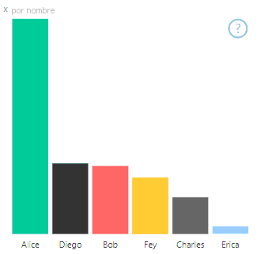
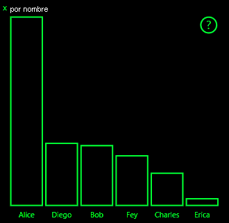
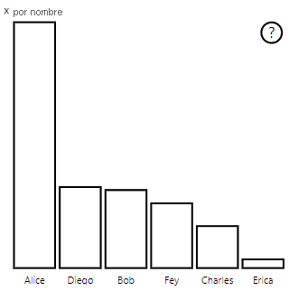

# <a name="high-contrast-mode-support-in-power-bi-visuals"></a><span data-ttu-id="e45da-103">Compatibilidad con el modo de contraste alto en objetos visuales de Power BI</span><span class="sxs-lookup"><span data-stu-id="e45da-103">High-contrast mode support in Power BI visuals</span></span>

<span data-ttu-id="e45da-104">La configuración de *contraste alto* de Windows mejora la visualización del texto y las aplicaciones al mostrar colores más definidos.</span><span class="sxs-lookup"><span data-stu-id="e45da-104">The Windows *high contrast* setting makes text and apps easier to see by displaying more distinct colors.</span></span> <span data-ttu-id="e45da-105">En este artículo se explica cómo agregar compatibilidad con el modo de contraste alto a objetos visuales de Power BI.</span><span class="sxs-lookup"><span data-stu-id="e45da-105">This article discusses how to add high-contrast mode support to Power BI visuals.</span></span> <span data-ttu-id="e45da-106">Para obtener más información, consulte [Compatibilidad con el contraste alto en Power BI](https://powerbi.microsoft.com/blog/power-bi-desktop-june-2018-feature-summary/#highContrast).</span><span class="sxs-lookup"><span data-stu-id="e45da-106">For more information, see [high-contrast support in Power BI](https://powerbi.microsoft.com/blog/power-bi-desktop-june-2018-feature-summary/#highContrast).</span></span>

<span data-ttu-id="e45da-107">Para ver una implementación de la compatibilidad con el contraste alto, vaya al [repositorio de objetos visuales PowerBI-visuals-sampleBarChart](https://github.com/Microsoft/PowerBI-visuals-sampleBarChart/commit/61011c82b66ca0d3321868f1d089c65101ca42e6).</span><span class="sxs-lookup"><span data-stu-id="e45da-107">To view an implementation of high-contrast support, go to the [PowerBI-visuals-sampleBarChart visual repository](https://github.com/Microsoft/PowerBI-visuals-sampleBarChart/commit/61011c82b66ca0d3321868f1d089c65101ca42e6).</span></span>

## <a name="on-initialization"></a><span data-ttu-id="e45da-108">En la inicialización</span><span class="sxs-lookup"><span data-stu-id="e45da-108">On initialization</span></span>

<span data-ttu-id="e45da-109">El miembro de colorPalette de `options.host` tiene varias propiedades para el modo de contraste alto.</span><span class="sxs-lookup"><span data-stu-id="e45da-109">The colorPalette member of `options.host` has several properties for high-contrast mode.</span></span> <span data-ttu-id="e45da-110">Use estas propiedades para determinar si el modo de contraste alto está activo y, de ser así, qué colores usar.</span><span class="sxs-lookup"><span data-stu-id="e45da-110">Use these properties to determine whether high-contrast mode is active and, if it is, what colors to use.</span></span>

### <a name="detect-that-power-bi-is-in-high-contrast-mode"></a><span data-ttu-id="e45da-111">Detectar si Power BI está en el modo de contraste alto</span><span class="sxs-lookup"><span data-stu-id="e45da-111">Detect that Power BI is in high-contrast mode</span></span>

<span data-ttu-id="e45da-112">Si `host.colorPalette.isHighContrast` es `true`, se activará el modo de contraste alto y, en consecuencia, se dibujará el objeto visual.</span><span class="sxs-lookup"><span data-stu-id="e45da-112">If `host.colorPalette.isHighContrast` is `true`, high-contrast mode is active and the visual should draw itself accordingly.</span></span>

### <a name="get-high-contrast-colors"></a><span data-ttu-id="e45da-113">Obtener colores de contraste alto</span><span class="sxs-lookup"><span data-stu-id="e45da-113">Get high-contrast colors</span></span>

<span data-ttu-id="e45da-114">En el modo de contraste alto, el objeto visual tiene que limitarse a los siguientes valores:</span><span class="sxs-lookup"><span data-stu-id="e45da-114">In high-contrast mode, your visual should limit itself to the following settings:</span></span>

* <span data-ttu-id="e45da-115">El color de **primer plano** se usa para dibujar cualquier línea, icono, texto y contorno o relleno de formas.</span><span class="sxs-lookup"><span data-stu-id="e45da-115">**Foreground** color is used to draw any lines, icons, text, and outline or fill of shapes.</span></span>
* <span data-ttu-id="e45da-116">El color de **fondo** se usa para el fondo, y como color de relleno de las formas con contorno.</span><span class="sxs-lookup"><span data-stu-id="e45da-116">**Background** color is used for background, and as the fill color of outlined shapes.</span></span>
* <span data-ttu-id="e45da-117">El color de **primer plano: seleccionado** se usa para indicar un elemento seleccionado o activo.</span><span class="sxs-lookup"><span data-stu-id="e45da-117">**Foreground - selected** color is used to indicate a selected or active element.</span></span>
* <span data-ttu-id="e45da-118">El color de los **hipervínculos** solo se usa para el texto de los hipervínculos.</span><span class="sxs-lookup"><span data-stu-id="e45da-118">**Hyperlink** color is used only for hyperlink text.</span></span>

> [!NOTE]
> <span data-ttu-id="e45da-119">Si necesita un color secundario, el color de primer plano puede usarse con cierta opacidad (los objetos visuales nativos de Power BI usan un 40 % de opacidad).</span><span class="sxs-lookup"><span data-stu-id="e45da-119">If a secondary color is needed, foreground color may be used with some opacity (Power BI native visuals use 40% opacity).</span></span> <span data-ttu-id="e45da-120">Use esta opción con moderación para asegurarse de que los detalles visuales puedan verse fácilmente.</span><span class="sxs-lookup"><span data-stu-id="e45da-120">Use this sparingly to keep the visual details easy to see.</span></span>

<span data-ttu-id="e45da-121">Durante la inicialización, puede almacenar los siguientes valores:</span><span class="sxs-lookup"><span data-stu-id="e45da-121">During initialization, you can store the following values:</span></span>

```typescript
private isHighContrast: boolean;

private foregroundColor: string;
private backgroundColor: string;
private foregroundSelectedColor: string;
private hyperlinkColor: string;
//...

constructor(options: VisualConstructorOptions) {
    this.host = options.host;
    let colorPalette: ISandboxExtendedColorPalette = host.colorPalette;
    //...
    this.isHighContrast = colorPalette.isHighContrast;
    if (this.isHighContrast) {
        this.foregroundColor = colorPalette.foreground.value;
        this.backgroundColor = colorPalette.background.value;
        this.foregroundSelectedColor = colorPalette.foregroundSelected.value;
        this.hyperlinkColor = colorPalette.hyperlink.value;
    }
```

<span data-ttu-id="e45da-122">O bien puede guardar el objeto `host` durante la inicialización y acceder a las propiedades de `colorPalette` relevantes durante la actualización.</span><span class="sxs-lookup"><span data-stu-id="e45da-122">Or you can store the `host` object during initialization and access the relevant `colorPalette` properties during update.</span></span>

## <a name="on-update"></a><span data-ttu-id="e45da-123">Al actualizar</span><span class="sxs-lookup"><span data-stu-id="e45da-123">On update</span></span>

<span data-ttu-id="e45da-124">Las implementaciones específicas de la compatibilidad con contraste alto varían según el objeto visual y dependen de los detalles del diseño gráfico.</span><span class="sxs-lookup"><span data-stu-id="e45da-124">The specific implementations of high-contrast support vary from visual to visual and depend on the details of the graphic design.</span></span> <span data-ttu-id="e45da-125">Para asegurarse de que los detalles importantes puedan distinguirse fácilmente con los colores limitados, el modo de contraste alto suele necesitar un diseño ligeramente distinto al del modo predeterminado.</span><span class="sxs-lookup"><span data-stu-id="e45da-125">To keep important details easy to distinguish with the limited colors, high-contrast mode ordinarily requires a design that's slightly different from the default mode.</span></span>

<span data-ttu-id="e45da-126">Los objetos visuales nativos de Power BI siguen estas normas:</span><span class="sxs-lookup"><span data-stu-id="e45da-126">Power BI native visuals follow these guidelines:</span></span>

* <span data-ttu-id="e45da-127">Todos los puntos de datos usan el mismo color (primer plano).</span><span class="sxs-lookup"><span data-stu-id="e45da-127">All data points use the same color (foreground).</span></span>
* <span data-ttu-id="e45da-128">Todo el texto, los ejes, las flechas, las líneas, etc. usan el color de primer plano.</span><span class="sxs-lookup"><span data-stu-id="e45da-128">All text, axes, arrows, lines, and so on use the foreground color.</span></span>
* <span data-ttu-id="e45da-129">Las formas gruesas se dibujan como contornos, con trazos gruesos (como mínimo, de dos píxeles) y relleno del color de fondo.</span><span class="sxs-lookup"><span data-stu-id="e45da-129">Thick shapes are drawn as outlines, with thick strokes (at least two pixels) and background color fill.</span></span>
* <span data-ttu-id="e45da-130">Si los puntos de datos son relevantes, se distinguen mediante varias formas de marcadores. Las líneas de datos se distinguen mediante el uso de distintas líneas discontinuas.</span><span class="sxs-lookup"><span data-stu-id="e45da-130">When data points are relevant, they're distinguished by different marker shapes, and data lines are distinguished by different dashing.</span></span>
* <span data-ttu-id="e45da-131">Al resaltar un elemento de datos, el resto de los elementos cambian su opacidad a 40 %.</span><span class="sxs-lookup"><span data-stu-id="e45da-131">When a data element is highlighted, all other elements change their opacity to 40%.</span></span>
* <span data-ttu-id="e45da-132">Para las segmentaciones, los elementos de filtro activos usan el color seleccionado del primer plano.</span><span class="sxs-lookup"><span data-stu-id="e45da-132">For slicers, active filter elements use foreground-selected color.</span></span>

<span data-ttu-id="e45da-133">En el siguiente gráfico de barras de ejemplo, todas las barras se dibujan con un contorno de primer plano de dos píxeles de grosor y con relleno de fondo.</span><span class="sxs-lookup"><span data-stu-id="e45da-133">In the following sample bar chart, for example, all bars are drawn with two pixels of thick foreground outline and background fill.</span></span> <span data-ttu-id="e45da-134">Compare el aspecto con los colores predeterminados y con un par de temas de contraste alto:</span><span class="sxs-lookup"><span data-stu-id="e45da-134">Compare the way it looks with default colors and with a couple of high-contrast themes:</span></span>

<span data-ttu-id="e45da-135">

</span><span class="sxs-lookup"><span data-stu-id="e45da-135">

</span></span>

<span data-ttu-id="e45da-136">En la siguiente sección se muestra un lugar de la función `visualTransform` que se ha cambiado para admitir el contraste alto.</span><span class="sxs-lookup"><span data-stu-id="e45da-136">The next section shows one place in the `visualTransform` function that was changed to support high contrast.</span></span> <span data-ttu-id="e45da-137">Se le llama como parte de la representación durante la actualización.</span><span class="sxs-lookup"><span data-stu-id="e45da-137">It's called as part of rendering during the update.</span></span>

### <a name="before"></a><span data-ttu-id="e45da-138">Antes</span><span class="sxs-lookup"><span data-stu-id="e45da-138">Before</span></span>

```typescript
for (let i = 0, len = Math.max(category.values.length, dataValue.values.length); i < len; i++) {
    let defaultColor: Fill = {
        solid: {
            color: colorPalette.getColor(category.values[i] + '').value
        }
    };

    barChartDataPoints.push({
        category: category.values[i] + '',
        value: dataValue.values[i],
        color: getCategoricalObjectValue<Fill>(category, i, 'colorSelector', 'fill', defaultColor).solid.color,
        selectionId: host.createSelectionIdBuilder()
            .withCategory(category, i)
            .createSelectionId()
    });
}
```

### <a name="after"></a><span data-ttu-id="e45da-139">Después</span><span class="sxs-lookup"><span data-stu-id="e45da-139">After</span></span>

```typescript
for (let i = 0, len = Math.max(category.values.length, dataValue.values.length); i < len; i++) {
    const color: string = getColumnColorByIndex(category, i, colorPalette);

    const selectionId: ISelectionId = host.createSelectionIdBuilder()
        .withCategory(category, i)
        .createSelectionId();

    barChartDataPoints.push({
        color,
        strokeColor,
        strokeWidth,
        selectionId,
        value: dataValue.values[i],
        category: `${category.values[i]}`,
    });
}

//...

function getColumnColorByIndex(
    category: DataViewCategoryColumn,
    index: number,
    colorPalette: ISandboxExtendedColorPalette,
): string {
    if (colorPalette.isHighContrast) {
        return colorPalette.background.value;
    }

    const defaultColor: Fill = {
        solid: {
            color: colorPalette.getColor(`${category.values[index]}`).value,
        }
    };

    return getCategoricalObjectValue<Fill>(category, index, 'colorSelector', 'fill', defaultColor).solid.color;
}
```
