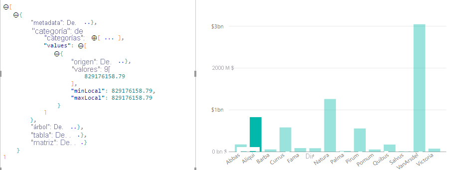
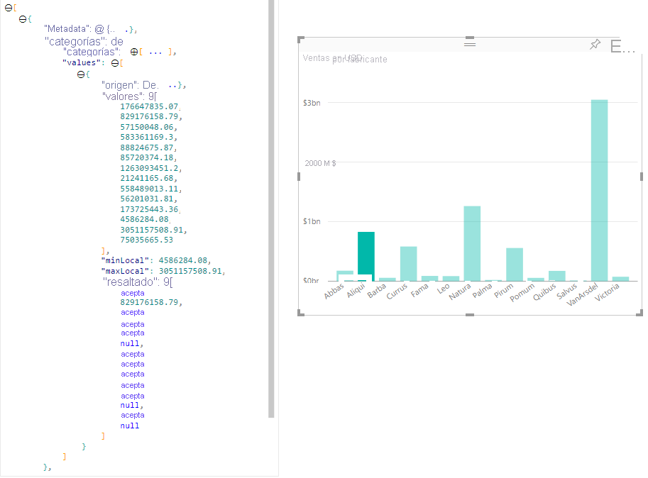

# Resaltado de puntos de datos en objetos visuales de Power BIHighlight data points in Power BI Visuals

De forma predeterminada, cada vez que se selecciona un elemento, la matriz `values` del objeto `dataView` se filtra solo por los valores seleccionados.By default whenever an element is selected the `values` array in the `dataView` object will be filtered to just the selected values. Hará que todos los demás objetos visuales de la página muestren solo los datos seleccionados.It will cause all other visuals on the page to display just the selected data.

Si establece la propiedad `supportsHighlight` de `capabilities.json` en `true`, recibirá la matriz `values` completa sin filtrar junto con una matriz `highlights`.If you set the `supportsHighlight` property in your `capabilities.json` to `true`, you'll receive the full unfiltered `values` array along with a `highlights` array. La matriz `highlights` tendrá la misma longitud que la matriz de valores y todos los valores no seleccionados se establecerán en `null`.The `highlights` array will be the same length as the values array and any non-selected values will be set to `null`. Con esta propiedad habilitada, el objeto visual es el responsable de resaltar los datos adecuados mediante la comparación de la matriz `values` con la matriz `highlights`.With this property enabled it's the visual's responsibility to highlight the appropriate data by comparing the `values` array to the `highlights` array.

En el ejemplo, observará que la barra 1 está seleccionada.In the example, you'll notice the 1 bar that is selected. Y es el único valor de la matriz highlights.And it's the only value in the highlights array. También es importante tener en cuenta que puede haber varias selecciones y resaltado parcial.It's also important to note there could be multiple selections and partial highlight. Existe el valor numérico correspondiente en los valores y las matrices highlights estarán presentes pero serán distintas.There's the corresponding numeric value in the values and highlights arrays will be present but different.
