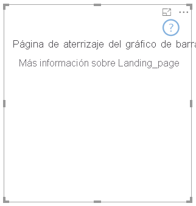

# <a name="add-a-landing-page-to-your-power-bi-visuals"></a><span data-ttu-id="9c624-103">Adición de una página de aterrizaje a los objetos visuales de Power BI</span><span class="sxs-lookup"><span data-stu-id="9c624-103">Add a landing page to your Power BI visuals</span></span>

<span data-ttu-id="9c624-104">Con la API 2.3.0, puede agregar una página de aterrizaje a los objetos visuales de Power BI.</span><span class="sxs-lookup"><span data-stu-id="9c624-104">With API 2.3.0, you can add a landing page to your Power BI visuals.</span></span> <span data-ttu-id="9c624-105">Para ello, agregue `supportsLandingPage` a las funcionalidades y establézcalo en true.</span><span class="sxs-lookup"><span data-stu-id="9c624-105">To do so, add `supportsLandingPage` to the capabilities, and set it to true.</span></span> <span data-ttu-id="9c624-106">Esta acción inicializa y actualiza el objeto visual antes de agregarle datos.</span><span class="sxs-lookup"><span data-stu-id="9c624-106">This action initializes and updates your visual before you add data to it.</span></span> <span data-ttu-id="9c624-107">Dado que el objeto visual ya no muestra una marca de agua, puede diseñar su propia página de aterrizaje para que se muestre en el objeto visual siempre que no tenga datos.</span><span class="sxs-lookup"><span data-stu-id="9c624-107">Because the visual no longer shows a watermark, you can design your own landing page to be displayed in the visual as long as it has no data.</span></span>

```typescript
export class BarChart implements IVisual {
    //...
    private element: HTMLElement;
    private isLandingPageOn: boolean;
    private LandingPageRemoved: boolean;
    private LandingPage: d3.Selection<any>;

    constructor(options: VisualConstructorOptions) {
            //...
            this.element = options.element;
            //...
    }

    public update(options: VisualUpdateOptions) {
    //...
        this.HandleLandingPage(options);
    }

    private HandleLandingPage(options: VisualUpdateOptions) {
        if(!options.dataViews || !options.dataViews.length) {
            if(!this.isLandingPageOn) {
                this.isLandingPageOn = true;
                const SampleLandingPage: Element = this.createSampleLandingPage(); //create a landing page
                this.element.appendChild(SampleLandingPage);
                this.LandingPage = d3.select(SampleLandingPage);
            }

        } else {
                if(this.isLandingPageOn && !this.LandingPageRemoved){
                    this.LandingPageRemoved = true;
                    this.LandingPage.remove();
                }
        }
    }
```

<span data-ttu-id="9c624-108">En la imagen siguiente se muestra una página de aterrizaje de ejemplo:</span><span class="sxs-lookup"><span data-stu-id="9c624-108">An example landing page is shown in the following image:</span></span>


