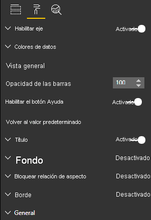

# <a name="create-a-launch-url"></a><span data-ttu-id="a77f9-103">Creación de una URL de inicio</span><span class="sxs-lookup"><span data-stu-id="a77f9-103">Create a launch URL</span></span>

<span data-ttu-id="a77f9-104">Al crear una URL de inicio, puede abrir una nueva pestaña (o ventana) del explorador mediante la delegación del trabajo real a Power BI.</span><span class="sxs-lookup"><span data-stu-id="a77f9-104">By creating a launch URL, you can open a new browser tab (or window) by delegating the actual work to Power BI.</span></span>

## <a name="sample"></a><span data-ttu-id="a77f9-105">Ejemplo</span><span class="sxs-lookup"><span data-stu-id="a77f9-105">Sample</span></span>

```typescript
   this.host.launchUrl('https://powerbi.microsoft.com');
```

## <a name="usage"></a><span data-ttu-id="a77f9-106">Usage (Uso)</span><span class="sxs-lookup"><span data-stu-id="a77f9-106">Usage</span></span>

<span data-ttu-id="a77f9-107">Use la llamada API `host.launchUrl()`, y pase la dirección URL de destino como argumento de cadena:</span><span class="sxs-lookup"><span data-stu-id="a77f9-107">Use the `host.launchUrl()` API call, passing your destination URL as a string argument:</span></span>

```typescript
this.host.launchUrl('http://some.link.net');
```

## <a name="restrictions"></a><span data-ttu-id="a77f9-108">Restricciones</span><span class="sxs-lookup"><span data-stu-id="a77f9-108">Restrictions</span></span>

* <span data-ttu-id="a77f9-109">Use solo rutas de acceso absolutas, no relativas.</span><span class="sxs-lookup"><span data-stu-id="a77f9-109">Use only absolute paths, not relative paths.</span></span> <span data-ttu-id="a77f9-110">Por ejemplo, use una ruta de acceso absoluta como `http://some.link.net/subfolder/page.html`.</span><span class="sxs-lookup"><span data-stu-id="a77f9-110">For example, use an absolute path such as `http://some.link.net/subfolder/page.html`.</span></span> <span data-ttu-id="a77f9-111">La ruta de acceso relativa `/page.html` no se abrirá.</span><span class="sxs-lookup"><span data-stu-id="a77f9-111">The relative path,`/page.html`, won't be opened.</span></span>

* <span data-ttu-id="a77f9-112">Actualmente, solo se admiten los protocolos *HTTP* y *HTTPS*.</span><span class="sxs-lookup"><span data-stu-id="a77f9-112">Currently, only *HTTP* and *HTTPS* protocols are supported.</span></span> <span data-ttu-id="a77f9-113">Evite *FTP*, *MAILTO*, etc.</span><span class="sxs-lookup"><span data-stu-id="a77f9-113">Avoid *FTP*, *MAILTO*, and so on.</span></span>

## <a name="best-practices"></a><span data-ttu-id="a77f9-114">Procedimientos recomendados</span><span class="sxs-lookup"><span data-stu-id="a77f9-114">Best practices</span></span>

* <span data-ttu-id="a77f9-115">Normalmente, es mejor abrir un vínculo solo como respuesta a una acción explícita del usuario.</span><span class="sxs-lookup"><span data-stu-id="a77f9-115">Usually, it's best to open a link only as a response to a user's explicit action.</span></span> <span data-ttu-id="a77f9-116">Los usuarios deben entender fácilmente que al hacer clic en el vínculo o el botón se abrirá una pestaña nueva. Desencadenar una llamada a `launchUrl()` sin la acción de un usuario, o como un efecto secundario de otra acción, puede ser confuso o frustrante para el usuario.</span><span class="sxs-lookup"><span data-stu-id="a77f9-116">Make it easy for the user to understand that clicking the link or button will result in opening a new tab. Triggering a `launchUrl()` call without a user's action, or as a side effect of a different action can be confusing or frustrating for the user.</span></span>

* <span data-ttu-id="a77f9-117">Si el vínculo no es fundamental para el funcionamiento correcto del objeto visual, le recomendamos que proporcione al autor del informe una manera de deshabilitar y ocultar el vínculo.</span><span class="sxs-lookup"><span data-stu-id="a77f9-117">If the link isn't essential for the proper functioning of the visual, we recommend that you give the report's author a way to disable and hide the link.</span></span> <span data-ttu-id="a77f9-118">Esta recomendación es especialmente relevante para los casos de uso especiales de Power BI, como insertar un informe en una aplicación de terceros o publicarlo en la web.</span><span class="sxs-lookup"><span data-stu-id="a77f9-118">This recommendation is especially relevant for special Power BI use cases, such as embedding a report in a third-party application or publishing it to the web.</span></span>

* <span data-ttu-id="a77f9-119">Evite activar una llamada a `launchUrl()` desde dentro de un bucle, la función `update` del objeto visual o cualquier otro código que se repita con frecuencia.</span><span class="sxs-lookup"><span data-stu-id="a77f9-119">Avoid triggering a `launchUrl()` call from inside a loop, the visual's `update` function, or any other frequently recurring code.</span></span>

## <a name="a-step-by-step-example"></a><span data-ttu-id="a77f9-120">Ejemplo paso a paso</span><span class="sxs-lookup"><span data-stu-id="a77f9-120">A step-by-step example</span></span>

### <a name="add-a-link-launching-element"></a><span data-ttu-id="a77f9-121">Adición de un elemento de inicio de vínculo</span><span class="sxs-lookup"><span data-stu-id="a77f9-121">Add a link-launching element</span></span>

<span data-ttu-id="a77f9-122">Las líneas siguientes se han agregado a la función `constructor` del objeto visual:</span><span class="sxs-lookup"><span data-stu-id="a77f9-122">The following lines were added to the visual's `constructor` function:</span></span>

```typescript
    this.helpLinkElement = this.createHelpLinkElement();
    options.element.appendChild(this.helpLinkElement);
```

<span data-ttu-id="a77f9-123">Se ha agregado una función privada que crea y adjunta el elemento delimitador:</span><span class="sxs-lookup"><span data-stu-id="a77f9-123">A private function that creates and attaches the anchor element was added:</span></span>

```typescript
private createHelpLinkElement(): Element {
    let linkElement = document.createElement("a");
    linkElement.textContent = "?";
    linkElement.setAttribute("title", "Open documentation");
    linkElement.setAttribute("class", "helpLink");
    linkElement.addEventListener("click", () => {
        this.host.launchUrl("https://docs.microsoft.com/power-bi/developer/visuals/custom-visual-develop-tutorial");
    });
    return linkElement;
};
```

<span data-ttu-id="a77f9-124">Por último, una entrada del archivo *visual.less* define el estilo del elemento de vínculo:</span><span class="sxs-lookup"><span data-stu-id="a77f9-124">Finally, an entry in the *visual.less* file defines the style for the link element:</span></span>

```less
.helpLink {
    position: absolute;
    top: 0px;
    right: 12px;
    display: block;
    width: 20px;
    height: 20px;
    border: 2px solid #80B0E0;
    border-radius: 20px;
    color: #80B0E0;
    text-align: center;
    font-size: 16px;
    line-height: 20px;
    background-color: #FFFFFF;
    transition: all 900ms ease;

    &:hover {
        background-color: #DDEEFF;
        color: #5080B0;
        border-color: #5080B0;
        transition: all 250ms ease;
    }

    &.hidden {
        display: none;
    }
}
```

### <a name="add-a-toggling-mechanism"></a><span data-ttu-id="a77f9-125">Adición de un mecanismo de alternancia</span><span class="sxs-lookup"><span data-stu-id="a77f9-125">Add a toggling mechanism</span></span>

<span data-ttu-id="a77f9-126">Para agregar un mecanismo de alternancia, debe agregar un objeto estático para que el autor del informe pueda alternar la visibilidad del elemento de vínculo.</span><span class="sxs-lookup"><span data-stu-id="a77f9-126">To add a toggling mechanism, you need to add a static object so that the report's author can toggle the visibility of the link element.</span></span> <span data-ttu-id="a77f9-127">(El valor predeterminado se establece en *hidden*). Para obtener más información, vea el [tutorial sobre objetos estáticos](https://microsoft.github.io/PowerBI-visuals/docs/concepts/objects-and-properties).</span><span class="sxs-lookup"><span data-stu-id="a77f9-127">(The default is set to *hidden*.) For more information, see the [static object tutorial](https://microsoft.github.io/PowerBI-visuals/docs/concepts/objects-and-properties).</span></span>

<span data-ttu-id="a77f9-128">Se ha agregado un objeto estático booleano `showHelpLink` a la entrada de objetos del archivo *capabilities.json*, tal como se muestra en el siguiente código:</span><span class="sxs-lookup"><span data-stu-id="a77f9-128">A `showHelpLink` Boolean static object was added to the *capabilities.json* file's objects entry, as shown in the following code:</span></span>

```typescript
"objects": {
    "generalView": {
            "displayName": "General View",
            "properties":
                "showHelpLink": {
                    "displayName": "Show Help Button",
                    "type": {
                        "bool": true
                    }
                }
            }
        }
    }
```



<span data-ttu-id="a77f9-130">Y, en la función `update` del objeto visual, se han agregado las líneas siguientes:</span><span class="sxs-lookup"><span data-stu-id="a77f9-130">And, in the visual's `update` function, the following lines were added:</span></span>

```typescript
if (settings.generalView.showHelpLink) {
    this.helpLinkElement.classList.remove("hidden");
} else {
    this.helpLinkElement.classList.add("hidden");
}
```

<span data-ttu-id="a77f9-131">La clase *hidden* se define en el archivo *visual.less* para controlar la presentación del elemento.</span><span class="sxs-lookup"><span data-stu-id="a77f9-131">The *hidden* class is defined in the *visual.less* file to control the display of the element.</span></span>
