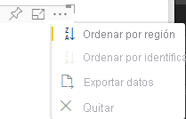

# <a name="sorting-options-for-power-bi-visuals"></a><span data-ttu-id="82af3-103">Opciones de ordenación para objetos visuales de Power BI</span><span class="sxs-lookup"><span data-stu-id="82af3-103">Sorting options for Power BI visuals</span></span>

<span data-ttu-id="82af3-104">En este artículo se describe cómo las opciones de *ordenación* especifican el comportamiento de ordenación de los objetos visuales de Power BI.</span><span class="sxs-lookup"><span data-stu-id="82af3-104">This article describes how *sorting* options specify the sorting behavior for Power BI visuals.</span></span> 

<span data-ttu-id="82af3-105">La funcionalidad de ordenación requiere uno de los siguientes parámetros.</span><span class="sxs-lookup"><span data-stu-id="82af3-105">The sorting capability requires one of the following parameters.</span></span>

## <a name="default-sorting"></a><span data-ttu-id="82af3-106">Ordenación predeterminada</span><span class="sxs-lookup"><span data-stu-id="82af3-106">Default sorting</span></span>

<span data-ttu-id="82af3-107">La opción `default` es la forma más simple.</span><span class="sxs-lookup"><span data-stu-id="82af3-107">The `default` option is the simplest form.</span></span> <span data-ttu-id="82af3-108">Permite ordenar los datos presentados en la sección “DataMappings”.</span><span class="sxs-lookup"><span data-stu-id="82af3-108">It allows sorting the data presented in the 'DataMappings' section.</span></span> <span data-ttu-id="82af3-109">La opción permite ordenar las asignaciones de datos por el usuario y especifica la dirección de ordenación.</span><span class="sxs-lookup"><span data-stu-id="82af3-109">The option enables sorting of the data mappings by the user and specifies the sorting direction.</span></span>

```json
    "sorting": {
        "default": {   }
    }
```



## <a name="implicit-sorting"></a><span data-ttu-id="82af3-111">Ordenación implícita</span><span class="sxs-lookup"><span data-stu-id="82af3-111">Implicit sorting</span></span>

<span data-ttu-id="82af3-112">La ordenación implícita ordena con el parámetro de matriz `clauses`, que describe la ordenación de cada rol de datos.</span><span class="sxs-lookup"><span data-stu-id="82af3-112">Implicit sorting is sorting with the array parameter `clauses`, which describes sorting for each data role.</span></span> <span data-ttu-id="82af3-113">`implicit` significa que el usuario del objeto visual no puede cambiar el criterio de ordenación.</span><span class="sxs-lookup"><span data-stu-id="82af3-113">`implicit` means that the visual's user can't change the sorting order.</span></span> <span data-ttu-id="82af3-114">Power BI no muestra las opciones de ordenación en el menú del objeto visual,</span><span class="sxs-lookup"><span data-stu-id="82af3-114">Power BI doesn't display sorting options in the visual's menu.</span></span> <span data-ttu-id="82af3-115">pero sí que ordena los datos según la configuración especificada.</span><span class="sxs-lookup"><span data-stu-id="82af3-115">However, Power BI does sort data according to specified settings.</span></span>

<span data-ttu-id="82af3-116">Los parámetros de `clauses` pueden contener varios objetos con dos parámetros:</span><span class="sxs-lookup"><span data-stu-id="82af3-116">`clauses` parameters can contain several objects with two parameters:</span></span>

- <span data-ttu-id="82af3-117">`role`: determina `DataMapping` para la ordenación.</span><span class="sxs-lookup"><span data-stu-id="82af3-117">`role`: Determines `DataMapping` for sorting</span></span>
- <span data-ttu-id="82af3-118">`direction`: determina la dirección de ordenación (1 = ascendente; 2 = descendente).</span><span class="sxs-lookup"><span data-stu-id="82af3-118">`direction`: Determines sort direction (1 = Ascending, 2 = Descending)</span></span>

```json
    "sorting": {
        "implicit": {
            "clauses": [
                {
                    "role": "category",
                    "direction": 1
                },
                {
                    "role": "measure",
                    "direction": 2
                }
            ]
        }
    }
```

## <a name="custom-sorting"></a><span data-ttu-id="82af3-119">Ordenación personalizada</span><span class="sxs-lookup"><span data-stu-id="82af3-119">Custom sorting</span></span>

<span data-ttu-id="82af3-120">La ordenación personalizada implica que el desarrollador administra la ordenación en el código del objeto visual.</span><span class="sxs-lookup"><span data-stu-id="82af3-120">Custom sorting means that the sorting is managed by the developer in the visual's code.</span></span>
