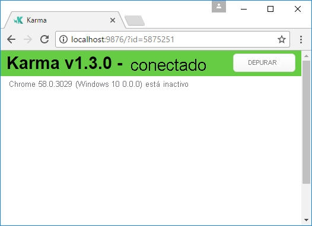
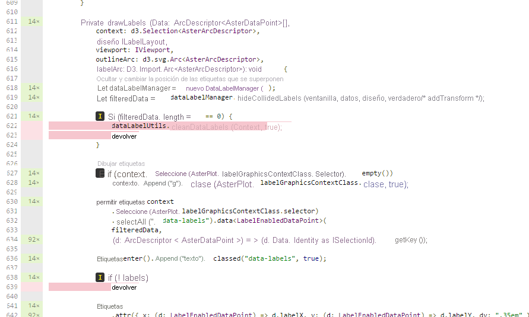

# <a name="tutorial-add-unit-tests-for-power-bi-visual-projects"></a><span data-ttu-id="4aee1-103">Tutorial: Adición de pruebas unitarias en proyectos de objetos visuales de Power BI</span><span class="sxs-lookup"><span data-stu-id="4aee1-103">Tutorial: Add unit tests for Power BI visual projects</span></span>

<span data-ttu-id="4aee1-104">En este artículo se describen los conceptos básicos de la escritura de pruebas unitarias para los objetos visuales de Power BI, y se indica cómo hacer lo siguiente:</span><span class="sxs-lookup"><span data-stu-id="4aee1-104">This article describes the basics of writing unit tests for your Power BI visuals, including how to:</span></span>

* <span data-ttu-id="4aee1-105">Configurar el marco de pruebas de ejecutor de pruebas de JavaScript de Karma, Jasmine.</span><span class="sxs-lookup"><span data-stu-id="4aee1-105">Set up the Karma JavaScript test runner testing framework, Jasmine.</span></span>
* <span data-ttu-id="4aee1-106">Usar el paquete powerbi-visuals-utils-testutils.</span><span class="sxs-lookup"><span data-stu-id="4aee1-106">Use the powerbi-visuals-utils-testutils package.</span></span>
* <span data-ttu-id="4aee1-107">Usar objetos ficticios y emulaciones para ayudar a simplificar las pruebas unitarias de objetos visuales de Power BI.</span><span class="sxs-lookup"><span data-stu-id="4aee1-107">Use mocks and fakes to help simplify unit testing of Power BI visuals.</span></span>

## <a name="prerequisites"></a><span data-ttu-id="4aee1-108">Requisitos previos</span><span class="sxs-lookup"><span data-stu-id="4aee1-108">Prerequisites</span></span>

* <span data-ttu-id="4aee1-109">Un proyecto de objetos visuales de Power BI instalado.</span><span class="sxs-lookup"><span data-stu-id="4aee1-109">An installed Power BI visuals project</span></span>
* <span data-ttu-id="4aee1-110">Un entorno de Node.js configurado.</span><span class="sxs-lookup"><span data-stu-id="4aee1-110">A configured Node.js environment</span></span>

## <a name="install-and-configure-the-karma-javascript-test-runner-and-jasmine"></a><span data-ttu-id="4aee1-111">Instalación y configuración del ejecutor de pruebas de JavaScript de Karma y Jasmine</span><span class="sxs-lookup"><span data-stu-id="4aee1-111">Install and configure the Karma JavaScript test runner and Jasmine</span></span>

<span data-ttu-id="4aee1-112">Agregue las bibliotecas necesarias al archivo *package.json* en la sección `devDependencies`:</span><span class="sxs-lookup"><span data-stu-id="4aee1-112">Add the required libraries to the *package.json* file in the `devDependencies` section:</span></span>

```json
"@babel/polyfill": "^7.2.5",
"@types/d3": "5.5.0",
"@types/jasmine": "2.5.37",
"@types/jasmine-jquery": "1.5.28",
"@types/jquery": "2.0.41",
"@types/karma": "3.0.0",
"@types/lodash-es": "4.17.1",
"coveralls": "3.0.2",
"istanbul-instrumenter-loader": "^3.0.1",
"jasmine": "2.5.2",
"jasmine-core": "2.5.2",
"jasmine-jquery": "2.1.1",
"jquery": "3.1.1",
"karma": "3.1.1",
"karma-chrome-launcher": "2.2.0",
"karma-coverage": "1.1.2",
"karma-coverage-istanbul-reporter": "^2.0.4",
"karma-jasmine": "2.0.1",
"karma-junit-reporter": "^1.2.0",
"karma-sourcemap-loader": "^0.3.7",
"karma-typescript": "^3.0.13",
"karma-typescript-preprocessor": "0.4.0",
"karma-webpack": "3.0.5",
"puppeteer": "1.17.0",
"style-loader": "0.23.1",
"ts-loader": "5.3.0",
"ts-node": "7.0.1",
"tslint": "^5.12.0",
"webpack": "4.26.0"
```

<span data-ttu-id="4aee1-113">Para obtener más información sobre el paquete, consulte la descripción en:</span><span class="sxs-lookup"><span data-stu-id="4aee1-113">To learn more about the package, see the description at.</span></span>

<span data-ttu-id="4aee1-114">Guarde el archivo *package.json* y, en la ubicación `package.json`, ejecute el siguiente comando:</span><span class="sxs-lookup"><span data-stu-id="4aee1-114">Save the *package.json* file and, at the `package.json` location, run the following command:</span></span>

```cmd
npm install
```

<span data-ttu-id="4aee1-115">El administrador de paquetes instala todos los paquetes nuevos que se han agregado a *package.json*.</span><span class="sxs-lookup"><span data-stu-id="4aee1-115">The package manager installs all new packages that are added to *package.json*.</span></span>

<span data-ttu-id="4aee1-116">Para ejecutar pruebas unitarias, configure el ejecutor de pruebas y la configuración `webpack`.</span><span class="sxs-lookup"><span data-stu-id="4aee1-116">To run unit tests, configure the test runner and `webpack` config.</span></span>

<span data-ttu-id="4aee1-117">El siguiente código es un ejemplo del archivo *test.webpack.config.js*:</span><span class="sxs-lookup"><span data-stu-id="4aee1-117">The following code is a sample of the *test.webpack.config.js* file:</span></span>

```typescript
const path = require('path');
const webpack = require("webpack");

module.exports = {
    devtool: 'source-map',
    mode: 'development',
    optimization : {
        concatenateModules: false,
        minimize: false
    },
    module: {
        rules: [
            {
                test: /\.tsx?$/,
                use: 'ts-loader',
                exclude: /node_modules/
            },
            {
                test: /\.json$/,
                loader: 'json-loader'
            },
            {
                test: /\.tsx?$/i,
                enforce: 'post',
                include: /(src)/,
                exclude: /(node_modules|resources\/js\/vendor)/,
                loader: 'istanbul-instrumenter-loader',
                options: { esModules: true }
            },
            {
                test: /\.less$/,
                use: [
                    {
                        loader: 'style-loader'
                    },
                    {
                        loader: 'css-loader'
                    },
                    {
                        loader: 'less-loader',
                        options: {
                            paths: [path.resolve(__dirname, 'node_modules')]
                        }
                    }
                ]
            }
        ]
    },
    externals: {
        "powerbi-visuals-api": '{}'
    },
    resolve: {
        extensions: ['.tsx', '.ts', '.js', '.css']
    },
    output: {
        path: path.resolve(__dirname, ".tmp/test")
    },
    plugins: [
        new webpack.ProvidePlugin({
            'powerbi-visuals-api': null
        })
    ]
};
```

<span data-ttu-id="4aee1-118">El siguiente código es un ejemplo del archivo *karma.conf.ts*:</span><span class="sxs-lookup"><span data-stu-id="4aee1-118">The following code is a sample of the *karma.conf.ts* file:</span></span>

```typescript
"use strict";

const webpackConfig = require("./test.webpack.config.js");
const tsconfig = require("./test.tsconfig.json");
const path = require("path");

const testRecursivePath = "test/visualTest.ts";
const srcOriginalRecursivePath = "src/**/*.ts";
const coverageFolder = "coverage";

process.env.CHROME_BIN = require("puppeteer").executablePath();

import { Config, ConfigOptions } from "karma";

module.exports = (config: Config) => {
    config.set(<ConfigOptions>{
        mode: "development",
        browserNoActivityTimeout: 100000,
        browsers: ["ChromeHeadless"], // or Chrome to use locally installed Chrome browser
        colors: true,
        frameworks: ["jasmine"],
        reporters: [
            "progress",
            "junit",
            "coverage-istanbul"
        ],
        junitReporter: {
            outputDir: path.join(__dirname, coverageFolder),
            outputFile: "TESTS-report.xml",
            useBrowserName: false
        },
        singleRun: true,
        plugins: [
            "karma-coverage",
            "karma-typescript",
            "karma-webpack",
            "karma-jasmine",
            "karma-sourcemap-loader",
            "karma-chrome-launcher",
            "karma-junit-reporter",
            "karma-coverage-istanbul-reporter"
        ],
        files: [
            "node_modules/jquery/dist/jquery.min.js",
            "node_modules/jasmine-jquery/lib/jasmine-jquery.js",
            {
                pattern: './capabilities.json',
                watched: false,
                served: true,
                included: false
            },
            testRecursivePath,
            {
                pattern: srcOriginalRecursivePath,
                included: false,
                served: true
            }
        ],
        preprocessors: {
            [testRecursivePath]: ["webpack", "coverage"]
        },
        typescriptPreprocessor: {
            options: tsconfig.compilerOptions
        },
        coverageIstanbulReporter: {
            reports: ["html", "lcovonly", "text-summary", "cobertura"],
            dir: path.join(__dirname, coverageFolder),
            'report-config': {
                html: {
                    subdir: 'html-report'
                }
            },
            combineBrowserReports: true,
            fixWebpackSourcePaths: true,
            verbose: false
        },
        coverageReporter: {
            dir: path.join(__dirname, coverageFolder),
            reporters: [
                // reporters not supporting the `file` property
                { type: 'html', subdir: 'html-report' },
                { type: 'lcov', subdir: 'lcov' },
                // reporters supporting the `file` property, use `subdir` to directly
                // output them in the `dir` directory
                { type: 'cobertura', subdir: '.', file: 'cobertura-coverage.xml' },
                { type: 'lcovonly', subdir: '.', file: 'report-lcovonly.txt' },
                { type: 'text-summary', subdir: '.', file: 'text-summary.txt' },
            ]
        },
        mime: {
            "text/x-typescript": ["ts", "tsx"]
        },
        webpack: webpackConfig,
        webpackMiddleware: {
            stats: "errors-only"
        }
    });
};
```

<span data-ttu-id="4aee1-119">Si es necesario, puede modificar esta configuración.</span><span class="sxs-lookup"><span data-stu-id="4aee1-119">If necessary, you can modify this configuration.</span></span>

<span data-ttu-id="4aee1-120">El código de *karma.conf.js* contiene la siguiente variable:</span><span class="sxs-lookup"><span data-stu-id="4aee1-120">The code in *karma.conf.js* contains the following variable:</span></span>

* <span data-ttu-id="4aee1-121">`recursivePathToTests`: busca el código de prueba.</span><span class="sxs-lookup"><span data-stu-id="4aee1-121">`recursivePathToTests`: Locates the test code</span></span>

* <span data-ttu-id="4aee1-122">`srcRecursivePath`: busca el código JavaScript de salida después de la compilación.</span><span class="sxs-lookup"><span data-stu-id="4aee1-122">`srcRecursivePath`: Locates the output JavaScript code after compiling</span></span>

* <span data-ttu-id="4aee1-123">`srcCssRecursivePath`: busca el CSS de salida después de compilar el archivo LESS con estilos.</span><span class="sxs-lookup"><span data-stu-id="4aee1-123">`srcCssRecursivePath`: Locates the output CSS after compiling less file with styles</span></span>

* <span data-ttu-id="4aee1-124">`srcOriginalRecursivePath`: busca el código fuente del objeto visual.</span><span class="sxs-lookup"><span data-stu-id="4aee1-124">`srcOriginalRecursivePath`: Locates the source code of your visual</span></span>

* <span data-ttu-id="4aee1-125">`coverageFolder`: determina dónde se creará el informe de cobertura.</span><span class="sxs-lookup"><span data-stu-id="4aee1-125">`coverageFolder`: Determines where the coverage report is to be created</span></span>

<span data-ttu-id="4aee1-126">El archivo de configuración incluye las siguientes propiedades:</span><span class="sxs-lookup"><span data-stu-id="4aee1-126">The configuration file includes the following properties:</span></span>

* <span data-ttu-id="4aee1-127">`singleRun: true`: las pruebas se ejecutan en un sistema de integración continua (CI) o se pueden ejecutar una vez.</span><span class="sxs-lookup"><span data-stu-id="4aee1-127">`singleRun: true`: Tests are run on a continuous integration (CI) system, or they can be run one time.</span></span> <span data-ttu-id="4aee1-128">Puede cambiar la configuración a *false* para depurar las pruebas.</span><span class="sxs-lookup"><span data-stu-id="4aee1-128">You can change the setting to *false* for debugging your tests.</span></span> <span data-ttu-id="4aee1-129">Karma mantiene el explorador en ejecución para que pueda usar la consola para la depuración.</span><span class="sxs-lookup"><span data-stu-id="4aee1-129">Karma keeps the browser running so that you can use the console for debugging.</span></span>

* <span data-ttu-id="4aee1-130">`files: [...]`: en esta matriz, puede especificar los archivos que se van a cargar en el explorador.</span><span class="sxs-lookup"><span data-stu-id="4aee1-130">`files: [...]`: In this array, you can specify the files to load to the browser.</span></span> <span data-ttu-id="4aee1-131">Normalmente, hay archivos de código fuente, casos de prueba y bibliotecas (Jasmine y utilidades de prueba).</span><span class="sxs-lookup"><span data-stu-id="4aee1-131">Usually, there are source files, test cases, libraries (Jasmine, test utilities).</span></span> <span data-ttu-id="4aee1-132">Puede agregar archivos adicionales a la lista, según sea necesario.</span><span class="sxs-lookup"><span data-stu-id="4aee1-132">You can add additional files to the list, as necessary.</span></span>

* <span data-ttu-id="4aee1-133">`preprocessors`: en esta sección, se configuran las acciones que se ejecutan antes de que se ejecuten las pruebas unitarias.</span><span class="sxs-lookup"><span data-stu-id="4aee1-133">`preprocessors`: In this section, you configure actions that run before the unit tests run.</span></span> <span data-ttu-id="4aee1-134">Se encargan de precompilar el TypeScript para JavaScript, preparar los archivos del mapa de origen y generar el informe de cobertura de código.</span><span class="sxs-lookup"><span data-stu-id="4aee1-134">They precompile the typescript to JavaScript, prepare source map files, and generate code coverage report.</span></span> <span data-ttu-id="4aee1-135">Puede deshabilitar `coverage` al depurar las pruebas.</span><span class="sxs-lookup"><span data-stu-id="4aee1-135">You can disable `coverage` when you debug your tests.</span></span> <span data-ttu-id="4aee1-136">La cobertura genera código adicional para comprobar el código de la cobertura de la prueba, lo que complica las pruebas de depuración.</span><span class="sxs-lookup"><span data-stu-id="4aee1-136">Coverage generates additional code for check code for the test coverage, which complicates debugging tests.</span></span>

<span data-ttu-id="4aee1-137">Para obtener descripciones de todas las configuraciones de Karma, vaya a la página del [archivo de configuración de Karma](https://karma-runner.github.io/1.0/config/configuration-file.html).</span><span class="sxs-lookup"><span data-stu-id="4aee1-137">For descriptions of all Karma configurations, go to the [Karma Configuration File](https://karma-runner.github.io/1.0/config/configuration-file.html) page.</span></span>

<span data-ttu-id="4aee1-138">Para su comodidad, puede agregar un comando de prueba en `scripts`:</span><span class="sxs-lookup"><span data-stu-id="4aee1-138">For your convenience, you can add a test command into `scripts`:</span></span>

```json
{
    "scripts": {
        "pbiviz": "pbiviz",
        "start": "pbiviz start",
        "typings":"node node_modules/typings/dist/bin.js i",
        "lint": "tslint -r \"node_modules/tslint-microsoft-contrib\"  \"+(src|test)/**/*.ts\"",
        "pretest": "pbiviz package --resources --no-minify --no-pbiviz --no-plugin",
        "test": "karma start"
    }
    ...
}
```

<span data-ttu-id="4aee1-139">Ya puede empezar a escribir las pruebas unitarias.</span><span class="sxs-lookup"><span data-stu-id="4aee1-139">You're now ready to begin writing your unit tests.</span></span>

## <a name="check-the-dom-element-of-the-visual"></a><span data-ttu-id="4aee1-140">Comprobación del elemento DOM del objeto visual</span><span class="sxs-lookup"><span data-stu-id="4aee1-140">Check the DOM element of the visual</span></span>

<span data-ttu-id="4aee1-141">Para probar el objeto visual, primero hay que crear una instancia de objeto visual.</span><span class="sxs-lookup"><span data-stu-id="4aee1-141">To test the visual, first create an instance of visual.</span></span>

### <a name="create-a-visual-instance-builder"></a><span data-ttu-id="4aee1-142">Creación de un generador de instancias de objeto visual</span><span class="sxs-lookup"><span data-stu-id="4aee1-142">Create a visual instance builder</span></span>

<span data-ttu-id="4aee1-143">Agregue un archivo *visualBuilder.ts* a la carpeta *test* con el siguiente código:</span><span class="sxs-lookup"><span data-stu-id="4aee1-143">Add a *visualBuilder.ts* file to the *test* folder by using the following code:</span></span>

```typescript
import {
    VisualBuilderBase
} from "powerbi-visuals-utils-testutils";

import {
    BarChart as VisualClass
} from "../src/visual";

import  powerbi from "powerbi-visuals-api";
import VisualConstructorOptions = powerbi.extensibility.visual.VisualConstructorOptions;

export class BarChartBuilder extends VisualBuilderBase<VisualClass> {
    constructor(width: number, height: number) {
        super(width, height);
    }

    protected build(options: VisualConstructorOptions) {
        return new VisualClass(options);
    }

    public get mainElement() {
        return this.element.children("svg.barChart");
    }
}
```

<span data-ttu-id="4aee1-144">Hay un método `build` para crear una instancia del objeto visual.</span><span class="sxs-lookup"><span data-stu-id="4aee1-144">There's `build` method for creating an instance of your visual.</span></span> <span data-ttu-id="4aee1-145">`mainElement` es un método get, que devuelve una instancia del elemento de Document Object Model (DOM) "root" del objeto visual.</span><span class="sxs-lookup"><span data-stu-id="4aee1-145">`mainElement` is a get method, which returns an instance of "root" document object model (DOM) element in your visual.</span></span> <span data-ttu-id="4aee1-146">El captador es opcional, pero facilita la escritura de la prueba unitaria.</span><span class="sxs-lookup"><span data-stu-id="4aee1-146">The getter is optional, but it makes writing the unit test easier.</span></span>

<span data-ttu-id="4aee1-147">Ya tiene una compilación de una instancia de su objeto visual.</span><span class="sxs-lookup"><span data-stu-id="4aee1-147">You now have a build of an instance of your visual.</span></span> <span data-ttu-id="4aee1-148">Vamos a escribir el caso de prueba.</span><span class="sxs-lookup"><span data-stu-id="4aee1-148">Let's write the test case.</span></span> <span data-ttu-id="4aee1-149">El caso de prueba examina los elementos SVG que se crean cuando se muestra el objeto visual.</span><span class="sxs-lookup"><span data-stu-id="4aee1-149">The test case checks the SVG elements that are created when your visual is displayed.</span></span>

### <a name="create-a-typescript-file-to-write-test-cases"></a><span data-ttu-id="4aee1-150">Creación de un archivo TypeScript para escribir casos de prueba</span><span class="sxs-lookup"><span data-stu-id="4aee1-150">Create a typescript file to write test cases</span></span>

<span data-ttu-id="4aee1-151">Agregue un archivo *visualTest.ts* para los casos de prueba mediante el código siguiente:</span><span class="sxs-lookup"><span data-stu-id="4aee1-151">Add a *visualTest.ts* file for the test cases by using the following code:</span></span>

```typescript
import powerbi from "powerbi-visuals-api";

import { BarChartBuilder } from "./VisualBuilder";

import {
    BarChart as VisualClass
} from "../src/visual";

import VisualBuilder = powerbi.extensibility.visual.test.BarChartBuilder;

describe("BarChart", () => {
    let visualBuilder: VisualBuilder;
    let dataView: DataView;

    beforeEach(() => {
        visualBuilder = new VisualBuilder(500, 500);
    });

    it("root DOM element is created", () => {
        expect(visualBuilder.mainElement).toBeInDOM();
    });
});
```

<span data-ttu-id="4aee1-152">Se llama a varios métodos:</span><span class="sxs-lookup"><span data-stu-id="4aee1-152">Several methods are called:</span></span>

* <span data-ttu-id="4aee1-153">[`describe`](https://jasmine.github.io/api/2.6/global.html#describe): describe un caso de prueba.</span><span class="sxs-lookup"><span data-stu-id="4aee1-153">[`describe`](https://jasmine.github.io/api/2.6/global.html#describe): Describes a test case.</span></span> <span data-ttu-id="4aee1-154">En el contexto del marco de Jasmine, se suele describir un conjunto o un grupo de especificaciones.</span><span class="sxs-lookup"><span data-stu-id="4aee1-154">In the context of the Jasmine framework, it often describes a suite or group of specs.</span></span>

* <span data-ttu-id="4aee1-155">`beforeEach`: se le llama antes de cada llamada al método `it`, que se define en el método [`describe`](https://jasmine.github.io/api/2.6/global.html#beforeEach).</span><span class="sxs-lookup"><span data-stu-id="4aee1-155">`beforeEach`: Is called before each call of the `it` method, which is defined in the [`describe`](https://jasmine.github.io/api/2.6/global.html#beforeEach) method.</span></span>

* <span data-ttu-id="4aee1-156">[`it`](https://jasmine.github.io/api/2.6/global.html#it): define una especificación única. El método `it` debe contener uno o varios `expectations`.</span><span class="sxs-lookup"><span data-stu-id="4aee1-156">[`it`](https://jasmine.github.io/api/2.6/global.html#it): Defines a single spec. The `it` method should contain one or more `expectations`.</span></span>

* <span data-ttu-id="4aee1-157">[`expect`](https://jasmine.github.io/api/2.6/global.html#expect): crea una expectativa para una especificación. Una especificación se realiza correctamente si se superan todas las expectativas sin errores.</span><span class="sxs-lookup"><span data-stu-id="4aee1-157">[`expect`](https://jasmine.github.io/api/2.6/global.html#expect): Creates an expectation for a spec. A spec succeeds if all expectations pass without any failures.</span></span>

* <span data-ttu-id="4aee1-158">`toBeInDOM`: uno de los métodos de *buscadores de coincidencias*.</span><span class="sxs-lookup"><span data-stu-id="4aee1-158">`toBeInDOM`: One of the *matchers* methods.</span></span> <span data-ttu-id="4aee1-159">Para obtener más información sobre los buscadores de coincidencias, vea [Jasmine Namespace: matchers](https://jasmine.github.io/api/2.6/matchers.html) (Espacio de nombres de Jasmine: buscadores de coincidencias).</span><span class="sxs-lookup"><span data-stu-id="4aee1-159">For more information about matchers, see [Jasmine Namespace: matchers](https://jasmine.github.io/api/2.6/matchers.html).</span></span>

<span data-ttu-id="4aee1-160">Para obtener más información sobre Jasmine, consulte la [página de documentación del marco de Jasmine](https://jasmine.github.io/).</span><span class="sxs-lookup"><span data-stu-id="4aee1-160">For more information about Jasmine, see the [Jasmine framework documentation](https://jasmine.github.io/) page.</span></span>

### <a name="launch-unit-tests"></a><span data-ttu-id="4aee1-161">Inicio de pruebas unitarias</span><span class="sxs-lookup"><span data-stu-id="4aee1-161">Launch unit tests</span></span>

<span data-ttu-id="4aee1-162">Esta prueba comprueba que se ha creado el elemento SVG raíz de los objetos visuales.</span><span class="sxs-lookup"><span data-stu-id="4aee1-162">This test checks that root SVG element of the visuals is created.</span></span> <span data-ttu-id="4aee1-163">Para ejecutar la prueba unitaria, escriba el siguiente comando en la herramienta de línea de comandos:</span><span class="sxs-lookup"><span data-stu-id="4aee1-163">To run the unit test, enter the following command in the command-line tool:</span></span>

```cmd
npm run test
```

<span data-ttu-id="4aee1-164">`karma.js` ejecuta el caso de prueba en el explorador Chrome.</span><span class="sxs-lookup"><span data-stu-id="4aee1-164">`karma.js` runs the test case in the Chrome browser.</span></span>



> [!NOTE]
> <span data-ttu-id="4aee1-166">Debe instalar Google Chrome de forma local.</span><span class="sxs-lookup"><span data-stu-id="4aee1-166">You must install Google Chrome locally.</span></span>

<span data-ttu-id="4aee1-167">En la ventana de la línea de comandos, obtendrá el siguiente resultado:</span><span class="sxs-lookup"><span data-stu-id="4aee1-167">In the command-line window, you'll get following output:</span></span>

```cmd
> karma start

23 05 2017 12:24:26.842:WARN [watcher]: Pattern "E:/WORKSPACE/PowerBI/PowerBI-visuals-sampleBarChart/data/*.csv" does not match any file.
23 05 2017 12:24:30.836:WARN [karma]: No captured browser, open http://localhost:9876/
23 05 2017 12:24:30.849:INFO [karma]: Karma v1.3.0 server started at http://localhost:9876/
23 05 2017 12:24:30.850:INFO [launcher]: Launching browser Chrome with unlimited concurrency
23 05 2017 12:24:31.059:INFO [launcher]: Starting browser Chrome
23 05 2017 12:24:33.160:INFO [Chrome 58.0.3029 (Windows 10 0.0.0)]: Connected on socket /#2meR6hjXFmsE_fjiAAAA with id 5875251
Chrome 58.0.3029 (Windows 10 0.0.0): Executed 1 of 1 SUCCESS (0.194 secs / 0.011 secs)

=============================== Coverage summary ===============================
Statements   : 27.43% ( 65/237 )
Branches     : 19.84% ( 25/126 )
Functions    : 43.86% ( 25/57 )
Lines        : 20.85% ( 44/211 )
================================================================================
```

### <a name="how-to-add-static-data-for-unit-tests"></a><span data-ttu-id="4aee1-168">Cómo agregar datos estáticos para pruebas unitarias</span><span class="sxs-lookup"><span data-stu-id="4aee1-168">How to add static data for unit tests</span></span>

<span data-ttu-id="4aee1-169">Cree el archivo *visualData.ts* en la carpeta *test* con el siguiente código:</span><span class="sxs-lookup"><span data-stu-id="4aee1-169">Create the *visualData.ts* file in the *test* folder by using the following code:</span></span>

```typescript
import powerbi from "powerbi-visuals-api";
import DataView = powerbi.DataView;

import {
    testDataViewBuilder,
    getRandomNumbers
} from "powerbi-visuals-utils-testutils";

export class SampleBarChartDataBuilder extends TestDataViewBuilder {
    public static CategoryColumn: string = "category";
    public static MeasureColumn: string = "measure";

    public constructor() {
        super();
        ...
    }

    public getDataView(columnNames?: string[]): DataView {
        let dateView: any = this.createCategoricalDataViewBuilder([
            ...
        ],
        [
            ...
        ], columnNames).build();

        // there's client side computed maxValue
        let maxLocal = 0;
        this.valuesMeasure.forEach((item) => {
                if (item > maxLocal) {
                    maxLocal = item;
                }
        });
        (<any>dataView).categorical.values[0].maxLocal = maxLocal;
    }
}
```

<span data-ttu-id="4aee1-170">La clase `SampleBarChartDataBuilder` amplía `TestDataViewBuilder` e implementa el método abstracto `getDataView`.</span><span class="sxs-lookup"><span data-stu-id="4aee1-170">The `SampleBarChartDataBuilder` class extends `TestDataViewBuilder` and implements the abstract method `getDataView`.</span></span>

<span data-ttu-id="4aee1-171">Al colocar datos en cubos de campos de datos, Power BI genera un objeto `dataview` categórico basado en los datos.</span><span class="sxs-lookup"><span data-stu-id="4aee1-171">When you put data into data-field buckets, Power BI produces a categorical `dataview` object that's based on your data.</span></span>


<span data-ttu-id="4aee1-173">En las pruebas unitarias, no tiene funciones principales de Power BI para reproducir los datos,</span><span class="sxs-lookup"><span data-stu-id="4aee1-173">In unit tests, you don't have Power BI core functions to reproduce the data.</span></span> <span data-ttu-id="4aee1-174">pero debe asignar los datos estáticos al objeto `dataview` categórico.</span><span class="sxs-lookup"><span data-stu-id="4aee1-174">But you need to map your static data to the categorical `dataview`.</span></span> <span data-ttu-id="4aee1-175">La clase `TestDataViewBuilder` puede ayudarle a asignarlos.</span><span class="sxs-lookup"><span data-stu-id="4aee1-175">The `TestDataViewBuilder` class can help you map it.</span></span>

<span data-ttu-id="4aee1-176">Para obtener más información sobre la asignación de vistas de datos, vea [DataViewMappings](https://github.com/Microsoft/PowerBI-visuals/blob/master/Capabilities/DataViewMappings.md).</span><span class="sxs-lookup"><span data-stu-id="4aee1-176">For more information about Data View mapping, see [DataViewMappings](https://github.com/Microsoft/PowerBI-visuals/blob/master/Capabilities/DataViewMappings.md).</span></span>

<span data-ttu-id="4aee1-177">En el método `getDataView`, llame al método `createCategoricalDataViewBuilder` con los datos.</span><span class="sxs-lookup"><span data-stu-id="4aee1-177">In the `getDataView` method, you call the `createCategoricalDataViewBuilder` method with your data.</span></span>

<span data-ttu-id="4aee1-178">En el archivo [capabilities.json](https://github.com/Microsoft/PowerBI-visuals-sampleBarChart/blob/master/capabilities.json#L2) del objeto visual `sampleBarChart`, tenemos objetos dataRoles y dataViewMapping:</span><span class="sxs-lookup"><span data-stu-id="4aee1-178">In `sampleBarChart` visual [capabilities.json](https://github.com/Microsoft/PowerBI-visuals-sampleBarChart/blob/master/capabilities.json#L2) file, we have dataRoles and dataViewMapping objects:</span></span>

```json
"dataRoles": [
    {
        "displayName": "Category Data",
        "name": "category",
        "kind": "Grouping"
    },
    {
        "displayName": "Measure Data",
        "name": "measure",
        "kind": "Measure"
    }
],
"dataViewMappings": [
    {
        "conditions": [
            {
                "category": {
                    "max": 1
                },
                "measure": {
                    "max": 1
                }
            }
        ],
        "categorical": {
            "categories": {
                "for": {
                    "in": "category"
                }
            },
            "values": {
                "select": [
                    {
                        "bind": {
                            "to": "measure"
                        }
                    }
                ]
            }
        }
    }
],
```

<span data-ttu-id="4aee1-179">Para generar la misma asignación, debe establecer los siguientes parámetros en el método `createCategoricalDataViewBuilder`:</span><span class="sxs-lookup"><span data-stu-id="4aee1-179">To generate the same mapping, you must set the following params to `createCategoricalDataViewBuilder` method:</span></span>

```typescript
([
    {
        source: {
            displayName: "Category",
            queryName: SampleBarChartData.ColumnCategory,
            type: ValueType.fromDescriptor({ text: true }),
            roles: {
                Category: true
            },
        },
        values: this.valuesCategory
    }
],
[
    {
        source: {
            displayName: "Measure",
            isMeasure: true,
            queryName: SampleBarChartData.MeasureColumn,
            type: ValueType.fromDescriptor({ numeric: true }),
            roles: {
                Measure: true
            },
        },
        values: this.valuesMeasure
    },
], columnNames)
```

<span data-ttu-id="4aee1-180">Donde `this.valuesCategory` es una matriz de categorías:</span><span class="sxs-lookup"><span data-stu-id="4aee1-180">Where `this.valuesCategory` is an array of categories:</span></span>

```ts
public valuesCategory: string[] = ["Monday", "Tuesday", "Wednesday", "Thursday", "Friday", "Saturday", "Sunday"];
```

<span data-ttu-id="4aee1-181">Y `this.valuesMeasure` es una matriz de medida para cada categoría:</span><span class="sxs-lookup"><span data-stu-id="4aee1-181">And `this.valuesMeasure` is an array of measures for each category:</span></span>

```ts
public valuesMeasure: number[] = [742731.43, 162066.43, 283085.78, 300263.49, 376074.57, 814724.34, 570921.34];
```

<span data-ttu-id="4aee1-182">Ahora puede usar la clase `SampleBarChartDataBuilder` en la prueba unitaria.</span><span class="sxs-lookup"><span data-stu-id="4aee1-182">Now, you can use the `SampleBarChartDataBuilder` class in your unit test.</span></span>

<span data-ttu-id="4aee1-183">La clase `ValueType` se define en el paquete powerbi-visuals-utils-testutils.</span><span class="sxs-lookup"><span data-stu-id="4aee1-183">The `ValueType` class is defined in the powerbi-visuals-utils-testutils package.</span></span> <span data-ttu-id="4aee1-184">Y el método `createCategoricalDataViewBuilder` requiere la biblioteca `lodash`.</span><span class="sxs-lookup"><span data-stu-id="4aee1-184">And the `createCategoricalDataViewBuilder` method requires the `lodash` library.</span></span>

<span data-ttu-id="4aee1-185">Agregue estos paquetes a las dependencias.</span><span class="sxs-lookup"><span data-stu-id="4aee1-185">Add these packages to the dependencies.</span></span>

<span data-ttu-id="4aee1-186">En`package.json`, en la sección `devDependencies`</span><span class="sxs-lookup"><span data-stu-id="4aee1-186">In `package.json` at `devDependencies` section</span></span>

```json
"lodash-es": "4.17.1",
"powerbi-visuals-utils-testutils": "2.2.0"
```

<span data-ttu-id="4aee1-187">Llamar a</span><span class="sxs-lookup"><span data-stu-id="4aee1-187">Call</span></span>

```cmd
npm install
```

<span data-ttu-id="4aee1-188">para instalar la biblioteca `lodash-es`.</span><span class="sxs-lookup"><span data-stu-id="4aee1-188">to install `lodash-es` library.</span></span>

<span data-ttu-id="4aee1-189">Ahora puede volver a ejecutar la prueba unitaria.</span><span class="sxs-lookup"><span data-stu-id="4aee1-189">Now, you can run the unit test again.</span></span> <span data-ttu-id="4aee1-190">Debe obtener el siguiente resultado:</span><span class="sxs-lookup"><span data-stu-id="4aee1-190">You must get the following output:</span></span>

```cmd
> karma start

23 05 2017 16:19:54.318:WARN [watcher]: Pattern "E:/WORKSPACE/PowerBI/PowerBI-visuals-sampleBarChart/data/*.csv" does not match any file.
23 05 2017 16:19:58.333:WARN [karma]: No captured browser, open http://localhost:9876/
23 05 2017 16:19:58.346:INFO [karma]: Karma v1.3.0 server started at http://localhost:9876/
23 05 2017 16:19:58.346:INFO [launcher]: Launching browser Chrome with unlimited concurrency
23 05 2017 16:19:58.394:INFO [launcher]: Starting browser Chrome
23 05 2017 16:19:59.873:INFO [Chrome 58.0.3029 (Windows 10 0.0.0)]: Connected on socket /#NcNTAGH9hWfGMCuEAAAA with id 3551106
Chrome 58.0.3029 (Windows 10 0.0.0): Executed 1 of 1 SUCCESS (1.266 secs / 1.052 secs)

=============================== Coverage summary ===============================
Statements   : 56.72% ( 135/238 )
Branches     : 32.54% ( 41/126 )
Functions    : 66.67% ( 38/57 )
Lines        : 52.83% ( 112/212 )
================================================================================
```

<span data-ttu-id="4aee1-191">El objeto visual se abre en el explorador Chrome, como se muestra a continuación:</span><span class="sxs-lookup"><span data-stu-id="4aee1-191">Your visual opens in the Chrome browser, as shown:</span></span>


<span data-ttu-id="4aee1-193">En el resumen se muestra que la cobertura ha aumentado.</span><span class="sxs-lookup"><span data-stu-id="4aee1-193">The summary shows that coverage has increased.</span></span> <span data-ttu-id="4aee1-194">Para obtener más información sobre la cobertura de código actual, abra `coverage\index.html`.</span><span class="sxs-lookup"><span data-stu-id="4aee1-194">To learn more about current code coverage, open `coverage\index.html`.</span></span>


<span data-ttu-id="4aee1-196">O examine el ámbito en la carpeta `src`:</span><span class="sxs-lookup"><span data-stu-id="4aee1-196">Or look at the scope of the `src` folder:</span></span>


<span data-ttu-id="4aee1-198">En el ámbito del archivo, puede ver el código fuente.</span><span class="sxs-lookup"><span data-stu-id="4aee1-198">In the scope of file, you can view the source code.</span></span> <span data-ttu-id="4aee1-199">Las utilidades de `Coverage` resaltan la fila en rojo si no se ha ejecutado un código determinado durante las pruebas unitarias.</span><span class="sxs-lookup"><span data-stu-id="4aee1-199">The `Coverage` utilities would highlight the row in red if certain code isn't executed during the unit tests.</span></span>



> [!IMPORTANT]
> <span data-ttu-id="4aee1-201">La cobertura de código no implica que tenga una buena cobertura de funcionalidad del objeto visual.</span><span class="sxs-lookup"><span data-stu-id="4aee1-201">Code coverage doesn't mean that you have good functionality coverage of the visual.</span></span> <span data-ttu-id="4aee1-202">Una prueba unitaria simple proporciona más del 96 % de la cobertura en `src\visual.ts`.</span><span class="sxs-lookup"><span data-stu-id="4aee1-202">One simple unit test provides over 96 percent coverage in `src\visual.ts`.</span></span>

## <a name="next-steps"></a><span data-ttu-id="4aee1-203">Pasos siguientes</span><span class="sxs-lookup"><span data-stu-id="4aee1-203">Next steps</span></span>

<span data-ttu-id="4aee1-204">Cuando el objeto visual esté listo, puede enviarlo a publicación.</span><span class="sxs-lookup"><span data-stu-id="4aee1-204">When your visual is ready, you can submit it for publication.</span></span> <span data-ttu-id="4aee1-205">Para más información, consulte [Publicación de objetos visuales de Power BI en AppSource](../office-store.md).</span><span class="sxs-lookup"><span data-stu-id="4aee1-205">For more information, see [Publish Power BI visuals to AppSource](../office-store.md).</span></span>
